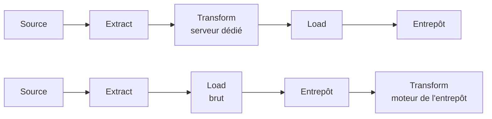

Niveau attendu : **usage**. Savoir travailler dans une chaîne ELT et dire ce que l'inversion change suffit ; l'architecture d'ingestion se décide plus haut.

Dans l'ETL classique, la transformation se fait en route, dans un serveur dédié, et seule la donnée transformée arrive. Dans l'ELT, on charge brut dans l'entrepôt et on transforme avec son moteur. Les conséquences pratiques sont nettes, et elles expliquent l'essentiel de ce qui a changé dans le métier.

## Ce qu'il faut savoir faire

- Tirer parti du brut conservé : une erreur de logique se corrige en rejouant une transformation, au lieu de redemander les données à une équipe source qui ne les a peut-être plus.
- Écrire la transformation en SQL, ce qui supprime la dépendance à un développeur et rend la logique lisible par le métier. C'est le changement qui a mis la modélisation à la portée de l'analyste.
- Surveiller le coût de calcul, devenu visible sur la facture de l'entrepôt. L'ELT déplace la dépense d'un serveur amorti vers une ligne de facturation variable, ce qui est un progrès de lisibilité et un risque budgétaire.
- Recourir à l'ingestion managée pour les connecteurs SaaS standards. Écrire soi-même un connecteur vers une API de facturation est rarement un bon usage du temps d'un BI Analyst ; le maintenir l'est encore moins.
- Garder l'ETL là où il reste juste : quand la donnée ne doit pas entrer brute dans l'entrepôt pour des raisons de confidentialité, la pseudonymisation se fait en route, avant le chargement.
- Ne pas confondre ce déplacement avec le nettoyage exploratoire d'un analyste. Ici, une règle de nettoyage n'est pas un geste dans un carnet : c'est un modèle versionné, testé, documenté, qui s'appliquera à tous les chargements suivants.

## Les notions mobilisées

- [[notions/transformation-dbt]] — l'outil qui a rendu l'ELT praticable : modèles, tests, documentation, matérialisations.
- [[notions/orchestration-de-flux]] — ce qui déclenche et enchaîne les transformations une fois qu'elles sont écrites.
- [[notions/sql]] — le langage de la transformation, avec les exigences de lisibilité que cela suppose.
- [[notions/donnees-sensibles]] — le seul cas où transformer avant de charger reste la bonne réponse.
- [[notions/entrepot-de-donnees]] — c'est son moteur qui exécute désormais la transformation, d'où la visibilité du coût.

> [!warning] Piège
> Laisser la logique métier dans l'outil de restitution. Une mesure calculée dans un rapport n'est ni testable, ni versionnée, ni réutilisable par un autre outil, et elle sera réécrite différemment dans le rapport suivant. Tout ce qui est une **définition** remonte dans la transformation ou la couche sémantique.

## Pour apprendre

- [What is dbt](https://www.getdbt.com/product/what-is-dbt) — le manifeste de l'ELT versionné, à lire comme un catalogue de pratiques.
- [Documentation dbt](https://docs.getdbt.com/docs/build/documentation) — la mise en œuvre, des modèles aux matérialisations.
- [dbt Learn — catalogue de cours](https://learn.getdbt.com/catalog) — les parcours gratuits, à faire dans l'ordre pour un premier projet.
- [Documentation Airflow](https://airflow.apache.org/docs) — l'autre moitié du sujet, quand la chaîne croise d'autres systèmes.
