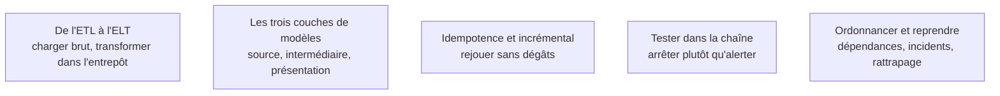

Le moment où le modèle devient du code exécuté chaque nuit. C'est aussi le déplacement qui a changé le métier : la transformation est passée d'un outil graphique administré par l'informatique à du SQL dans un dépôt.

## Les cinq sujets

**Porte de sortie** : trois couches de modèles versionnés, des tests qui bloquent la chaîne, et une documentation générée depuis le code.

## Ma progression

- [ ] [[parcours/bi-analyst/transformation-et-orchestration/de-l-etl-a-l-elt|De l'ETL à l'ELT]] — ce que l'inversion change concrètement au quotidien
- [ ] [[parcours/bi-analyst/transformation-et-orchestration/les-trois-couches-de-modeles|Les trois couches de modèles]] — la discipline qui empêche une règle d'être réécrite quinze fois
- [ ] [[parcours/bi-analyst/transformation-et-orchestration/idempotence-et-chargement-incremental|Idempotence et incrémental]] — rejouer deux fois doit donner le même résultat
- [ ] [[parcours/bi-analyst/transformation-et-orchestration/tester-dans-la-chaine|Tester dans la chaîne]] — un rapport vide fait moins de dégâts qu'un rapport plausible et faux
- [ ] [[parcours/bi-analyst/transformation-et-orchestration/ordonnancer-et-reprendre|Ordonnancer et reprendre]] — dépendances, alertes, et ce qui se passe à trois heures du matin
