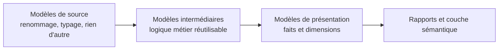

Niveau attendu : **autonomie**. Le découpage source, intermédiaire, présentation se conçoit et se défend en revue de code, contre la tentation permanente du raccourci.

Une couche de mise en forme minimale par source, une couche intermédiaire pour la logique métier réutilisable, une couche de présentation qui expose faits et dimensions. Cette discipline est ce qui empêche la même règle d'être réécrite dans quinze modèles.

## Ce qu'il faut savoir faire

- Tenir la couche source strictement minimale : un modèle par table source, renommage et typage, aucune règle métier. Sa seule fonction est d'isoler le reste du modèle des noms et des types du système amont.
- Placer dans la couche intermédiaire tout ce qui est utilisé plus d'une fois — une règle d'exclusion, une déduplication, une jonction de référentiels. La règle d'admission est simple : un second appelant.
- N'exposer que la couche de présentation. Elle porte les noms que le métier reconnaît, et elle est la seule surface stable sur laquelle des rapports peuvent s'appuyer.
- Nommer les modèles par ce qu'ils contiennent et non par leur rang. Un nom qui dit le grain et le sujet sert de documentation à lui seul dans le graphe de dépendances.
- Pratiquer la revue de code sur les modèles. C'est ce qui attrape les erreurs de grain avant qu'elles atteignent un rapport, et c'est le passage qui distingue une équipe BI outillée d'une équipe qui ne l'est pas.
- Travailler dans un environnement de développement séparé, avec son propre jeu de schémas. Construire un modèle directement en production est la pratique qui produit le plus d'incidents pour le moins de gain.

## Les notions mobilisées

- [[notions/transformation-dbt]] — les couches sont une convention de l'outil autant qu'une discipline de conception.
- [[notions/integration-continue]] — rejouer les tests sur la branche transforme « j'espère que ça n'a rien cassé » en réponse vérifiable.
- [[notions/tests-logiciels]] — les pratiques du développement appliquées à du SQL, y compris la revue et l'environnement séparé.
- [[notions/lignage-des-donnees]] — le graphe de dépendances entre modèles est produit par cette structure, pas malgré elle.

> [!tip] Les trois habitudes qui changent tout
> Un environnement de développement séparé, la revue de code sur les modèles, et l'intégration continue qui rejoue les tests sur la branche. Elles ne coûtent rien en licences et une semaine en mise en place. Une équipe BI qui a ces trois choses ne ressemble plus du tout à une équipe BI qui ne les a pas.

## Pour apprendre

- [Documentation dbt](https://docs.getdbt.com/docs/build/documentation) — la structure en couches et la documentation générée depuis le code.
- [dbt Learn — catalogue de cours](https://learn.getdbt.com/catalog) — le parcours guidé pour construire les trois couches sur un projet réel.
- [Documentation GitHub Actions](https://docs.github.com/en/actions) — de quoi rejouer les tests sur chaque branche sans infrastructure dédiée.
