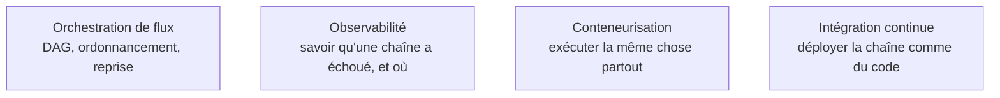

Niveau attendu : **usage**. La chaîne BI courante ne demande ni conception ni exploitation d'un ordonnanceur d'entreprise — ce terrain appartient à l'ingénierie de données.

L'ordonnanceur gère les dépendances, les reprises et les alertes. Pour une chaîne BI simple, le planificateur intégré à la plateforme de transformation suffit souvent ; l'orchestrateur dédié se justifie quand la chaîne croise d'autres systèmes.

## Ce qu'il faut savoir faire

- Décrire la chaîne par ses dépendances réelles plutôt que par des horaires. Un enchaînement fondé sur « à trois heures, puis à quatre heures » casse dès qu'une étape prend dix minutes de plus, et il casse silencieusement.
- Choisir l'outil selon le périmètre : planificateur intégré tant que la chaîne reste dans la plateforme de transformation, orchestrateur dédié dès qu'elle déclenche une extraction, un export ou un traitement extérieur.
- Définir ce qui se passe en cas d'échec, par étape : réessayer, s'arrêter, ou continuer en marquant la sortie comme partielle. Le défaut « réessayer trois fois puis alerter » ne convient pas à une étape non idempotente.
- Rendre l'alerte actionnable. Un message qui nomme l'étape, la fenêtre concernée et la commande de rejeu vaut mieux qu'une notification d'échec générique reçue à six heures du matin.
- Publier l'état de la chaîne là où le métier le voit, ou au minimum la date du dernier rafraîchissement réussi. L'écart entre « la chaîne a échoué » et « le tableau de bord affiche des chiffres d'avant-hier » doit être visible du consommateur, pas seulement de l'équipe.
- Prévoir le rejeu manuel d'une fenêtre comme une opération normale et documentée, pas comme une intervention d'expert. C'est ce qui décide si l'équipe d'exploitation pourra reprendre la chaîne après un départ.

## Les notions mobilisées

- [[notions/orchestration-de-flux]] — DAG, dépendances, rattrapage et reprise, indépendamment de l'outil retenu.
- [[notions/observabilite]] — instrumenter la chaîne pour que l'échec soit visible avant que le métier ne le signale.
- [[notions/conteneurisation]] — ce qui rend une exécution reproductible entre le poste de l'analyste et la production.
- [[notions/integration-continue]] — la chaîne se déploie comme du code, avec revue et retour arrière possible.

> [!warning] Piège
> L'alerte par courriel envoyée à une liste. Au bout de trois mois, la liste filtre le message, l'échec devient invisible, et la panne se découvre par un utilisateur. Une alerte doit avoir un destinataire nommé, une astreinte, ou ne pas exister — et dans ce dernier cas, il faut assumer que l'incident se découvrira côté métier.

## Pour apprendre

- [Documentation Airflow](https://airflow.apache.org/docs) — la référence sur les DAG, les dépendances et la reprise.
- [Documentation Prefect](https://docs.prefect.io/v3/get-started) — une approche plus légère, souvent suffisante pour une chaîne BI.
- [Documentation Grafana](https://grafana.com/docs/) — pour exposer l'état de la chaîne en dehors de l'outil décisionnel.
- [Documentation Docker](https://docs.docker.com/) — exécuter la même transformation en développement et en production, sans surprise.
