Un test qui échoue doit **arrêter la chaîne**, pas alerter. Un rapport visiblement vide fait moins de dégâts qu'un rapport plausible et faux : le premier provoque un appel, le second provoque une décision.

```mermaid
flowchart TD
  UN["Unicité de la clé de grain<br/>une ligne par événement déclaré"]
  NU["Absence de nul<br/>sur les colonnes structurantes"]
  RE["Intégrité référentielle<br/>faits vers dimensions"]
  VA["Valeurs admises<br/>sur les colonnes codifiées"]
  FR["Fraîcheur<br/>dernière donnée à moins de N heures"]
  VO["Volume et distribution<br/>dans leur plage habituelle"]

  click UN "/parcours/bi-analyst/modelisation-dimensionnelle/declarer-le-grain"
  click NU "/notions/qualite-des-donnees"
  click RE "/notions/modelisation-dimensionnelle"
  click VA "/notions/transformation-dbt"
  click FR "/parcours/bi-analyst/transformation-et-orchestration/ordonnancer-et-reprendre"
  click VO "/notions/observabilite"
```

## Ce qu'il faut savoir faire

- Écrire les quatre tests structurels sur chaque modèle de présentation : unicité de la clé de grain, absence de valeur nulle sur les colonnes structurantes, intégrité référentielle entre faits et dimensions, valeurs acceptées sur les colonnes codifiées.
- Faire échouer la chaîne sur ces quatre-là, et seulement sur eux. Un test bloquant sur un contrôle secondaire produit des réveils nocturnes injustifiés, puis des tests désactivés — ce qui est pire que pas de tests.
- Ajouter la **détection d'anomalie sur les volumes et les distributions**. Surveiller que le nombre de lignes chargées et la distribution des mesures principales restent dans leur plage habituelle attrape les pannes silencieuses que les tests de schéma laissent passer : la table est bien là, correctement typée, avec un tiers des lignes en moins.
- Tester au plus près de la source plutôt qu'au plus près du rapport. Un test qui échoue sur un modèle de source désigne le coupable ; le même échec constaté en présentation laisse dix modèles à examiner.
- Transformer chaque incident en test. La règle qui tient dans la durée est qu'un chiffre faux découvert en production donne lieu à un test avant sa correction, faute de quoi il reviendra.
- Rejouer les tests sur chaque branche avant fusion. C'est ce qui empêche une modification de modèle de casser un rapport dont l'auteur ignorait l'existence.

## Les notions mobilisées

- [[notions/tests-logiciels]] — la discipline du test appliquée à des données plutôt qu'à du code, avec les mêmes propriétés.
- [[notions/qualite-des-donnees]] — les six dimensions de la qualité, dont chacune doit devenir un test exécutable ou n'est pas gérée.
- [[notions/integration-continue]] — rejouer les tests sur la branche, ce qui rend la réponse vérifiable au lieu d'être espérée.
- [[notions/transformation-dbt]] — les tests y sont des objets du projet, versionnés avec les modèles qu'ils gardent.
- [[notions/observabilite]] — la détection d'anomalie sur volumes et distributions relève de la surveillance, pas du test unitaire.

> [!tip] Le test qui rassure le métier
> La réconciliation avec la source métier : comparer chaque nuit le chiffre d'affaires de l'entrepôt à celui du système de facturation, et alerter sur l'écart. Il attrape les pannes d'ingestion, les doublons et les erreurs de grain d'un seul coup, et c'est le seul contrôle que le métier comprend immédiatement.

## Pour apprendre

- [Documentation dbt](https://docs.getdbt.com/docs/build/documentation) — les tests de schéma et les tests personnalisés, versionnés avec les modèles.
- [What Is Data Quality? — IBM](https://www.ibm.com/think/topics/data-quality) — les dimensions à traduire en tests, une par une.
- [End-to-end testing — Code With Engineering Playbook](https://microsoft.github.io/code-with-engineering-playbook/automated-testing/e2e-testing/) — la logique du test de bout en bout, transposable à une chaîne de données.
