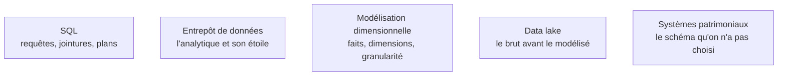

**Autonomie.** C'est le composant qu'on maltraite le plus et celui qu'il faut déboguer sous pression — lire un plan d'exécution, choisir un niveau d'isolation, accepter une dénormalisation — sans prétendre au niveau de l'administrateur de base, qui reste la référence.

La base de données est là où vivent réellement les données d'entreprise, et c'est le composant qu'un profil data maltraite le plus.

## Modéliser, isoler, distribuer

Le vrai critère entre relationnel et non-relationnel n'est pas le volume mais le **schéma d'accès** : requêtes ad hoc et jointures d'un côté, accès par clé connue et schéma mouvant de l'autre. On normalise pour la cohérence en écriture, on dénormalise pour la vitesse en lecture — et un entrepôt analytique assume l'étoile. Le modèle entité-association, avec ses cardinalités et ses clés, est le document à demander avant d'écrire la moindre requête ; c'est aussi celui que consomme une génération de requêtes assistée par modèle.

Les quatre familles de commandes — définition, manipulation, interrogation, droits — se distinguent par une question pratique : la commande est-elle transactionnelle, et verrouille-t-elle. Côté objets, le B-tree est l'index par défaut, GIN et GiST couvrent JSON et texte intégral, `pgvector` les plongements ; une vue matérialisée est un cache à rafraîchir ; une procédure stockée est performante mais difficile à versionner et à tester.

Les **transactions** ne se comprennent qu'à travers leurs niveaux d'isolation — *read committed*, *repeatable read*, *serializable* — et à travers un fait d'exploitation : une transaction longue bloque le nettoyage des versions. Au-delà d'une machine, l'arbitrage change de nature. ACID promet la garantie forte, BASE la disponibilité et la cohérence à terme ; le théorème CAP arbitre en cas de partition, et PACELC ajoute l'arbitrage latence contre cohérence en fonctionnement normal — c'est celui qu'on rencontre au quotidien. Réplication, partitionnement et fédération ont chacun leur piège : le décalage du réplica qui fait lire des données périmées, la clé de partition qui détermine tout et rend une jointure inter-partitions très coûteuse, la fédération qui évite la duplication au prix de la latence.

## Ce qu'il faut savoir faire

- **Lire un plan d'exécution** et en déduire quel index manque, lequel n'est pas emprunté et où passe le temps.
- **Extraire un jeu de données de façon cohérente** : instantané explicite ou colonne de date de coupure, jamais un `SELECT` long pendant que le système écrit.
- **Choisir un niveau d'isolation** en connaissance de cause, et savoir ce qu'il autorise comme anomalie.
- **Demander et lire le modèle entité-association** avant d'écrire une requête, plutôt que de deviner les cardinalités à partir des données.
- **Situer une base sur l'axe CAP puis sur l'axe PACELC**, et en déduire ce qu'elle promet vraiment en fonctionnement normal.
- **Décrire un schéma pour un système de génération de requêtes** : une vue métier propre vaut mieux qu'un schéma normalisé au maximum.

> [!warning] Piège
> Extraire un jeu de données avec un `SELECT` sans transaction pendant que le système écrit. Les lignes lues au début et à la fin ne reflètent pas le même état, et l'incohérence reste invisible jusqu'à ce qu'un total ne tombe pas juste.

## Les notions mobilisées

- [[notions/sql]] — l'angle *computer science* : la requête est une intention, le plan d'exécution est ce qui se passe réellement.
- [[notions/entrepot-de-donnees]] — la dénormalisation assumée pour la lecture, et ce qu'elle coûte en cohérence.
- [[notions/modelisation-dimensionnelle]] — faits, dimensions et granularité : le vocabulaire commun avec l'équipe qui possède le schéma.
- [[notions/data-lake]] — le stockage brut en amont, et la frontière avec ce qui est modélisé.
- [[notions/systemes-patrimoniaux]] — en entreprise, le schéma n'est presque jamais choisi : il se lit et se contourne.

## Pour apprendre

- [Documentation PostgreSQL](https://www.postgresql.org/docs/current/index.html), chapitres *Indexes* et *Concurrency Control* — la meilleure source pratique sur indexation et isolation, toutes bases confondues.
- *Designing Data-Intensive Applications*, Martin Kleppmann — réplication, partitionnement, cohérence ; le chapitre 7 sur les transactions vaut à lui seul le livre.
- [Jepsen](https://jepsen.io/analyses) — les analyses de cohérence sous partition, base par base : ce que chaque produit promet et ce qu'il tient.
- [SQLBolt](https://sqlbolt.com/) — les bases de SQL par l'exercice, en une soirée, sans installation.
- [PACELC](https://en.wikipedia.org/wiki/PACELC_design_principle) — la formulation qui complète CAP par l'arbitrage du fonctionnement normal.
