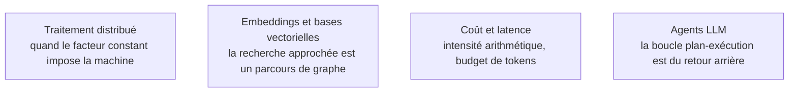

Niveau attendu : **usage**. L'attendu est d'estimer avant de lancer et de reconnaître les quatre schémas quand ils passent, documentation ouverte ; concevoir un algorithme nouveau ou démontrer une borne est le travail d'un chercheur, pas d'un ingénieur confirmé qui livre des systèmes.

L'analyse asymptotique répond à une seule question — quand la taille des données est multipliée par dix, que devient le temps de calcul — et les classes de complexité disent quand arrêter de chercher un algorithme exact.

## Lire un coût, puis reconnaître un schéma

Big O borne par le haut, Big Omega par le bas, Big-Theta encadre — et Theta est ce qu'on veut souvent dire en écrivant O. Les régimes qui comptent vont de l'indexation constante à la dichotomie logarithmique, puis au scan linéaire, puis à l'endroit où meurent silencieusement les pipelines : jointure imbriquée, matrice de similarité tous contre tous. L'exponentiel et le factoriel ne sont acceptables que sur des entrées minuscules ou avec élagage. L'axe le plus souvent oublié est la **complexité mémoire** : une matrice de similarité sur cent mille documents fait dix milliards de flottants, l'algorithme est correct et la machine tombe.

Les classes P, NP, NP-difficile et NP-complet servent à une chose : reconnaître qu'un problème métier est un sac à dos ou un voyageur de commerce déguisé, et basculer immédiatement vers une heuristique ou un solveur plutôt que de chercher l'exact.

Personne ne réimplémente un tri en production ; l'intérêt du catalogue est le **répertoire de schémas de raisonnement**. Diviser pour régner, avec le tri fusion stable et externalisable qui est celui des moteurs de bases de données quand les données ne tiennent pas en mémoire. Parcourir, en largeur pour le plus court chemin en nombre d'arêtes, en profondeur pour la détection de cycles et le tri topologique — donc l'ordonnancement de tout graphe de tâches acyclique. Avancer par choix localement optimal, de Dijkstra à Huffman, ce dernier étant le grand-parent conceptuel du codage par paires d'octets. Explorer puis revenir en arrière, ce que fait tout système qui teste plusieurs plans. Ces quatre schémas couvrent la quasi-totalité des problèmes non triviaux d'un pipeline ou d'un moteur de recherche.

## Ce qu'il faut savoir faire

- **Estimer le coût d'un traitement avant de le lancer**, en temps *et* en mémoire, et savoir dire à partir de quelle taille il ne passera plus.
- **Reconnaître les quatre schémas** — division, parcours, glouton, retour arrière — et les appliquer au bon problème plutôt que de réinventer une boucle.
- **Mesurer sur deux ordres de grandeur** et regarder la pente, pas la valeur : à mille lignes tout est instantané et le classement s'inverse souvent à l'échelle réelle.
- **Compléter la complexité par l'intensité arithmétique** — FLOPs sur octets déplacés : c'est l'argument de FlashAttention, même complexité, ordre de grandeur gagné sur les accès mémoire.
- **Imposer une profondeur maximale et un critère d'élagage** à toute boucle qui explore : c'est ce qui sépare un retour arrière d'une boucle infinie.
- **Identifier un problème NP-difficile déguisé** et proposer une heuristique assumée plutôt qu'un exact qui ne finira pas.

> [!warning] Piège
> Croire que la recherche vectorielle approchée est un k-plus-proches-voisins simplement accéléré. Un index HNSW est un graphe parcouru en largeur guidée : il hérite des pathologies des graphes et le rappel n'est jamais total. Le mesurer contre une recherche exhaustive sur un échantillon est le seul moyen de savoir ce qu'on perd.

## Les notions mobilisées

- [[notions/traitement-distribue]] — le tri externe par fusion est exactement ce que fait un mélange Spark : le coût se paie en passes disque, d'où l'intérêt de partitionner avant de trier.
- [[notions/embeddings-et-bases-vectorielles]] — l'angle *computer science* : un index approché est une structure algorithmique, avec un compromis rappel-latence à mesurer.
- [[notions/cout-et-latence-inference]] — remplir une fenêtre de contexte sous budget de tokens est un problème de sac à dos, et se traite comme tel.
- [[notions/agents-llm]] — la boucle plan, exécution, retour arrière est du *backtracking* déguisé, avec les mêmes besoins d'élagage.

## Pour apprendre

- [Algorithms](https://algs4.cs.princeton.edu/home/), Sedgewick et Wayne — le manuel en ligne avec le code et les démonstrations de coût ; le meilleur rapport effort/rendement du domaine.
- [Big-O Cheat Sheet](https://www.bigocheatsheet.com/) — le tableau à afficher : coûts d'opération de chaque structure et de chaque tri.
- [Complexity Zoo — P vs NP](https://complexityzoo.net/Petting_Zoo) — de quoi situer P, NP et NP-complet sans passer par un cours entier.
- [FlashAttention: Fast and Memory-Efficient Exact Attention](https://arxiv.org/abs/2205.14135) — la démonstration la plus claire que les octets déplacés comptent plus que les opérations.
- [Visualgo](https://visualgo.net/) — les algorithmes de tri, de graphe et d'arbre animés pas à pas ; utile une fois, décisif pour le retour arrière.
