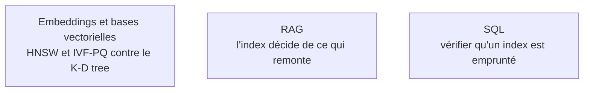

Niveau attendu : **autonomie**. Choisir un index vectoriel, régler son compromis entre rappel, latence et mémoire puis le défendre est un arbitrage que personne ne fera à la place d'un profil IA ou data — c'est le domaine du socle le plus directement en prise avec le métier.

Tout ce chapitre répond à une question : retrouver une donnée sans tout lire. Un index est toujours un compromis entre coût d'écriture, coût de lecture et espace occupé.

## Du rééquilibrage strict au compromis d'écriture

Les **arbres équilibrés** se distinguent par la sévérité de leur rééquilibrage : l'AVL est strict et privilégie la lecture, le red-black est plus lâche et offre un meilleur compromis en écriture — c'est l'implémentation des tables ordonnées des bibliothèques standard. Les arbres à plusieurs clés par nœud — 2-3, 2-3-4, k-aire — en sont la base conceptuelle, avec une propriété décisive : plus le nœud est large, moins l'arbre est profond, donc moins d'accès disque.

C'est exactement ce qu'exploite le **B-tree** et sa variante B+, l'index de PostgreSQL, MySQL et SQLite : chaque nœud tient dans une page disque, ce qui permet de retrouver une ligne parmi des millions en trois ou quatre lectures. Le **trie** est l'arbre préfixe — autocomplétion, routage d'URL, et le mécanisme qui rend efficace la tokenisation par plus long préfixe. Le **K-D tree** partitionne l'espace pour le plus proche voisin mais s'effondre en grande dimension, d'où les méthodes approchées. La **skip list**, alternative probabiliste simple à rendre concurrente, sert dans les ensembles ordonnés Redis et les mémoires tampon des moteurs LSM.

Deux structures absentes de la roadmap d'origine dominent la pratique. Le **LSM-tree** — RocksDB, Cassandra, ClickHouse — optimise l'écriture en accumulant en mémoire puis en fusionnant sur disque, à l'inverse du B-tree qui privilégie la lecture : c'est le seul arbitrage à retenir entre les deux familles. Et les **index vectoriels** — HNSW, graphe navigable multicouche, ou IVF-PQ, partitionnement plus quantification — remplacent le K-D tree au-delà de quelques dizaines de dimensions, au prix d'un rappel inférieur à cent pour cent.

## Ce qu'il faut savoir faire

- **Expliquer B-tree contre LSM-tree** en une phrase d'arbitrage — lecture contre écriture — et choisir en fonction du profil de charge réel.
- **Mesurer le compromis rappel-latence d'un index vectoriel** contre une recherche exhaustive sur un échantillon : sans cette mesure, on ignore ce que l'index perd.
- **Vérifier qu'un index est réellement emprunté** par le planificateur avec `EXPLAIN ANALYZE`, avant de le garder.
- **Reconnaître le bon index pour le bon accès** : préfixe pour l'autocomplétion, B-tree pour l'égalité et l'intervalle, inversé pour le texte intégral, vectoriel pour la similarité.
- **Estimer le coût d'écriture d'un index** avant de l'ajouter : chaque index ralentit les insertions et consomme de l'espace.

> [!warning] Piège
> Multiplier les index en pensant accélérer. Un index non emprunté est un coût pur, payé à chaque écriture, que personne ne remarque parce qu'il ne casse rien.

## Les notions mobilisées

- [[notions/embeddings-et-bases-vectorielles]] — l'angle *computer science* : HNSW et IVF-PQ sont des structures de données, avec des paramètres qui se règlent et un rappel qui se mesure.
- [[notions/rag]] — la qualité de ce qui remonte est bornée par l'index avant de l'être par le modèle.
- [[notions/sql]] — lire un plan d'exécution est la seule façon de savoir si un index sert ; le reste est une supposition.

## Pour apprendre

- [Use The Index, Luke!](https://use-the-index-luke.com/) — le manuel libre sur l'indexation SQL : quand un index est emprunté, quand il ne l'est pas, et pourquoi.
- [B-trees and database indexes](https://planetscale.com/blog/btrees-and-database-indexes) — l'explication illustrée du B+ tree en conditions réelles, page disque comprise.
- [Log Structured Merge Trees](https://www.benstopford.com/2015/02/14/log-structured-merge-trees/), Ben Stopford — l'arbitrage LSM contre B-tree, expliqué sans mathématiques.
- [Efficient and robust approximate nearest neighbor search using HNSW](https://arxiv.org/abs/1603.09320) — l'article d'origine de l'index vectoriel le plus déployé.
- [ANN Benchmarks](https://ann-benchmarks.com/) — les courbes rappel contre débit de tous les index approchés, sur jeux publics : la référence pour choisir.
