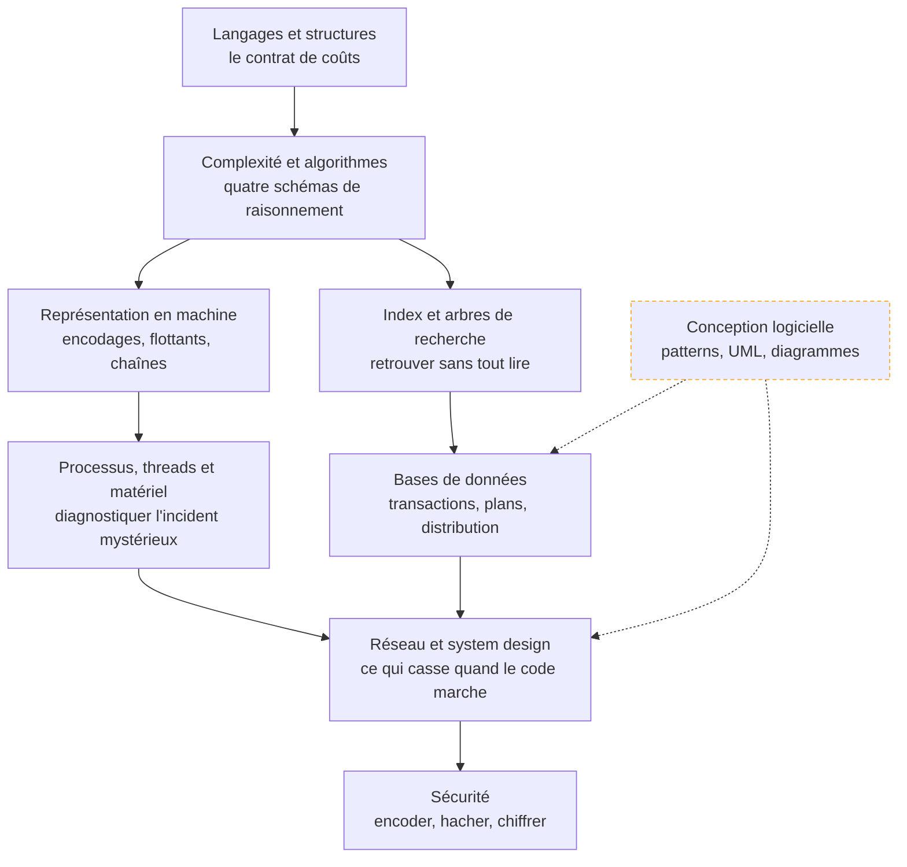

Les fondations qui ne se périment pas — algorithmique, représentation, index, bases de données, réseau, sécurité, machine — relues pour quelqu'un qui code déjà et veut cesser de traiter la machine comme une boîte noire.

## La roadmap

Chaque case mène à sa page. Cochez les étapes acquises en bas de page pour suivre votre progression.

## Ma progression

- [ ] [[parcours/computer-science/langages-et-structures-de-donnees|Langages et structures de données]] — pratiquer un langage où la mémoire est visible, choisir une structure par ses coûts
- [ ] [[parcours/computer-science/complexite-et-algorithmes|Complexité et algorithmes]] — estimer avant de lancer, reconnaître les quatre schémas de raisonnement
- [ ] [[parcours/computer-science/representation-en-machine|Représentation en machine]] — encodages, arithmétique flottante, recherche dans le texte
- [ ] [[parcours/computer-science/index-et-arbres-de-recherche|Index et arbres de recherche]] — B-tree, LSM-tree, index vectoriels et leurs compromis
- [ ] [[parcours/computer-science/bases-de-donnees|Bases de données]] — modélisation, transactions, plans d'exécution, distribution
- [ ] [[parcours/computer-science/reseau-et-system-design|Réseau et system design]] — TLS, DNS, délais d'attente, files, caches, mise à l'échelle
- [ ] [[parcours/computer-science/securite|Sécurité]] — encoder, hacher, chiffrer, et la revue OWASP
- [ ] [[parcours/computer-science/processus-threads-et-materiel|Processus, threads et matériel]] — concurrence, mémoire, cache, hiérarchie jusqu'à la VRAM
- [ ] [[parcours/computer-science/conception-logicielle|Conception logicielle]] — patterns à reconnaître, diagrammes qui servent vraiment
