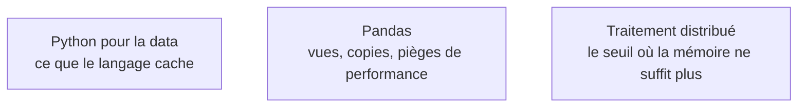

Niveau attendu : **autonomie**. Choisir une structure par ses coûts et lire une empreinte mémoire est un geste quotidien en IA et en data : on l'arbitre et on le défend, sans être pour autant l'auteur du ramasse-miettes ni celui du compilateur.

Une structure de données est un contrat de coûts : ce qu'elle rend gratuit et ce qu'elle rend cher. Un second langage, où la mémoire et les types sont visibles, sert d'appareil de mesure pour lire ce contrat.

## Le contrat de coûts, structure par structure

Le **tableau** offre l'accès indexé constant et la mémoire contiguë, donc la compatibilité avec le cache processeur — c'est toute l'explication de l'écart entre NumPy et une liste Python. La **liste chaînée** offre l'insertion constante si l'on tient déjà le nœud, mais un parcours par sauts de pointeurs qui détruit le cache : rarement le bon choix. **Pile** et **file** sont les deux disciplines d'accès, LIFO et FIFO, de la pile d'un analyseur syntaxique aux files de tâches d'un pipeline. La **table de hachage** donne un coût amorti constant, le **tas** l'extraction du minimum en temps logarithmique — ce dernier fait tourner tout calcul de top-k et l'ordonnancement de Dijkstra.

Les **arbres** organisent la hiérarchie et la recherche ordonnée, mais un arbre binaire de recherche n'est efficace que s'il reste équilibré : d'où le vocabulaire *full*, *complete*, *balanced*, *unbalanced* — et le fait qu'un arbre complet se stocke dans un simple tableau, ce qui est exactement l'astuce du tas. Les **graphes** modélisent toute relation ; la liste d'adjacence sert aux graphes creux, la matrice d'adjacence aux graphes denses et à tout ce qui se calcule en algèbre linéaire, et l'arbre couvrant minimise le coût de connexion.

Côté langage, le duo réellement rentable pour un profil data est Python plus Rust. Python cache tout — allocation, verrou global, copies implicites ; C et C++ sont les couches réelles sous NumPy, BLAS, PyTorch et llama.cpp, et les lire suffit ; Rust apporte la sûreté mémoire sans ramasse-miettes et occupe désormais l'outillage moderne, exposé en Python. Go, Java et C# relèvent de la réalité des systèmes d'information d'entreprise plus que du choix personnel.

## Ce qu'il faut savoir faire

- **Choisir une structure et justifier le choix par les coûts d'opération** attendus, pas par habitude ni par ce qu'impose la bibliothèque.
- **Reconnaître une matrice d'adjacence creuse** au format CSR et savoir qu'un passage de messages sur graphe n'est qu'un produit matrice creuse par matrice dense.
- **Profiler avant d'optimiser** — py-spy, cProfile, perf — et n'attaquer que la boucle chaude effectivement mesurée.
- **Écrire une extension native pour une boucle chaude** une fois qu'elle est identifiée : cinquante lignes de Rust exposées en Python sont devenues plus simples qu'un équivalent en Cython.
- **Lire du C sans l'écrire** : c'est ce qui permet de comprendre un message d'erreur venu d'une bibliothèque compilée plutôt que de le contourner.

> [!warning] Piège
> Utiliser une liste Python comme file et faire `pop(0)` : l'opération est linéaire à chaque retrait, donc quadratique sur la boucle. `collections.deque` règle le problème en une ligne, et le même réflexe vaut pour la concaténation de chaînes.

## Les notions mobilisées

- [[notions/python-pour-la-data]] — l'angle *computer science* : comptage de références, vues NumPy et verrou global expliquent l'essentiel des surprises de performance.
- [[notions/pandas]] — le lieu où le contrat de coûts se manifeste au quotidien : une copie implicite coûte un ordre de grandeur.
- [[notions/traitement-distribue]] — au-delà d'un certain volume, aucune structure en mémoire ne tient ; savoir où est ce seuil évite de distribuer trop tôt.

## Pour apprendre

- [Open Data Structures](https://opendatastructures.org/) — le manuel libre de référence, chaque structure avec ses coûts démontrés et son code.
- [Python Data Structures](https://docs.python.org/3/tutorial/datastructures.html) et le module [`collections`](https://docs.python.org/3/library/collections.html) — ce que la bibliothèque standard fournit déjà, et qu'on réécrit à tort.
- [The Rust Programming Language](https://doc.rust-lang.org/book/) — le livre officiel, gratuit ; les quatre premiers chapitres suffisent à rendre visible ce que Python cache.
- [PyO3 — user guide](https://pyo3.rs/) — exposer du Rust en Python, avec l'exemple minimal d'une boucle chaude remplacée.
- [What scientists must know about hardware to write fast code](https://viralinstruction.com/posts/hardware/) — pourquoi la contiguïté mémoire décide plus souvent que la complexité.
