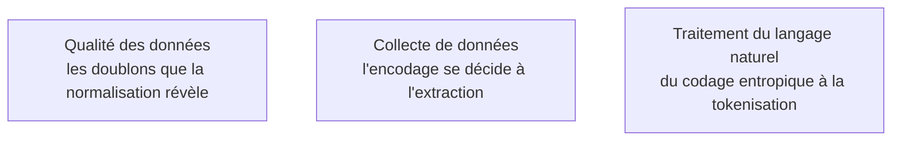

Le chapitre qui explique les bugs qu'on ne comprend pas : le caractère devenu point d'interrogation, la somme de flottants qui ne tombe pas juste, le fichier binaire illisible ailleurs.

## Trois couches qui se confondent, et une arithmétique qui ment

Un **point de code** n'est ni un caractère affiché ni un octet. UTF-8 est à longueur variable, donc `len()` ne donne ni le nombre d'octets ni le nombre de graphèmes. Et la normalisation NFC contre NFD fait diverger deux chaînes visuellement identiques : c'est la cause classique des doublons non détectés dans un corpus. L'ordre des octets, lui, ne devient visible qu'à la lecture d'un format binaire brut, d'une projection mémoire produite sur une autre architecture ou d'une capture réseau.

L'**arithmétique flottante** IEEE 754 est le second piège : l'addition n'est pas associative, la comparaison stricte à zéro est un bug, l'accumulation sur des millions de valeurs dérive. La règle pratique tient en une ligne : accumuler en float64 même quand on calcule en float32. Le sujet est redevenu central avec la quantification — bfloat16 sacrifie la mantisse pour garder l'exposant de float32, ce qui le rend stable à l'entraînement là où float16 sature ; les formats sur huit et quatre bits ajoutent des échelles par bloc pour compenser la dynamique perdue. Savoir lire « exposant, mantisse, échelle par groupe » suffit à comprendre pourquoi un modèle quantifié se dégrade sur certaines couches.

Les **opérateurs bit à bit** — masques, décalages, comptage de bits — sont la base des bitmaps de filtrage, des filtres de Bloom et de la distance de Hamming sur empreinte binaire. Côté **recherche de motif**, la force brute suffit sur textes courts ; le hachage glissant de Rabin-Karp se généralise à la détection de quasi-doublons ; Knuth-Morris-Pratt précalcule préfixe et suffixe pour un coût linéaire garanti ; Boyer-Moore saute en avant par mauvais caractère et c'est ce qui est derrière `grep`. Indexer tous les suffixes permet enfin la recherche de sous-chaîne en temps logarithmique et le calcul de répétitions dans un corpus.

## Ce qu'il faut savoir faire

- **Spécifier l'encodage à chaque lecture de fichier**, et traiter une erreur de décodage comme une donnée à corriger, jamais comme une exception à ignorer.
- **Normaliser un corpus avant de dédupliquer** : sans forme normale commune, deux chaînes identiques à l'œil restent deux entrées distinctes.
- **Diagnostiquer une dérive numérique** : reconnaître une somme qui ne tombe pas juste, et savoir où placer l'accumulation en double précision.
- **Lire une description de format quantifié** et en déduire ce qui a été sacrifié — dynamique ou précision — et sur quelles couches cela se verra.
- **Choisir un algorithme de recherche de motif** selon la longueur du texte et le nombre de motifs, plutôt que d'empiler des expressions régulières.

> [!warning] Piège
> Lire un CSV sans spécifier l'encodage. Sur un fichier Windows en cp1252, la lecture passe silencieusement et corrompt les accents ; l'erreur ne se manifeste que trois étapes plus loin, dans les plongements.

## Les notions mobilisées

- [[notions/qualite-des-donnees]] — l'angle *computer science* : l'unicité, c'est une question de normalisation Unicode avant d'être une question de règle métier.
- [[notions/collecte-de-donnees]] — l'encodage et les métadonnées d'extraction se décident à la source ; après, on ne fait que réparer.
- [[notions/traitement-langage-naturel]] — le codage de Huffman est le grand-parent conceptuel du codage par paires d'octets, qui décide de ce que coûte un texte.

## Pour apprendre

- [The Absolute Minimum Every Software Developer Must Know About Unicode](https://www.joelonsoftware.com/2003/10/08/the-absolute-minimum-every-software-developer-absolutely-positively-must-know-about-unicode-and-character-sets-no-excuses/), Joel Spolsky — vingt ans après, toujours la meilleure entrée en matière.
- [Unicode HOWTO](https://docs.python.org/3/howto/unicode.html) (Python) — la mise en pratique : décodage, normalisation, pièges de `len()`.
- [What Every Computer Scientist Should Know About Floating-Point Arithmetic](https://docs.oracle.com/cd/E19957-01/806-3568/ncg_goldberg.html), David Goldberg — la référence sur IEEE 754, à lire par sections.
- [Float Exposed](https://float.exposed/) — manipuler exposant et mantisse à la main : dix minutes qui rendent la quantification évidente.
- [Exact String Matching Algorithms](https://www-igm.univ-mlv.fr/~lecroq/string/) — le catalogue complet des algorithmes de recherche, avec animations et code.
