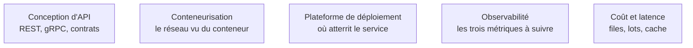

Niveau attendu : **autonomie**. Concevoir des délais d'attente, des reprises, une file et un cache, puis défendre le dimensionnement en revue, fait partie de ce qu'on livre — l'exploitation du réseau d'entreprise, elle, appartient à d'autres, qu'on sait nommer.

Le réseau est ce qui casse quand le code fonctionne : délais d'attente sur un point d'accès, certificat refusé derrière un proxy d'entreprise, DNS qui échoue dans un conteneur.

## Situer une panne, puis dimensionner un service

Sept couches de référence servent à **situer** un problème, quatre couches réelles à le **résoudre**. TCP garantit l'ordre et la livraison, UDP ne garantit rien mais ne bloque pas. Le DNS est le premier suspect quand un service répond par adresse IP et pas par nom. Distinguer 401 de 403, et 429 de 503, change entièrement la stratégie de reprise. En entreprise, le proxy qui inspecte le trafic impose d'ajouter son autorité de certification, faute de quoi tout appel sortant échoue sur un certificat. Le socket, enfin, explique les connexions réinitialisées et l'intérêt du pool de connexions.

Mettre un service en production relève du **system design** : une file devant le traitement, un cache devant ce qui se répète, un répartiteur devant les répliques, une API devant le tout. La mise à l'échelle verticale est souvent forcée quand un modèle doit tenir en mémoire vidéo ; router selon la charge réelle bat le tour de rôle dès que les requêtes ont des durées très inégales ; le proxy inverse porte TLS, authentification, limitation de débit et quotas. Le cache est le levier le plus rentable, le réseau de diffusion de contenu ne concerne que les fichiers statiques, et la file découple production et consommation tout en rendant la reprise possible.

Pour le reste, quelques noms suffisent à discuter : monolithe modulaire d'abord et découpage sur preuve de besoin ; disjoncteur, reprise avec attente croissante, cloisonnement, side-car et saga comme recettes de résilience ; REST comme défaut raisonnable, GraphQL quand les clients varient vraiment, gRPC pour l'interne à faible latence ; et, côté temps réel, le flux d'événements serveur comme standard de fait pour le streaming, la connexion bidirectionnelle réservée aux cas qui le sont réellement.

## Ce qu'il faut savoir faire

- **Déboguer une chaîne TLS, DNS et délai d'attente** de bout en bout, et savoir dire à quelle couche le problème se situe avant de toucher au code.
- **Concevoir une chaîne de service** avec file, cache et répartiteur, et justifier chaque composant par une contrainte mesurée.
- **Choisir une stratégie de reprise à partir du code de retour** : ce qui se retente, ce qui s'abandonne, ce qui attend.
- **Suivre trois métriques de service** — temps jusqu'à la première réponse, débit par requête, occupation du cache — plutôt qu'une moyenne de latence.
- **Désactiver la bufferisation du proxy** sur un flux d'événements, sinon il arrive d'un bloc et le streaming n'existe que sur le papier.
- **Normaliser une clé de cache** : cacher sur une chaîne exacte contenant un identifiant ou un horodatage donne un taux de succès proche de zéro.

> [!warning] Piège
> Dimensionner un service de traitement par lots comme une API classique. Le regroupement continu fait légèrement monter la latence individuelle pendant que le débit global triple : c'est la file d'attente, pas le processeur, qui devient le vrai levier.

## Les notions mobilisées

- [[notions/conception-d-api]] — l'angle *computer science* : le style d'interface décide de la stratégie de reprise et du coût de la montée en version.
- [[notions/conteneurisation]] — la moitié des pannes DNS et certificat se produisent parce que le conteneur ne voit pas le réseau de l'hôte.
- [[notions/plateforme-de-deploiement]] — périphérie, plateforme applicative ou infrastructure brute : le choix fixe ce qu'on a le droit de configurer.
- [[notions/observabilite]] — sans traces ni métriques, un incident réseau se diagnostique par témoignage.
- [[notions/cout-et-latence-inference]] — file, lots et cache sont les trois leviers qui déplacent réellement la facture.

## Pour apprendre

- *Computer Networking: A Top-Down Approach*, Kurose et Ross — le réseau abordé depuis HTTP en descendant vers les sockets ; la progression la plus efficace pour un profil logiciel.
- [High Performance Browser Networking](https://hpbn.co/), Ilya Grigorik — libre et complet sur TCP, TLS et HTTP/2, avec les chiffres de latence.
- [The System Design Primer](https://github.com/donnemartin/system-design-primer) — le catalogue des composants et de leurs compromis, avec des études de cas.
- [Cloud Design Patterns](https://learn.microsoft.com/en-us/azure/architecture/patterns/) (Microsoft) — disjoncteur, cloisonnement, saga : les recettes de résilience nommées et illustrées.
- [Server-Sent Events](https://developer.mozilla.org/en-US/docs/Web/API/Server-sent_events/Using_server-sent_events) (MDN) — le protocole de streaming à connaître, avec ses pièges de bufferisation.
