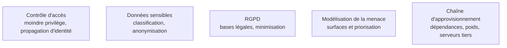

**Usage.** L'attendu est de ne pas commettre les fautes de base — confondre encoder, hacher et chiffrer — et de savoir dérouler une revue OWASP liste en main ; l'autorité appartient à l'équipe sécurité, et la reconnaître tôt fait partie du niveau.

Trois notions confondues en permanence — encoder, hacher, chiffrer — expliquent la majorité des erreurs de sécurité amateur.

## Encoder n'est pas hacher, hacher n'est pas chiffrer

**Encoder** — base64, URL-encoding — est une représentation réversible sans secret : ce n'est jamais de la sécurité, et c'est l'erreur la plus fréquente. **Hacher** est à sens unique ; pour des mots de passe, seuls des algorithmes lents et salés conviennent — bcrypt, scrypt, Argon2 — jamais un SHA-256 nu, précisément parce qu'il est rapide. **Chiffrer** est réversible avec une clé : le symétrique pour le volume, l'asymétrique pour l'échange de clés et la signature, ce qui est le socle de TLS, de SSH et de la signature de commits.

Le choix de la fonction de hachage dépend de l'usage, pas de la mode : SHA-2 et SHA-3 pour l'intégrité, HMAC pour l'authentification de message, xxHash ou MurmurHash pour la déduplication rapide — et ces derniers n'ont aucune propriété de sécurité, ce qui est parfaitement acceptable tant qu'on ne les y emploie pas. MD5 et SHA-1 sont cassés pour tout usage de sécurité.

L'**OWASP Top 10** reste la liste de contrôle minimale avant d'exposer quoi que ce soit : injection, authentification défaillante, mauvaise configuration, désérialisation non sûre. Son extension dédiée aux applications fondées sur des modèles de langage est devenue la référence de revue pour toute chaîne de récupération documentaire ou tout agent. Ce qui mord en pratique : une instruction hostile dans un document ingéré, une fuite d'information sensible dans la réponse, des permissions excessives accordées à un outil, un empoisonnement de la base d'index. La contre-mesure structurante n'est pas un filtre, c'est le **moindre privilège** sur les outils plus une validation des sorties côté application.

## Ce qu'il faut savoir faire

- **Distinguer encoder, hacher et chiffrer** dans une revue de code, et repérer la confusion dans le code des autres.
- **Choisir une fonction de hachage par usage** : intégrité, authentification de message, mot de passe, déduplication — quatre réponses différentes.
- **Passer une revue OWASP** sur un service avant de l'exposer, et savoir laquelle des dix entrées s'applique vraiment.
- **Gérer des secrets** : hors du dépôt, hors des variables d'environnement partagées, avec rotation, et jamais dans un prompt ni dans un journal.
- **Appliquer le moindre privilège à un outil exposé** : lecture seule par défaut, périmètre de données minimal, confirmation humaine sur l'irréversible.

> [!warning] Piège
> Traiter le contenu récupéré dans un corpus comme des données inertes. Un document indexé peut contenir des instructions que le modèle exécutera : toute donnée retrouvée est une entrée non fiable, au même titre qu'un champ de formulaire.

## Les notions mobilisées

- [[notions/controle-d-acces]] — l'angle *computer science* : authentification et autorisation sont deux mécanismes distincts, et la propagation d'identité est ce qui se perd en chemin.
- [[notions/donnees-sensibles]] — classification et cloisonnement : ce qui décide de ce qu'on a le droit de faire transiter.
- [[notions/rgpd]] — minimisation et base légale s'appliquent aux journaux et aux jeux de test, pas seulement à la base de production.
- [[notions/modelisation-de-la-menace]] — prioriser par impact plutôt que par liste, ce qui est exactement l'intérêt d'un référentiel.
- [[notions/chaine-d-approvisionnement-logicielle]] — dépendances, images et artefacts tiers : la surface qu'aucune revue de code ne couvre.

## Pour apprendre

- [OWASP Top 10](https://owasp.org/www-project-top-ten/) et [OWASP Top 10 for LLM Applications](https://genai.owasp.org/llm-top-10/) — les deux listes de contrôle de revue, à parcourir avant toute mise en ligne.
- [OWASP Cheat Sheet Series](https://cheatsheetseries.owasp.org/) — la réponse concrète par sujet : stockage de mots de passe, gestion de session, journalisation.
- [Crypto 101](https://www.crypto101.io/) — le manuel libre qui explique symétrique, asymétrique et signatures sans prérequis mathématique.
- [Cryptographic Right Answers](https://www.latacora.com/blog/2018/04/03/cryptographic-right-answers/), Latacora — quoi utiliser, en une ligne par besoin ; la page à suivre plutôt qu'à discuter.
- [Password Storage Cheat Sheet](https://cheatsheetseries.owasp.org/cheatsheets/Password_Storage_Cheat_Sheet.html) — les paramètres actuels d'Argon2, bcrypt et scrypt, mis à jour.
