> [!abstract] Le métier de celui à qui on pose une question et qui rend une réponse chiffrée, datée, défendable. Cadrage de la question, collecte, nettoyage, exploration, analyse, restitution. Pour qui veut faire décider quelqu'un d'autre à partir de données, et non construire l'infrastructure décisionnelle ni entraîner des modèles.

Deux partis pris d'écriture, à connaître avant de lire.

**L'ordre a été refait.** La roadmap amont énumère 99 nœuds organisés par outil : une grappe Excel, une grappe statistiques, une grappe bibliothèques, une grappe algorithmes. C'est une liste de courses, pas un métier. Cette note suit le cycle réel d'une mission d'analyse — cadrer, collecter, nettoyer, explorer, analyser, restituer — et regroupe l'outillage en une seule section, au début, pour l'évacuer. Tous les nœuds amont sont couverts, à leur place.

**Les notions transverses ne sont pas expliquées ici.** Statistiques, tests, corrélation, régression, SQL, Pandas, tableur, visualisation appartiennent à plusieurs métiers : elles vivent dans `content/notions/` et sont appelées par lien. Cette note ajoute seulement ce que chacune veut dire *quand on est analyste*. Ce qui relève de l'entrepôt, de la modélisation dimensionnelle, de dbt, de la couche sémantique et de la gouvernance est traité dans [[parcours/bi-analyst/index|BI Analyst]] — c'est le métier voisin, pas celui-ci.

---

## En un coup d'œil

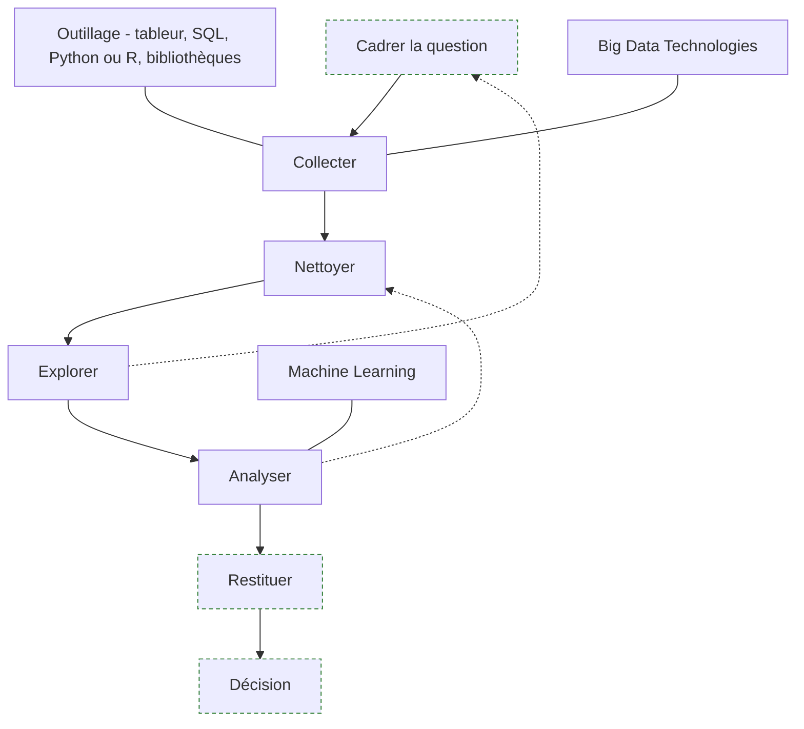

Les flèches en pointillé sont les retours en arrière, et ils sont la norme : l'exploration reformule la question, l'analyse renvoie au nettoyage. Une mission d'analyse qui se déroule en ligne droite est une mission où personne n'a regardé les données.

---

## 1. Le métier et ses quatre questions

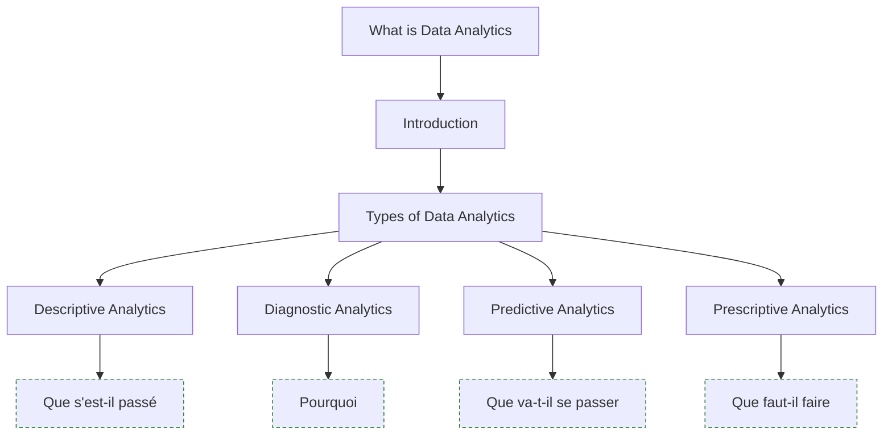

**À quoi ça sert.** Les quatre types d'analytique ne sont pas quatre niveaux de sophistication qu'on gravit, contrairement à ce que laisse entendre la présentation habituelle en escalier. Ce sont quatre questions différentes, et la seule chose utile qu'elles apportent est un test de cadrage : avant de commencer, savoir laquelle des quatre on vous pose. La confusion la plus fréquente et la plus coûteuse est de répondre au descriptif quand on attendait du diagnostic — livrer un tableau de bord des résiliations à quelqu'un qui demandait pourquoi elles ont augmenté. Le tableau est juste, il ne répond pas.

En pratique le Data Analyst vit sur les deux premières questions, occasionnellement sur la troisième, presque jamais sur la quatrième. Le prescriptif — moteurs de recommandation, tarification dynamique, optimisation — est un métier d'ingénierie, pas d'analyse.

**Ce qu'il faut savoir**

- Descriptif : ce qui s'est passé. Un chiffre, une évolution, une répartition. C'est la moitié des demandes réelles et ce n'est pas dévalorisant.
- Diagnostic : pourquoi. C'est là que se trouve la valeur du métier, et c'est aussi là qu'on se trompe le plus — voir la section 7.
- Prédictif : ce qui va probablement arriver. Une régression ou un modèle simple suffit dans l'immense majorité des cas d'analyste ; au-delà, c'est du travail de data scientist.
- Prescriptif : ce qu'il faut faire. L'analyste y contribue par une recommandation argumentée, pas par un système automatisé.
- Une demande formulée en descriptif cache très souvent une question diagnostique. « Donne-moi le chiffre d'affaires par région » veut presque toujours dire « explique-moi pourquoi une région décroche ».

**Où s'arrête ce métier, et où commencent les voisins**

| Rôle | La question qu'on lui pose | Ce qu'il livre | Où il s'arrête |
|---|---|---|---|
| Business Analyst | « Notre facturation coince, où ? » | un diagnostic de processus, des exigences | ne manipule pas la donnée lui-même |
| **Data Analyst** | « Pourquoi les résiliations ont-elles bondi en mars ? » | une réponse chiffrée, datée, argumentée, avec ses limites | ne met rien en production, ne maintient rien |
| BI Analyst | « Tout le monde doit pouvoir suivre les résiliations » | un modèle de données, des métriques partagées, un rapport qui tourne seul | ne traite pas les questions ponctuelles |
| Data Scientist | « Peut-on prédire qui va résilier ? » | un modèle évalué sur des données non vues, un protocole | ne répond pas à la question d'hier après-midi |
| Data Engineer | « D'où viennent ces données, pourquoi ont-elles trois heures de retard ? » | des flux fiables et documentés | ne produit pas d'analyse |

La frontière avec le Data Scientist n'est pas une frontière d'outils — les deux écrivent du Python, les deux font des régressions. Elle est dans la nature du livrable. L'analyste livre **une réponse** sur un périmètre et une période donnés ; il optimise le délai et l'explicabilité, et son travail est fini quand quelqu'un décide. Le scientifique livre **un artefact qui généralise** ; il optimise la performance sur des données jamais vues, et son travail commence à l'évaluation. Le détail du second parcours est dans [[02 - Roadmap — AI and Data Scientist]].

> [!tip] Ajout 2026
> Le titre « Data Analyst » recouvre désormais trois postes distincts sur le marché francophone : l'analyste ad hoc rattaché à une direction métier (le vrai sujet de cette note), l'analyste-développeur de rapports qui fait en réalité de la BI, et l'*analytics engineer* qui construit des modèles dbt et ne parle à personne. Lis les missions décrites dans l'offre, pas l'intitulé — et si l'offre parle d'entrepôt, de dbt et de couche sémantique, c'est [[parcours/bi-analyst/index|BI Analyst]] qu'il faut lire.

> [!warning] Piège
> Accepter une demande sans savoir quelle décision elle sert. Une analyse qui ne change aucune action est du travail propre et inutile, et elle consomme le temps qu'on aurait mis sur la question suivante. Le réflexe qui protège : demander « et si le chiffre sort dans l'autre sens, qu'est-ce que tu fais ? ». Si la réponse est « rien », l'analyse n'a pas lieu d'être.

---

## 2. L'outillage — le socle, et ce qu'il ne fait pas

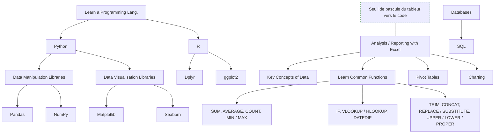

**À quoi ça sert.** La roadmap amont consacre une trentaine de nœuds à l'outillage, dont une vingtaine à des fonctions Excel prises une par une. Ce volume est trompeur : ces outils s'apprennent en quelques semaines et ne distinguent personne. Ce qui distingue, c'est de savoir **quand basculer de l'un à l'autre**. Le tableur est imbattable pour regarder trois mille lignes et comprendre leur forme en dix minutes ; il devient un risque dès que le même traitement doit être refait le mois prochain, parce qu'il n'y a ni trace ni preuve de ce qui a été fait à la main dans la colonne H. SQL est le langage d'accès à la donnée d'entreprise, et il rend inutile 80 % de ce qui se fait péniblement en formules. Python ou R prennent le relais quand l'analyse doit être reproductible, versionnée et relue.

**Ce qu'il faut savoir**

- [[notions/tableur]] — pour l'analyste, la bonne question n'est pas « quelles formules connaître » mais « à quel moment je n'ai plus le droit de rester ici ». Le seuil : dès qu'un résultat devra être régénéré, ou qu'une valeur a été saisie à la main dans un fichier de production.
- [[notions/sql]] — c'est l'outil le plus rentable du métier, avant tout le reste. Côté analyste, l'essentiel tient dans l'agrégation, les jointures, les fonctions de fenêtrage et les sous-requêtes ; l'optimisation et l'administration ne sont pas ton sujet.
- [[notions/python-pour-la-data]] et [[notions/r-et-tidyverse]] — choisis-en un et va au fond. Python si tu dois t'interfacer avec le reste du système d'information, R si ton environnement est statistique ou académique. Savoir bricoler dans les deux ne vaut rien ; maîtriser un des deux vaut beaucoup.
- [[notions/pandas]] — la bibliothèque de manipulation tabulaire côté Python, avec NumPy en dessous. Pour l'analyste, l'enjeu est la lisibilité de l'enchaînement des transformations, pas la performance.
- [[notions/visualisation-de-donnees]] — Matplotlib, Seaborn et ggplot2 sont des moyens. Le choix du graphique est traité en section 8, parce qu'il relève de la restitution et non de l'outil.
- [[notions/outils-decisionnels]] — Tableau, Power BI, Looker. L'analyste les consomme et y publie parfois ; les construire et les gouverner relève de [[parcours/bi-analyst/index|BI Analyst]].

> [!tip] Ajout 2026
> Deux évolutions ont changé l'équilibre. D'un côté, les tableurs ont intégré des moteurs de transformation sérieux (Power Query) et du Python natif, ce qui repousse le seuil de bascule — sans supprimer le problème de fond, qui reste la traçabilité. De l'autre, DuckDB permet de lancer du SQL directement sur des fichiers CSV ou Parquet posés sur un disque, sans serveur ni import : c'est aujourd'hui le chemin le plus court entre un export brut et une réponse, et cela rend obsolète une bonne partie des allers-retours tableur-base.

> [!warning] Piège
> Confondre maîtrise de l'outil et maîtrise du métier. On voit régulièrement des profils capables d'écrire une requête fenêtrée de quarante lignes qui livrent un chiffre faux parce que la table contient des doublons de réplication. L'outil ne pose aucune question sur la donnée — c'est ton travail, et c'est tout l'objet des sections qui suivent.

---

## 3. Cadrer la question avant de toucher la donnée

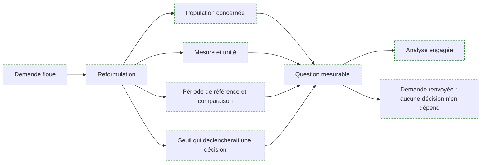

**À quoi ça sert.** C'est la section que la roadmap amont n'a pas, et c'est celle qui sépare un analyste d'un exécutant de requêtes. Une demande arrive presque toujours sous une forme inexploitable : « les clients sont moins actifs », « on perd de l'argent sur le segment pro », « regarde-moi ça ». Le travail consiste à la transformer en une question qui a une réponse vérifiable : de quels clients parle-t-on exactement, actif veut dire quoi et sur quelle fenêtre, comparé à quoi, et à partir de quel écart quelqu'un fera quelque chose. Ce cadrage prend rarement plus d'une heure et détermine l'essentiel de la valeur du livrable. La méthode générale de recueil et de reformulation est traitée dans [[notions/cadrage-besoin]] ; ce qui est propre à l'analyse, c'est que chaque terme de la question doit devenir une colonne, un filtre ou un seuil avant d'écrire la première requête.

**Ce qu'il faut savoir**

- Quatre éléments rendent une question mesurable : la population (qui est dans le périmètre et qui en sort), la mesure (quelle colonne, quelle unité, quelle agrégation), la période (et à quoi on la compare), le seuil (l'écart à partir duquel on agit).
- Faire valider la définition de la mesure par le demandeur, à l'écrit, avant l'analyse. « Client actif » a autant de définitions que d'interlocuteurs, et la découverte du malentendu au moment de la restitution coûte toute l'analyse.
- Demander la décision visée. Elle détermine la précision requise : un arbitrage budgétaire à 2 M€ ne demande pas la même rigueur qu'un choix de formulation d'e-mail.
- Estimer le coût avant de s'engager, et le dire. Une question qui suppose de reconstituer six mois d'historique à partir de logs n'a pas le même prix qu'un regroupement sur une table existante.
- Savoir refuser, ou plutôt renégocier. Renvoyer une demande dont la réponse ne changera rien est un service rendu, à condition de proposer la question voisine qui, elle, sert à quelque chose.
- Consigner la question cadrée en tête du livrable. C'est ce qui permet, trois mois plus tard, de savoir ce qui avait été mesuré et ce qui ne l'avait pas été.

> [!tip] Ajout 2026
> Un cadrage tient en cinq lignes écrites avant toute requête : la question reformulée, la population, la mesure, la période de comparaison, la décision attendue. Garde ce bloc en tête de notebook et en tête de restitution. C'est le seul artefact du métier qui résiste au temps — les requêtes seront réécrites, le chiffre sera périmé, la question cadrée reste lisible et vérifiable.

> [!warning] Piège
> Partir explorer la donnée « pour voir » avant d'avoir cadré. On trouve toujours quelque chose, et ce quelque chose devient la réponse par construction : on a exploré jusqu'à trouver un écart intéressant, puis on l'a raconté. C'est le même mécanisme que le p-hacking de la section 7, appliqué en amont. Explorer est indispensable, mais après avoir écrit la question, pas à sa place.

---

## 4. Collecter

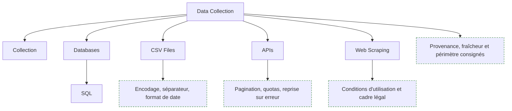

**À quoi ça sert.** L'analyste ne construit pas les flux de données — c'est le métier du Data Engineer — mais il en dépend entièrement et il est le seul à constater leurs défauts, parce qu'il est le premier à regarder le contenu. Collecter, ici, veut dire rapatrier le bon sous-ensemble dans son environnement de travail en sachant précisément d'où il vient, de quand il date et ce qu'il exclut. Ces trois informations conditionnent la validité de tout ce qui suit, et elles ne se retrouvent pas après coup.

**Ce qu'il faut savoir**

- Bases de données via [[notions/sql]] — la source de référence dans presque tous les contextes d'entreprise. Interroger l'entrepôt plutôt que le système de production quand il existe : mêmes données, historisées, sans risque de charge sur un service vivant.
- Fichiers CSV — le format d'échange universel et la première source d'erreurs silencieuses : encodage (UTF-8 contre Latin-1 sur les accents), séparateur (le point-virgule en contexte francophone), séparateur décimal, dates en format américain une ligne sur deux. Impose le type des colonnes à la lecture au lieu de laisser l'inférence décider.
- API — lis la pagination, les quotas et la politique de limitation avant d'écrire la boucle, et conserve la réponse brute avant tout traitement. Une extraction relancée trois jours plus tard ne renvoie pas les mêmes données.
- Web scraping — techniquement accessible, juridiquement encadré. Conditions d'utilisation du site, `robots.txt`, droit des bases de données, et [[notions/rgpd]] dès qu'il y a de la donnée personnelle, ce qui est le cas plus souvent qu'on ne le croit. En entreprise, faire valider avant, pas après.
- Consigner systématiquement trois métadonnées avec l'extraction : la requête ou l'URL exacte, l'horodatage, le nombre de lignes obtenu. C'est ce qui permet de rejouer et d'expliquer un écart entre deux versions du même chiffre.
- Vérifier le volume attendu dès la collecte. Une table de commandes qui rend 4 000 lignes là où le métier en annonce 40 000 signale un filtre implicite, un droit d'accès partiel ou une jointure fautive — et il vaut mieux le voir maintenant.

> [!tip] Ajout 2026
> Adopte Parquet comme format de travail intermédiaire dès que l'extraction dépasse quelques centaines de milliers de lignes : types conservés, compression, lecture par colonne, et lisible directement par DuckDB, Polars et Pandas. Le CSV reste le format d'échange avec les autres humains, il n'a plus à être le format de stockage de ton analyse.

> [!warning] Piège
> L'extraction manuelle refaite à la main tous les mois — un export depuis une interface, un filtre cliqué, un fichier daté à la main. Elle n'est ni rejouable ni vérifiable, et l'écart entre deux mois est impossible à expliquer. Si un chiffre doit ressortir plus d'une fois, la collecte s'écrit en requête ou en script dès la première.

---

## 5. Nettoyer

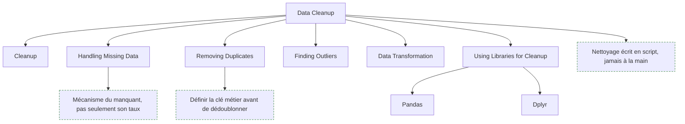

**À quoi ça sert.** C'est la moitié du temps d'une mission et la partie que personne ne voit. Une donnée d'entreprise porte l'histoire de ses systèmes : une migration de 2021 qui a laissé deux conventions de statut, un champ libre rempli par vingt commerciaux avec vingt orthographes, une réplication qui duplique certaines lignes. Nettoyer, ce n'est pas appliquer une recette de suppression des valeurs manquantes : c'est comprendre pourquoi la donnée est dans cet état, puis décider — en le documentant — ce qu'on en fait. Les critères généraux de complétude, fraîcheur, unicité et validité sont dans [[notions/qualite-des-donnees]] ; ce qui est propre à l'analyste, c'est qu'il nettoie **pour une question précise** et qu'il n'a ni le mandat ni les moyens de corriger la source.

**Ce qu'il faut savoir**

- Valeurs manquantes — le taux ne dit rien, le mécanisme dit tout. Un champ vide parce que la question n'a pas été posée, parce que le client a refusé de répondre, ou parce que le système ne l'a pas encore renseigné mènent à trois traitements différents. Souvent la bonne réponse est de créer une modalité « non renseigné » plutôt que d'imputer, car l'absence est elle-même une information.
- Doublons — définis la clé métier avant de dédoublonner. Deux lignes identiques sur toutes les colonnes sont probablement un artefact technique ; deux commandes du même client le même jour sont probablement réelles. `drop_duplicates()` sans clé explicite supprime des faits.
- Valeurs aberrantes — trois origines à distinguer : erreur de saisie (un âge de 300 ans), erreur d'unité (des euros et des centimes dans la même colonne), extrême légitime (un client qui pèse 40 % du chiffre d'affaires). Seule la première se corrige sans discussion ; la troisième ne s'écrête jamais sans l'accord du métier, parce qu'elle porte l'essentiel du signal.
- Transformation — typage, normalisation des libellés, dates en type date et non en chaîne, découpage ou regroupement de modalités. Chaque règle de regroupement est un choix d'analyse et se documente comme tel.
- Outils : [[notions/pandas]] côté Python, dplyr côté [[notions/r-et-tidyverse]]. Le choix compte moins que la règle d'écriture : le nettoyage est un script rejouable depuis la donnée brute, jamais une suite de corrections manuelles sur une copie.
- Conserver la donnée brute intacte et rejouer le nettoyage par-dessus. C'est la seule façon de revenir en arrière quand une règle se révèle fausse au milieu de l'analyse, ce qui arrive.
- Compter les lignes après chaque étape. Une jointure qui fait passer de 50 000 à 63 000 lignes est un défaut de cardinalité, pas un enrichissement — voir le piège de la section 11.

> [!tip] Ajout 2026
> Transforme tes constats de nettoyage en contrôles exécutables plutôt qu'en commentaires : quelques assertions en tête de script — cette colonne n'est jamais nulle, ce montant est positif, cette clé est unique, ce total colle au chiffre officiel du contrôle de gestion. Des bibliothèques comme Pandera ou Great Expectations formalisent cela, mais cinq assertions écrites à la main font déjà le plus gros du travail : elles échouent bruyamment le jour où la source change, au lieu de laisser passer un chiffre faux.

> [!warning] Piège
> Nettoyer en silence. Supprimer 8 % des lignes parce qu'elles sont incomplètes, puis présenter un résultat sans le dire, c'est publier un chiffre sur une population qui n'est pas celle qu'on croit — et les lignes incomplètes sont rarement réparties au hasard. Toute suppression, imputation ou exclusion figure dans la restitution, avec son volume.

---

## 6. Explorer

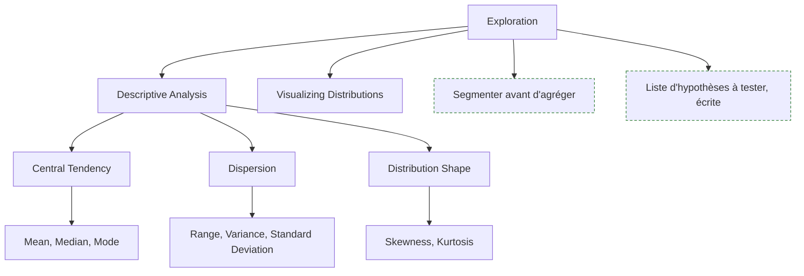

**À quoi ça sert.** L'exploration est le moment où l'on découvre ce que la donnée contient réellement, par opposition à ce que le dictionnaire de données prétend. Elle sert deux objectifs distincts qu'il faut garder séparés : vérifier que les données supportent la question posée, et produire la liste des hypothèses qui seront ensuite testées. Elle ne sert pas à trouver la réponse — si une exploration livre directement la conclusion, c'est presque toujours qu'on a regardé jusqu'à ce qu'elle apparaisse. Le contenu statistique de cette étape — tendance centrale, dispersion, forme de distribution — est dans [[notions/statistiques-descriptives]] ; ce qui est propre à l'analyste, c'est l'ordre dans lequel on regarde et ce qu'on en fait.

**Ce qu'il faut savoir**

- L'ordre qui fait gagner du temps : volumétrie et période couverte, puis taux de remplissage colonne par colonne, puis distribution de chaque variable clé, puis croisements avec la variable qui porte la question.
- Toujours regarder la distribution avant la moyenne. Une moyenne sur une distribution bimodale ou à queue lourde décrit une population qui n'existe pas — le revenu moyen d'une équipe où le dirigeant est compté est le cas d'école.
- Médiane et quartiles par défaut sur les montants, les durées et les délais. Ce sont des grandeurs presque toujours asymétriques, et la médiane répond mieux à la question « un cas typique, c'est quoi ».
- Segmenter avant d'agréger. Un agrégat global masque presque toujours deux populations qui bougent en sens inverse ; c'est le fond du paradoxe de Simpson, traité en section 7.
- Visualiser pour soi, vite et laid : histogramme, boîte à moustaches, nuage de points. Ces graphiques d'exploration ne sont pas ceux de la restitution et n'ont pas à être présentables — voir [[notions/visualisation-de-donnees]] pour ce qui relève de la lecture d'un graphique.
- Écrire la liste des hypothèses au fil de l'exploration, avec pour chacune ce qu'on s'attend à observer si elle est vraie. C'est ce qui rend la section suivante honnête.

> [!tip] Ajout 2026
> Le profilage automatique fait gratuitement la première heure : distributions, taux de manquants, cardinalités, corrélations en une commande, que ce soit avec un outil dédié ou les résumés natifs de Polars et DuckDB. Le gain réel n'est pas le temps économisé, c'est l'exhaustivité — un humain pressé regarde les cinq colonnes qui l'intéressent et rate la sixième qui invalide l'analyse.

> [!warning] Piège
> Prendre une découverte d'exploration pour un résultat. Un écart repéré en regardant vingt croisements a de bonnes chances d'être du bruit : sur vingt comparaisons indépendantes, une au seuil de 5 % sort par pur hasard. Ce qui est trouvé en explorant est une hypothèse, et une hypothèse se confirme sur d'autres données ou sur une autre période — pas sur celles qui l'ont suggérée.

---

## 7. Analyser — corrélation, test, régression

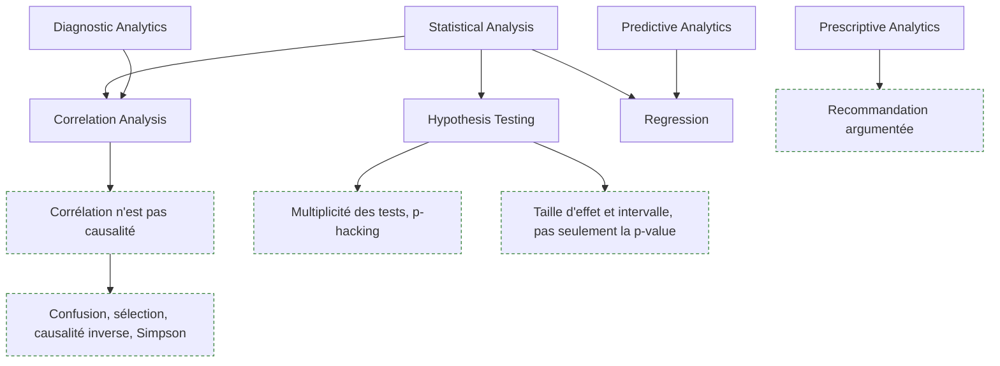

**À quoi ça sert.** C'est le cœur diagnostique du métier : passer d'un constat à une explication défendable. Les trois outils de l'amont se répartissent clairement. La corrélation mesure qu'un lien existe et rien d'autre — voir [[notions/analyse-correlation]]. Le test d'hypothèse dit si un écart observé est compatible avec le hasard — voir [[notions/tests-hypotheses]]. La régression quantifie la relation en tenant compte de plusieurs facteurs à la fois — [[notions/regression-lineaire]] pour une grandeur continue, [[notions/regression-logistique]] pour un oui-non comme la résiliation ou la fraude. Quand la question porte sur l'effet d'une action qu'on contrôle, le protocole expérimental reste la seule réponse propre : [[notions/ab-testing]].

Ce qui est propre à l'analyste, c'est qu'on lui demandera systématiquement de conclure au-delà de ce que ces outils permettent. La compétence n'est pas de calculer un coefficient, c'est de savoir jusqu'où on peut aller et de le dire.

**Ce qu'il faut savoir**

- La corrélation établit un lien, jamais un sens ni une cause. Quatre explications concurrentes existent toujours : le lien causal supposé, la causalité inverse, une variable de confusion qui agit sur les deux, et la coïncidence.
- La variable de confusion est le cas majoritaire en entreprise, et elle est souvent le temps ou la taille. Les clients qui utilisent la fonctionnalité résilient moins — parce que la fonctionnalité fidélise, ou parce que les clients déjà engagés sont ceux qui l'activent.
- Le contrôle anti-Simpson : recalculer tout écart agrégé segment par segment avant de le publier, une tendance globale pouvant s'inverser dans chaque sous-groupe. C'est le contrôle le moins cher et le plus rentable du métier, et il tient en une ligne de code.
- Les deux lectures à ne jamais faire devant un décideur : présenter une p-value comme la probabilité que l'hypothèse soit vraie, et traduire « non significatif » par « pas d'effet ». La mécanique du test est dans la notion ; ce qui t'engage, c'est que sur de gros volumes tout finit par être significatif — présente donc la taille d'effet et sa fourchette, ce sont elles qui portent la décision.
- Multiplicité : tester vingt segments jusqu'à en trouver un qui « sort » produit un faux positif par construction. Fixer les comparaisons avant de les faire, ou corriger le seuil, ou présenter le résultat comme une piste à confirmer.
- Régression : les coefficients se lisent « toutes choses égales par ailleurs parmi les variables incluses ». La variable non incluse ne s'annule pas, elle se cache dans les autres coefficients.
- Sur un lien fort et suspect, chercher d'abord la fuite : une variable calculée après le fait à expliquer. Un modèle qui prédit parfaitement la résiliation à partir du champ « motif de résiliation » n'a rien appris.
- Quand aucun protocole expérimental n'est possible — le cas le plus fréquent —, le bon livrable n'est pas une conclusion causale prudente, c'est une conclusion corrélationnelle assumée plus la liste explicite des explications alternatives qu'on n'a pas pu écarter.

> [!tip] Ajout 2026
> Deux réflexes qui valent tout un cours d'inférence causale. Le premier : pour chaque lien que tu t'apprêtes à présenter, écrire à voix haute les trois explications concurrentes et dire laquelle tu as éliminée et comment. Le second : chercher une rupture — un changement de tarif, une migration, une ouverture de marché — et comparer avant et après sur un groupe non touché. Ce n'est pas une expérience contrôlée, mais c'est infiniment plus solide qu'un coefficient de corrélation, et c'est à la portée d'un analyste sans appareillage économétrique.

> [!warning] Piège
> Livrer une phrase causale parce que c'est ce qu'on attendait de toi. « La campagne a fait progresser les ventes de 12 % » est presque toujours faux au sens strict : la campagne a eu lieu pendant que les ventes progressaient de 12 %. La formulation honnête — « les ventes ont progressé de 12 % sur la période de la campagne ; sur le segment non exposé elles ont progressé de 7 % » — est plus longue, moins flatteuse, et c'est la seule que tu pourras défendre six mois plus tard quand la campagne suivante ne produira rien.

---

## 8. Restituer

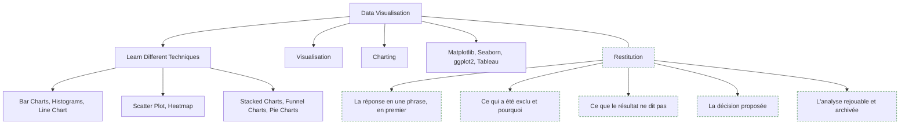

**À quoi ça sert.** C'est l'étape sur laquelle le métier est jugé, et celle que la roadmap amont réduit à un catalogue de types de graphiques. Restituer n'est pas montrer ce qu'on a fait : c'est mettre quelqu'un en position de décider. Le critère de réussite est net — la personne en face sait ce qu'elle doit faire et ce qu'elle risque en le faisant. Une analyse impeccable mal restituée ne produit aucune décision, donc aucune valeur ; c'est la principale cause de frustration du métier, et elle est entièrement sous ta responsabilité. Le choix du graphique relève de [[notions/visualisation-de-donnees]] et la publication dans un outil partagé de [[notions/outils-decisionnels]] ; ce qui suit est la part que personne d'autre ne fera à ta place.

**Ce qu'il faut savoir**

- La réponse en premier, en une phrase, avec son chiffre. Pas la méthode, pas le contexte, pas le cheminement. Le raisonnement vient après, pour ceux qui contestent — et ils existent.
- Un livrable, un message. Si l'analyse porte trois conclusions, ce sont trois blocs distincts avec chacun sa recommandation, pas une planche unique où le lecteur choisit ce qu'il voit.
- Annoncer le périmètre et les exclusions dans la restitution elle-même, pas en annexe : la période, la population, les lignes écartées et leur volume. C'est ce qui rend le chiffre opposable.
- Dire explicitement ce que le résultat ne permet pas de conclure. C'est contre-intuitif et c'est ce qui construit la confiance : un analyste qui ne dit jamais « je ne sais pas » finit par n'être cru sur rien.
- Donner l'ordre de grandeur de l'incertitude, en langage de décideur : une fourchette, une plage de scénarios, pas un intervalle de confiance à 95 % qui sera mal lu.
- Proposer une décision, même si elle sera écartée. Un analyste qui livre un constat sans recommandation laisse l'interprétation au plus bavard de la réunion.
- Adapter le niveau, pas le contenu. Le comité de direction reçoit la conclusion et l'ordre de grandeur, l'équipe métier reçoit le détail par segment, et les deux doivent pouvoir remonter à la même requête.
- Archiver le livrable avec la question cadrée, le script et la date d'extraction. La question « d'où sort ce chiffre » arrive toujours, et souvent des mois plus tard.

> [!tip] Ajout 2026
> Écris la phrase de conclusion **avant** de construire le moindre graphique, et construis ensuite le graphique qui la démontre. Cela supprime d'un coup les deux défauts les plus répandus de la restitution : la planche de douze visualisations sans hiérarchie, et le graphique joli qui n'appuie aucune affirmation. Si la phrase ne s'écrit pas, l'analyse n'est pas finie — ce n'est pas un problème de restitution.

> [!warning] Piège
> Livrer un tableau de bord quand on attendait une réponse. C'est la dérobade classique : au lieu de conclure, on donne des filtres et on laisse le lecteur trouver. Cela déplace la charge d'interprétation sur quelqu'un de moins bien placé pour l'assumer, et cela fabrique en prime un objet que personne ne maintiendra. Si le besoin est réellement un suivi récurrent, ce n'est pas une analyse ad hoc : c'est une commande pour [[parcours/bi-analyst/index|BI Analyst]], et il faut le dire.

---

## 9. Le machine learning à sa juste place

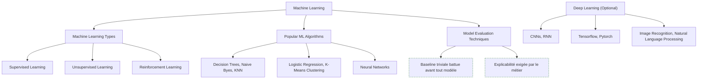

**À quoi ça sert.** L'amont consacre une quinzaine de nœuds au machine learning et au deep learning, ce qui est disproportionné pour ce métier : un analyste applique des modèles, il n'en construit pas, et l'essentiel de sa valeur se situe avant le modèle. Ce qu'il faut en retenir tient en une question de cadrage : le problème est-il de **comprendre** ou de **prédire** ? Si c'est comprendre, une segmentation propre et une régression lisible battent tout le reste, parce qu'elles produisent une phrase qu'un directeur peut répéter. Si c'est prédire, à volume et à enjeu sérieux, le sujet change de métier et passe au data scientist — voir [[02 - Roadmap — AI and Data Scientist]].

L'usage réellement rentable pour un analyste est étroit et bien identifié : la classification supervisée sur un oui-non métier, le regroupement non supervisé pour dégrossir une segmentation, et rien de plus la plupart du temps.

**Ce qu'il faut savoir**

- [[notions/apprentissage-supervise]] — pour l'analyste : prédire une étiquette connue (résiliation, impayé, requalification). La régression logistique reste le premier choix, parce qu'elle donne des coefficients qu'on peut expliquer.
- [[notions/apprentissage-non-supervise]] — le clustering sert à proposer une segmentation, pas à la trancher. Une segmentation statistique qu'aucun responsable métier ne reconnaît ne sera jamais utilisée, quelle que soit sa qualité mathématique.
- [[notions/apprentissage-par-renforcement]] — hors du périmètre de l'analyste, cité par l'amont pour l'exhaustivité. Le connaître suffit à ne pas le confondre avec le supervisé en réunion.
- [[notions/metriques-evaluation-ml]] — la métrique se choisit avec le métier avant d'entraîner quoi que ce soit, parce qu'elle encode un arbitrage entre faux positifs et faux négatifs qui n'est pas une décision technique.
- Algorithmes courants — arbres de décision, Naive Bayes, k plus proches voisins, k-moyennes, régression logistique. Un arbre peu profond est souvent le meilleur livrable d'analyste : moins performant, immédiatement lisible, et il produit des règles que le métier peut appliquer à la main.
- [[notions/reseaux-de-neurones]] et le deep learning — TensorFlow, PyTorch, reconnaissance d'images, traitement du langage. Sur données tabulaires, qui sont ton quotidien, un modèle à base d'arbres bien réglé reste à l'état de l'art : le deep learning ne se justifie que sur texte, image ou son.
- [[notions/traitement-langage-naturel]] — le seul volet deep learning qui touche vraiment l'analyste, par ce qu'il permet sur les verbatims clients : classification thématique, détection de sujets, analyse de sentiment. Depuis 2024, un appel à un modèle de langage fait ce travail sans entraînement préalable.
- Toujours établir une référence triviale avant de modéliser : la moyenne, la valeur de la période précédente, la règle métier existante. Un modèle qui ne bat pas cette référence n'a aucune raison d'exister, et cela arrive plus souvent qu'on ne le publie.

> [!tip] Ajout 2026
> L'analyse de verbatims est le cas où le rapport valeur sur effort a le plus changé. Classer dix mille commentaires par thème demandait un corpus annoté et un modèle entraîné ; cela demande aujourd'hui une grille de catégories écrite avec le métier, un appel par lot à un modèle de langage, et une vérification manuelle sur un échantillon de deux cents cas pour mesurer le taux d'erreur. L'étape de vérification n'est pas optionnelle : sans elle, tu publies une répartition dont tu ignores la fiabilité.

> [!warning] Piège
> Sortir un modèle pour répondre à une question descriptive. La demande « quels clients risquent de partir » se traite neuf fois sur dix par trois indicateurs de comportement et un seuil convenu avec le métier — livrable en deux jours, compris par tout le monde, actionnable immédiatement. Le modèle de churn arrive trois semaines plus tard, obtient une AUC honorable, et personne ne s'en sert parce qu'il ne dit pas quoi faire du client identifié.

---

## 10. Le passage à l'échelle

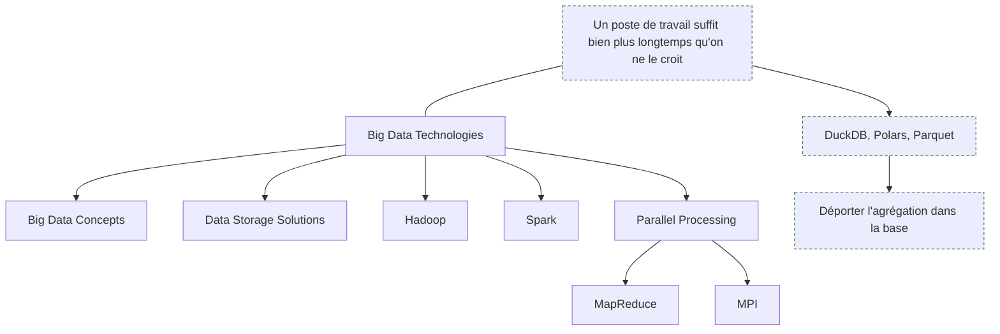

**À quoi ça sert.** L'amont place ici Hadoop, Spark, MapReduce et MPI. C'est la partie de la roadmap qui a le plus mal vieilli pour ce métier : MPI relève du calcul scientifique haute performance et n'a rien à faire dans un parcours d'analyste, et MapReduce n'a plus d'intérêt qu'historique. Ce qui reste utile est le principe — quand la donnée ne tient plus sur une machine, le calcul se distribue et l'ordre des opérations devient déterminant pour le coût. Ce qu'il faut surtout savoir, c'est **à partir de quand** le sujet se pose, et la réponse a beaucoup bougé : un poste de travail courant traite aujourd'hui plusieurs dizaines de millions de lignes en mémoire sans effort particulier.

**Ce qu'il faut savoir**

- Le premier réflexe n'est pas de distribuer, c'est de ne pas rapatrier. Agréger, filtrer et joindre dans la base avec [[notions/sql]], puis descendre un résultat de quelques milliers de lignes. La plupart des problèmes de volume sont des problèmes de requête.
- DuckDB et Polars couvrent l'essentiel du reste : SQL ou manipulation tabulaire sur des fichiers de plusieurs gigaoctets, sur un seul poste, sans infrastructure. C'est la réponse par défaut en 2026 quand Pandas sature.
- Spark garde son intérêt sur des volumes réellement distribués ou quand c'est le socle imposé par l'entreprise, généralement via PySpark. L'écrire soi-même depuis rien n'arrive presque jamais dans ce métier.
- Les trois V (volume, vélocité, variété) sont un vocabulaire de réunion, utile pour se comprendre, sans conséquence technique directe.
- Le stockage — systèmes de fichiers distribués, stockage objet, formats colonnes. Ce qui te concerne réellement : Parquet, parce qu'il divise les temps de lecture et conserve les types.
- Le coût du calcul distribué est désormais aussi un coût facturé. Sur un entrepôt cloud, une requête mal écrite se paie à l'octet scanné ; regarder ce que coûte une requête fait partie du métier.

> [!tip] Ajout 2026
> Avant d'invoquer le passage à l'échelle, mesure. Charge les colonnes utiles au lieu de la table entière, convertis en Parquet, et refais le test. La grande majorité des « il faut du Spark » observés sur le terrain sont un `SELECT *` sur une table large, un type mal choisi, ou une jointure faite côté client alors que la base l'aurait faite. L'infrastructure distribuée ajoute un coût permanent d'exploitation pour résoudre un problème qui dure dix minutes.

> [!warning] Piège
> Prendre le volume de données de l'entreprise pour le volume de son analyse. Une table de logs de plusieurs téraoctets ne signifie pas que l'analyse porte sur des téraoctets : la question concerne le plus souvent trois mois, deux colonnes et un segment. Formuler le périmètre avant de regarder la taille de la table évite un chantier d'infrastructure entier.

---

## 11. Ce que l'IA générative a changé au métier — et ce qu'elle n'a pas changé

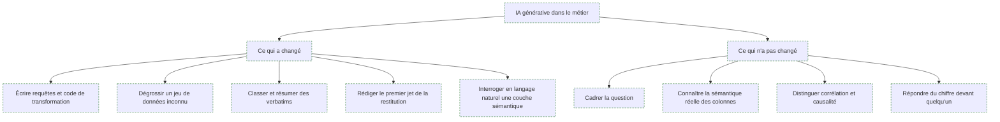

**À quoi ça sert.** La roadmap amont n'en dit presque rien, alors que c'est le changement le plus visible du métier sur les deux dernières années. Le constat de terrain est stable : l'IA générative a fortement accéléré la partie **fabrication** du travail d'analyse, et n'a rien changé à la partie **jugement**. Écrire une requête, retrouver la syntaxe d'une fonction de fenêtrage, réécrire une boucle Pandas illisible, produire un premier jet de note de synthèse : ce temps-là a été divisé par deux ou trois. Cadrer une question ambiguë, savoir que la colonne `statut` porte deux conventions depuis une migration, refuser une conclusion causale, assumer un chiffre devant un comité : ce temps-là est identique, et il représente désormais une part bien plus grande du métier.

La conséquence pratique est un déplacement du niveau d'exigence, pas une disparition du poste. La production de requêtes n'est plus un facteur de différenciation ; la qualité du cadrage et de la restitution l'est devenue davantage. Les profils les plus exposés sont ceux dont le travail consistait à exécuter des demandes déjà formulées.

**Ce qu'il faut savoir**

- Génération de requêtes et de code — le gain le plus net, à condition de fournir le schéma et de relire. Un modèle qui ne connaît pas tes tables invente des noms de colonnes plausibles ; un modèle à qui tu donnes le schéma produit du SQL correct la plupart du temps. Voir [[notions/assistants-de-codage]].
- Exploration assistée — décrire un jeu de données inconnu, proposer les croisements à regarder, repérer les colonnes suspectes. Utile pour dégrossir, jamais pour conclure.
- Analyse de verbatims et de champs libres — le cas où le gain est le plus fort, traité en section 9.
- Rédaction — un premier jet de restitution à partir de tes résultats, que tu réécris. Le modèle ne sait pas quelle conclusion tu es prêt à défendre.
- Interrogation en langage naturel — cela fonctionne quand une couche sémantique définit les métriques, et échoue quand on la branche sur des tables brutes, parce que le modèle n'a aucun moyen de savoir laquelle des quatre colonnes de montant est la bonne. Construire cette couche est le travail de [[parcours/bi-analyst/index|BI Analyst]] ; c'est ce qui explique que le même outil soit jugé excellent dans une entreprise et inutilisable dans une autre.
- Confidentialité — un extrait de base client ne se colle pas dans un service grand public. Vérifie ce que ton entreprise autorise, et à quel niveau de donnée ; [[notions/rgpd]] s'applique intégralement à ce geste-là.
- Ce que cela ne remplace pas : la connaissance du terrain. Savoir que les commandes de juillet 2024 sont dupliquées à cause d'une reprise de données est une information qui ne se trouve dans aucun modèle, et c'est le cœur de ta valeur.

> [!tip] Ajout 2026
> La bonne division du travail est stable : tu écris la question cadrée et les contrôles, le modèle écrit le code, tu vérifies le résultat contre un chiffre que tu connais déjà. Ce dernier point est la seule protection qui fonctionne — avant de publier un résultat produit avec assistance, recalcule un total que tu peux confronter à une source indépendante, un rapport officiel ou un ordre de grandeur connu du métier.

> [!warning] Piège
> Le SQL plausible qui s'exécute et qui est faux. C'est le mode d'échec dominant, et il est silencieux : une jointure sur une clé non unique multiplie les lignes et gonfle un total de 30 % sans lever la moindre erreur. Le code généré ne bloque pas, il répond. Prends le réflexe de compter les lignes avant et après chaque jointure, et de comparer un agrégat à une valeur connue — c'est exactement le contrôle qu'un analyste faisait déjà avant, et qui est devenu obligatoire.

---

## Parcours conseillé

| Ordre | Étape | Effort | À viser |
|---|---|---|---|
| 1 | SQL | ~3 semaines | Agréger, joindre, fenêtrer sur une base réelle sans aide |
| 2 | Tableur | ~1 semaine | Savoir surtout à quel moment il ne suffit plus |
| 3 | Un langage, Python ou R | ~6 semaines | Une analyse complète en script rejouable de bout en bout |
| 4 | Statistiques descriptives et distributions | ~3 semaines | Regarder une distribution avant de citer une moyenne |
| 5 | Cadrage de la question | continu | Cinq lignes écrites et validées avant toute requête |
| 6 | Collecte et nettoyage | ~4 semaines | Nettoyage scripté, assertions en tête, rien fait à la main |
| 7 | Tests, corrélation, régression | ~6 semaines | Énoncer trois explications concurrentes d'un lien observé |
| 8 | Visualisation et restitution | ~4 semaines | Une phrase de conclusion, un graphique qui la démontre |
| 9 | Machine learning appliqué | ~4 semaines | Une régression logistique évaluée honnêtement, et sa baseline |
| 10 | Volumes et formats colonnes | ~2 semaines | DuckDB ou Polars sur un fichier qui excède la mémoire |
| 11 | IA générative dans le flux de travail | continu | Gagner en vitesse sans perdre le contrôle du chiffre |

Six à neuf mois pour être opérationnel en travaillant à côté, et l'ordre compte : SQL en premier parce qu'il conditionne l'accès à tout le reste. Les étapes 5 et 8 — cadrer et restituer — ne s'apprennent qu'en situation réelle et ne figurent dans aucune certification ; ce sont elles qui décident de la trajectoire, pas la maîtrise d'une bibliothèque.

---

## Parcours voisins

- [[parcours/bi-analyst/index|BI Analyst]] — le métier jumeau, côté infrastructure décisionnelle : entrepôt, modélisation dimensionnelle, dbt, couche sémantique, gouvernance. Quand une demande devient un suivi récurrent partagé, elle bascule là.
- [[02 - Roadmap — AI and Data Scientist]] — la suite naturelle pour qui veut aller vers la modélisation et la généralisation. La frontière est détaillée en section 1.
- [[parcours/data-engineer/index|Data Engineer]] — l'amont : d'où viennent les tables, pourquoi elles arrivent en retard, et à qui parler quand elles sont fausses.
- [[04 - Roadmap — Machine Learning]] — l'approfondissement de la section 9 pour qui décide d'y aller sérieusement.
- [[parcours/ai-engineer/index|AI Engineer]] — la voie applicative si l'analyse de verbatims donne envie de construire des produits sur des modèles de langage.

## Pour aller plus loin

- *Practical Statistics for Data Scientists* — Peter Bruce, Andrew Bruce, Peter Gedeck. Le pont le mieux calibré entre statistique et pratique de l'analyse.
- *Python for Data Analysis* — Wes McKinney, l'auteur de Pandas. Référence directe pour l'étape 3, disponible en ligne.
- *R for Data Science* — Wickham, Çetinkaya-Rundel, Grolemund. L'équivalent côté R, gratuit sur r4ds.hadley.nz.
- *Python Data Science Handbook* — Jake VanderPlas, cité par la roadmap amont et lisible librement sur jakevdp.github.io.
- *Storytelling with Data* — Cole Nussbaumer Knaflic. Le livre le plus directement rentable du métier pour l'étape 8.
- *Fundamentals of Data Visualization* — Claus Wilke. Le versant technique du précédent : quel graphique pour quelle donnée, et pourquoi. Libre sur clauswilke.com/dataviz.
- *The Book of Why* — Judea Pearl et Dana Mackenzie. Pour comprendre ce qu'un coefficient de corrélation ne dira jamais.
- *How to Lie with Statistics* — Darrell Huff. Écrit en 1954, toujours la meilleure heure de lecture pour repérer les graphiques trompeurs, y compris les siens.
