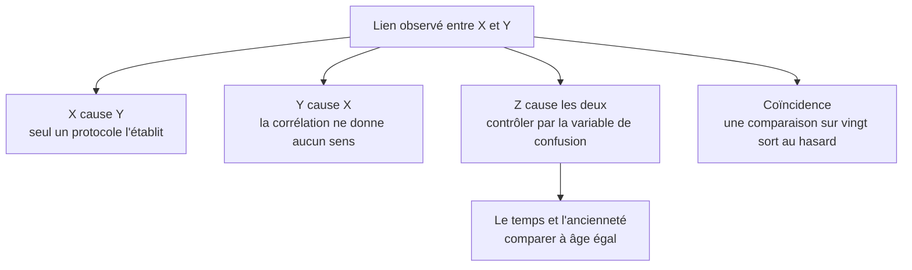

Niveau attendu : **référence**. Nommer les quatre explications concurrentes devant un décideur pressé est la compétence qui définit le métier, et la seule chose qui empêche l'entreprise de conclure trop vite.

La corrélation établit qu'un lien existe, jamais son sens ni sa cause. Quatre explications concurrentes subsistent toujours, et la compétence du métier consiste à dire laquelle on a écartée, et comment.

## Ce qu'il faut savoir faire

- Énoncer les quatre explications concurrentes pour chaque lien que l'on s'apprête à présenter, et dire laquelle on a éliminée et par quel moyen. C'est un exercice de deux minutes qui change la nature du livrable.
- Reconnaître la variable de confusion, cas majoritaire en entreprise, et souvent le temps ou la taille. Les clients qui utilisent la fonctionnalité résilient moins — parce qu'elle fidélise, ou parce que les clients déjà engagés sont ceux qui l'activent.
- Repérer l'effet de sélection : la population observée n'est pas la population d'intérêt. Les clients qui ont répondu à l'enquête ne sont pas les clients, et les dossiers qui sont allés au bout ne sont pas les dossiers.
- Chercher la fuite avant de se réjouir d'un lien fort et suspect : une variable calculée après le fait à expliquer. Un modèle qui prédit parfaitement la résiliation à partir du champ « motif de résiliation » n'a rien appris.
- Livrer une conclusion corrélationnelle assumée, accompagnée de la liste explicite des explications alternatives non écartées, quand aucun protocole n'est possible — ce qui est le cas le plus fréquent. C'est plus solide qu'une conclusion causale prudente.
- Chercher une rupture exploitable — changement de tarif, migration, ouverture de marché — et comparer avant et après sur un groupe non touché. Ce n'est pas une expérience contrôlée, c'est infiniment plus solide qu'un coefficient.

## Les notions mobilisées

- [[notions/analyse-correlation]] — la mécanique du coefficient et ses pièges ; ce qui est propre à l'analyste, c'est de savoir où s'arrêter.
- [[notions/ab-testing]] — la seule réponse propre sur l'effet d'une action qu'on contrôle, quand elle est possible.
- [[notions/regression-lineaire]] — contrôler par une variable observée est la parade la plus accessible à la confusion, et elle reste partielle.
- [[notions/analyse-de-cohorte]] — comparer à âge égal élimine d'un coup la confusion par l'ancienneté, la plus répandue de toutes.

> [!warning] Piège
> Livrer une phrase causale parce que c'est ce qu'on attendait de vous. « La campagne a fait progresser les ventes de 12 % » est presque toujours faux au sens strict : la campagne a eu lieu pendant que les ventes progressaient de 12 %. La formulation honnête — « les ventes ont progressé de 12 % sur la période ; sur le segment non exposé elles ont progressé de 7 % » — est plus longue, moins flatteuse, et la seule défendable six mois plus tard.

## Pour apprendre

- [Correlation vs. Causation](https://www.scribbr.com/methodology/correlation-vs-causation/) — court, correct, à garder sous la main pour les réunions.
- [The Effect](https://theeffectbook.net/) — Nick Huntington-Klein, libre en ligne : l'inférence causale expliquée à des gens qui font de l'analyse, pas de l'économétrie théorique.
- [Causal Inference: The Mixtape](https://mixtape.scunning.com/) — Scott Cunningham, libre : la comparaison avant-après sur groupe témoin, avec le code.
- [Spurious Correlations](https://www.tylervigen.com/spurious-correlations) — la démonstration par l'absurde, utile pour faire comprendre le problème en dix secondes.
