Le cœur diagnostique du métier : passer d'un constat à une explication défendable. On vous demandera systématiquement de conclure au-delà de ce que les outils permettent — la compétence est de savoir jusqu'où on peut aller et de le dire.

## Les six sujets

```mermaid
flowchart TD
  C["Corrélation et causalité<br/>quatre explications concurrentes, toujours"]
  T["Tester une hypothèse<br/>ce que la p-value ne dit pas"]
  M["La multiplicité des tests<br/>vingt segments, un faux positif"]
  R["La régression<br/>toutes choses égales parmi les variables incluses"]
  E["Le protocole expérimental<br/>la seule réponse propre sur l'effet d'une action"]
  D["L'évolution dans le temps<br/>saisonnalité, cohortes, effet de composition"]

  click C "/parcours/data-analyst/analyser/correlation-et-causalite"
  click T "/parcours/data-analyst/analyser/tester-une-hypothese"
  click M "/parcours/data-analyst/analyser/la-multiplicite-des-tests"
  click R "/parcours/data-analyst/analyser/la-regression"
  click E "/parcours/data-analyst/analyser/le-protocole-experimental"
  click D "/parcours/data-analyst/analyser/l-evolution-dans-le-temps"
```

**Porte de sortie** : pour chaque lien présenté, les explications alternatives écartées sont nommées.

## Ma progression

- [ ] [[parcours/data-analyst/analyser/correlation-et-causalite|Corrélation et causalité]] — confusion, causalité inverse, sélection, coïncidence
- [ ] [[parcours/data-analyst/analyser/tester-une-hypothese|Tester une hypothèse]] — taille d'effet et fourchette plutôt que seuil de significativité
- [ ] [[parcours/data-analyst/analyser/la-multiplicite-des-tests|La multiplicité des tests]] — fixer les comparaisons avant de les faire
- [ ] [[parcours/data-analyst/analyser/la-regression|La régression]] — lire un coefficient sans lui faire dire ce qu'il ne dit pas
- [ ] [[parcours/data-analyst/analyser/le-protocole-experimental|Le protocole expérimental]] — et la comparaison avant-après quand il est impossible
- [ ] [[parcours/data-analyst/analyser/l-evolution-dans-le-temps|L'évolution dans le temps]] — distinguer une vraie variation d'une saisonnalité ou d'un effet de composition
