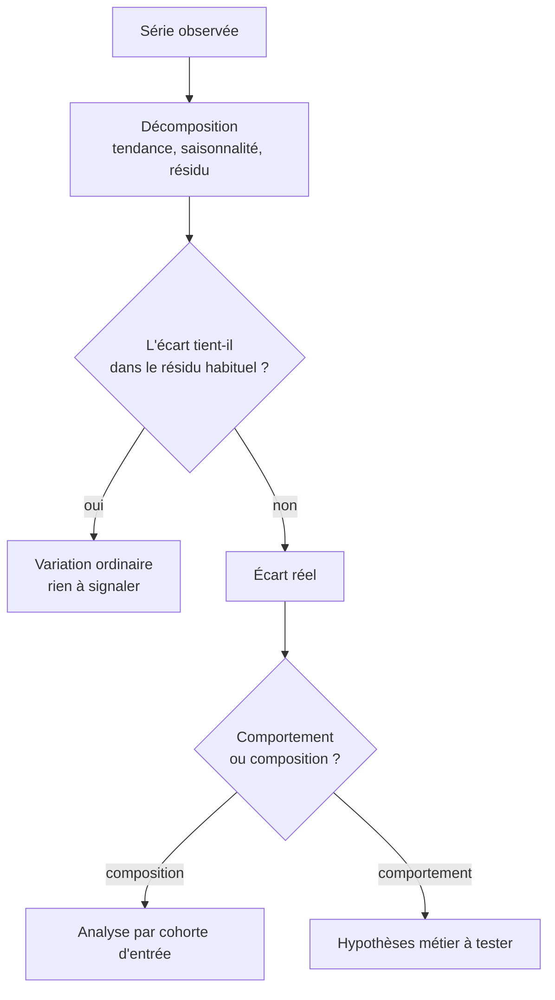

L'essentiel des alertes d'un tableau de bord sont de la saisonnalité mal interprétée. Devant une variation, une seule question compte : est-ce que cela sort de ce qui se passe habituellement à cette période ?

## Ce qu'il faut savoir faire

- Séparer tendance, saisonnalité et résidu avant de commenter une évolution. Une hausse de novembre n'est une information que comparée aux novembres précédents, pas au mois d'octobre.
- Tenir compte des effets de calendrier : nombre de jours ouvrés, jours fériés, décalage des vacances, mois de cinq week-ends. Ils produisent des écarts à deux chiffres qui n'ont aucun contenu métier.
- Comparer à la même période de l'année précédente en premier, et à la période précédente ensuite. L'ordre inverse est la source la plus commune de fausses alertes.
- Distinguer changement de comportement et effet de composition. Un taux de rétention global qui monte parce que le recrutement a ralenti n'est pas une amélioration : la population a vieilli.
- Analyser par cohorte d'entrée dès que l'ancienneté influence la mesure. C'est le seul moyen simple de comparer des groupes ayant le même âge plutôt que la même date.
- Se méfier de la prévision. Une référence naïve — la valeur de l'an dernier à la même période, corrigée de la tendance — bat la plupart des modèles sur les séries d'entreprise, et sert d'étalon obligatoire à tout ce qu'on proposerait de plus sophistiqué.

## Les notions mobilisées

- [[notions/series-temporelles]] — tendance, saisonnalité, résidu, effets de calendrier, et la référence naïve d'une prévision.
- [[notions/analyse-de-cohorte]] — le regroupement par période d'entrée, qui isole l'effet de composition.
- [[notions/statistiques-descriptives]] — l'ampleur de la variation ordinaire se mesure, elle ne s'apprécie pas à l'œil.
- [[notions/regression-lineaire]] — l'ajustement d'une tendance est une régression comme une autre, avec les mêmes précautions de lecture.

> [!warning] Piège
> Comparer deux périodes de longueurs ou de compositions différentes sans le dire : un trimestre à onze semaines de facturation contre un à treize, un mois avec un jour férié de plus, un périmètre qui a gagné une filiale en cours de route. L'écart est alors entièrement mécanique, et il sera présenté comme une performance ou comme une alerte.

## Pour apprendre

- [Introduction to Time Series Analysis (NIST)](https://www.itl.nist.gov/div898/handbook/pmc/section4/pmc4.htm) — la décomposition tendance-saisonnalité-résidu, rigoureusement et gratuitement.
- [Forecasting: Principles and Practice](https://otexts.com/fpp3/) — Hyndman et Athanasopoulos, libre en ligne : la référence du domaine, et la place qu'elle donne aux méthodes naïves.
- [statsmodels — Séries temporelles](https://www.statsmodels.org/stable/tsa.html) — la décomposition et les modèles classiques, directement utilisables.
