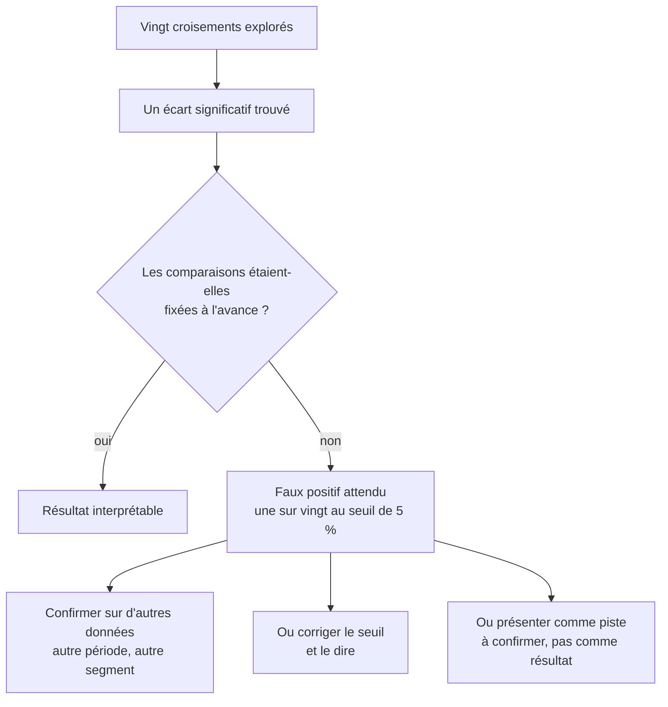

Niveau attendu : **autonomie**. Fixer les comparaisons avant de les faire est une discipline de méthode qu'on applique et qu'on défend, pas une expertise qu'on arbitre.

Tester vingt segments jusqu'à en trouver un qui « sort » produit un faux positif par construction. Sur vingt comparaisons indépendantes, une au seuil de 5 % apparaît par pur hasard — et c'est exactement celle qu'on aura envie de raconter.

## Ce qu'il faut savoir faire

- Fixer les comparaisons avant de les faire, et les écrire. C'est la seule protection qui ne demande aucune technique, et elle règle le problème à la racine.
- Compter les tests réellement effectués, y compris ceux qu'on n'a pas retenus. L'exploration qui a précédé compte : vingt croisements regardés puis un test formel font vingt-et-un tests, pas un.
- Corriger le seuil quand les comparaisons multiples sont assumées, et l'annoncer dans la restitution. La correction rend le résultat plus difficile à obtenir : c'est son objet.
- Présenter comme piste à confirmer, et non comme résultat, ce qui a été trouvé en cherchant. La formulation « ce segment mérite une vérification sur le trimestre suivant » est honnête et reste utile.
- Confirmer sur des données qui n'ont pas servi à formuler l'hypothèse : autre période, autre région, autre source. C'est la parade la plus solide et la moins technique.
- Reconnaître le p-hacking chez les autres sans agressivité : un résultat présenté sans le nombre de comparaisons explorées est incomplet, pas malhonnête. La question « combien de découpages avez-vous regardés » se pose poliment.

## Les notions mobilisées

- [[notions/tests-hypotheses]] — la puissance, le seuil et ce que la répétition leur fait.
- [[notions/ab-testing]] — les tests multiples et l'arrêt anticipé sont les deux façons classiques de fausser un protocole expérimental.
- [[notions/analyse-correlation]] — sur un tableau de corrélations, le nombre de paires explose avec le nombre de colonnes, et avec lui le nombre de faux positifs.
- [[notions/metriques-evaluation-ml]] — la même arithmétique gouverne les faux positifs d'un modèle et ceux d'une campagne de tests.

> [!warning] Piège
> L'arrêt au bon moment. Regarder les résultats chaque semaine et conclure dès que l'écart devient significatif produit un faux positif dans une large part des cas, même sans mauvaise intention. La durée d'observation se fixe à l'avance, au même titre que les comparaisons.

## Pour apprendre

- [Statistics Done Wrong](https://www.statisticsdonewrong.com/) — Alex Reinhart, libre en ligne : le chapitre sur les comparaisons multiples est le plus clair qui existe.
- [Hack Your Way To Scientific Glory](https://projects.fivethirtyeight.com/p-hacking/) — le simulateur interactif : cinq minutes pour comprendre viscéralement le problème.
- [A Refresher on A/B Testing](https://hbr.org/2017/06/a-refresher-on-ab-testing) — la partie sur l'arrêt anticipé, à relire avant chaque test.
