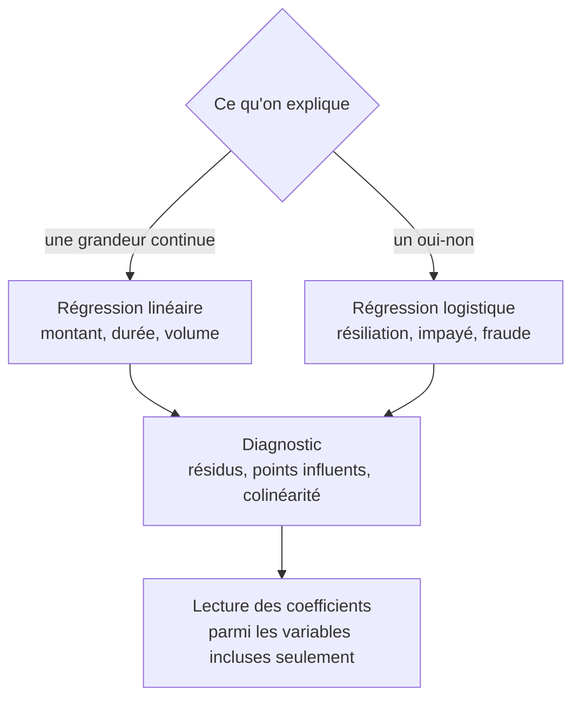

Elle quantifie la relation en tenant compte de plusieurs facteurs à la fois. Ses coefficients se lisent « toutes choses égales par ailleurs **parmi les variables incluses** » — et la variable non incluse ne s'annule pas, elle se cache dans les autres coefficients.

## Ce qu'il faut savoir faire

- Lire un coefficient correctement : l'effet associé à une variable, les autres variables du modèle étant tenues constantes. Ce n'est ni un effet causal, ni un effet total, ni une prédiction individuelle.
- Choisir les variables de contrôle avec le métier, sur la base de ce qui peut influencer les deux côtés du lien. Ajouter toutes les colonnes disponibles n'est pas un contrôle, c'est un mélange dont plus personne ne lit les coefficients.
- Regarder les diagnostics avant les résultats : résidus, points influents, colinéarité. Deux variables quasi identiques se partagent un effet de façon arbitraire et produisent des coefficients instables, parfois de signe opposé.
- Refuser d'inclure une variable postérieure au fait expliqué. C'est la fuite la plus courante, et elle transforme un modèle en tautologie bien ajustée.
- Présenter les coefficients dans l'unité du métier — euros, points de pourcentage, jours — et jamais en unités standardisées devant un décideur.
- Préférer un modèle simple et lisible à un modèle ajusté. Pour un analyste, la valeur du modèle est la phrase qu'il permet de dire, pas le pourcentage de variance expliquée.

## Les notions mobilisées

- [[notions/regression-lineaire]] — moindres carrés, hypothèses et diagnostic : ce que le modèle suppose avant de rendre un chiffre.
- [[notions/regression-logistique]] — le cas du oui-non, et la lecture des rapports de cotes, qui se traduit mal en français de réunion.
- [[notions/analyse-correlation]] — contrôler par une variable observée atténue la confusion, ne l'élimine pas.
- [[notions/apprentissage-supervise]] — la frontière : dès que l'objectif devient la performance sur des données non vues, l'exercice change de métier.

> [!warning] Piège
> Commenter le signe d'un coefficient sans avoir regardé la corrélation entre les variables explicatives. En présence de colinéarité, un coefficient peut sortir avec le signe opposé à ce que le bon sens et les données brutes indiquent — et le commenter tel quel en réunion est difficile à rattraper.

## Pour apprendre

- [A Refresher on Regression Analysis](https://hbr.org/2015/11/a-refresher-on-regression-analysis) — ce qu'un coefficient dit, et surtout ce qu'il ne dit pas.
- [statsmodels](https://www.statsmodels.org/stable/index.html) — la bibliothèque qui rend les diagnostics et les intervalles de confiance directement lisibles, contrairement aux outils orientés prédiction.
- [Common statistical tests are linear models](https://lindeloev.github.io/tests-as-linear/) — comprendre que la plupart des tests classiques sont des régressions simplifie tout le reste.
- [The Effect](https://theeffectbook.net/) — ce qu'un contrôle par variable permet réellement de conclure, et dans quelles conditions.
