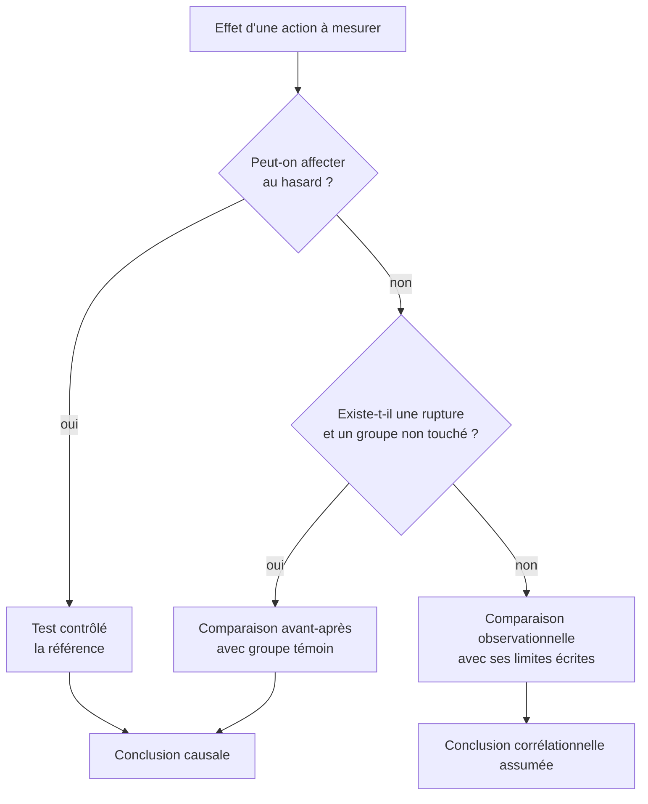

Quand la question porte sur l'effet d'une action qu'on contrôle, l'expérimentation reste la seule réponse propre. Quand elle est impossible — le cas le plus fréquent —, il existe une gradation de solutions de repli, et il faut savoir ce que chacune vaut.

## Ce qu'il faut savoir faire

- Reconnaître la question qui appelle un protocole : toute question sur l'effet d'une action décidée par l'entreprise. Y répondre par une comparaison observationnelle donne un chiffre que le premier contradicteur démontera.
- Fixer avant le lancement la métrique principale, la durée et la taille d'échantillon nécessaire. Ces trois éléments décidés après coup suffisent à invalider un test parfaitement exécuté par ailleurs.
- Vérifier que l'affectation est bien aléatoire et que les deux groupes sont comparables sur les caractéristiques connues. Une affectation « par région » ou « par commercial volontaire » n'est pas un tirage au sort.
- Chercher la rupture exploitable quand le test est impossible : un changement de tarif, une migration, l'ouverture d'un marché, un déploiement progressif. Comparer avant et après sur un groupe non touché est à la portée de tout analyste, sans appareillage.
- Proposer le déploiement progressif comme protocole par défaut. Une mise en service par vagues donne un groupe témoin gratuit, et il suffit de demander à ce que l'ordre des vagues ne soit pas choisi par les équipes elles-mêmes.
- Dire ce que l'expérience ne mesure pas : la durée d'observation courte capte mal les effets différés, et l'effet sur les volontaires n'est pas l'effet sur la population.

## Les notions mobilisées

- [[notions/ab-testing]] — le protocole, les métriques de ratio et la sensibilité ; l'angle analyste est surtout de savoir le réclamer au bon moment.
- [[notions/analyse-correlation]] — ce que le protocole permet d'éliminer, et que rien d'autre n'élimine.
- [[notions/mesure-d-usage-produit]] — quand l'action porte sur un produit, l'instrumentation conditionne la métrique, et elle se prépare avant le test.
- [[notions/analyse-de-cohorte]] — la comparaison à âge égal, indispensable dès que l'effet mesuré dépend de l'ancienneté.

> [!tip] La demande à formuler avant un déploiement
> « Peut-on retenir 10 % du périmètre pendant six semaines ? » C'est la phrase qui transforme rétrospectivement un déploiement en expérience. Elle coûte peu, elle est presque toujours acceptée quand elle est demandée avant, et jamais quand elle est demandée après.

## Pour apprendre

- [A Refresher on A/B Testing](https://hbr.org/2017/06/a-refresher-on-ab-testing) — le rappel de protocole à relire avant chaque test, y compris le dixième.
- [Causal Inference: The Mixtape](https://mixtape.scunning.com/) — la comparaison avant-après avec groupe témoin, expliquée avec le code.
- [The Effect](https://theeffectbook.net/) — la gradation complète des solutions de repli, écrite pour des praticiens.
- [Statistics Done Wrong](https://www.statisticsdonewrong.com/) — les façons ordinaires de rater un protocole, sans mauvaise foi.
