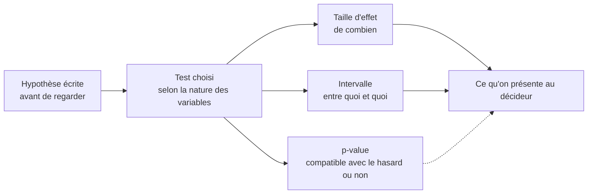

Niveau attendu : **référence**. C'est à l'analyste de corriger la salle sur ce qu'une p-value ne dit pas, et d'imposer taille d'effet et fourchette à la place du seuil.

Le test dit si un écart observé est compatible avec le hasard. Il ne dit ni l'importance de l'écart, ni la probabilité que l'hypothèse soit vraie — et ce sont pourtant les deux lectures qu'on entendra faire de votre résultat.

## Ce qu'il faut savoir faire

- Présenter la taille d'effet et sa fourchette, pas seulement le résultat du test. Sur de gros volumes tout finit par être significatif : ce qui porte la décision est l'ampleur de l'écart, pas son étiquette statistique.
- Ne jamais présenter une p-value comme la probabilité que l'hypothèse soit vraie, et ne jamais traduire « non significatif » par « pas d'effet ». Ce sont les deux erreurs qu'un décideur fera spontanément si on ne l'en empêche pas.
- Choisir le test selon la nature des variables et la forme des données, en s'appuyant sur un arbre de décision plutôt que sur la mémoire. Le mauvais test sur les bonnes données est indétectable dans la sortie.
- Vérifier les hypothèses du test avant de le lire : indépendance des observations surtout, qui tombe dès qu'on mesure plusieurs fois les mêmes individus.
- Dire combien d'observations soutiennent le résultat, et ce que l'étude aurait pu détecter. Un test non significatif sur soixante dossiers ne démontre rien du tout, et il faut le dire ainsi.
- Écrire l'hypothèse avant de regarder les données. Un test appliqué à une hypothèse suggérée par ces mêmes données ne mesure plus rien — c'est le sujet de [[parcours/data-analyst/analyser/la-multiplicite-des-tests]].

## Les notions mobilisées

- [[notions/tests-hypotheses]] — hypothèse nulle, p-value, puissance : la mécanique, qui n'a pas à être réexpliquée ici.
- [[notions/statistiques-descriptives]] — la taille d'effet se lit sur la distribution, pas dans la sortie du test.
- [[notions/ab-testing]] — le cadre où le test est pleinement valide, parce que l'affectation a été maîtrisée.
- [[notions/metriques-evaluation-ml]] — le vocabulaire des faux positifs et faux négatifs, identique à celui des erreurs de première et seconde espèce.

> [!tip] La phrase qui remplace la p-value en restitution
> « Les résiliations sont passées de 4,1 % à 4,8 %, soit environ 340 clients de plus sur le trimestre ; compte tenu du volume, l'écart réel se situe entre 200 et 480. » Elle dit l'ampleur, l'incertitude et l'unité que le décideur manipule. Personne ne demandera jamais la p-value derrière.

## Pour apprendre

- [Choosing the Right Statistical Test](https://www.scribbr.com/statistics/statistical-tests/) — l'arbre de décision qu'on relit avant chaque test.
- [Type I & Type II Errors](https://www.scribbr.com/statistics/type-i-and-type-ii-errors/) — la distinction qu'on croit connaître et qu'on inverse en réunion.
- [Common statistical tests are linear models](https://lindeloev.github.io/tests-as-linear/) — la mise au point qui simplifie durablement la compréhension des tests classiques.
- [OpenIntro Statistics](https://www.openintro.org/book/os/) — les chapitres d'inférence, avec exercices corrigés.
