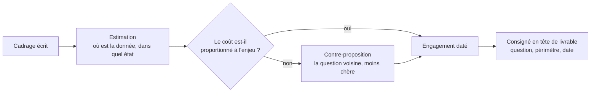

Trois gestes qui tiennent en une demi-heure et qui décident du reste : estimer ce que la demande coûte, la renvoyer ou la déplacer quand elle ne tient pas, et garder la trace de ce qui a été convenu.

## Ce qu'il faut savoir faire

- Estimer avant de s'engager, et dire l'estimation. Le coût d'une analyse tient rarement dans le calcul : il tient dans l'état de la donnée, et cela se vérifie par deux requêtes d'inventaire avant de promettre une date.
- Proposer la question voisine plutôt que de refuser sèchement. Renvoyer une demande sans alternative laisse le demandeur avec son problème ; proposer une version moins chère qui répond à 80 % du besoin fait avancer les deux parties.
- Découper quand la demande est trop grosse : livrer d'abord le descriptif qui existe déjà, puis le diagnostic. Un premier résultat en trois jours change souvent la suite de la demande.
- Consigner la question cadrée en tête du livrable, pas dans un fil de discussion. C'est ce qui permet, trois mois plus tard, de savoir ce qui avait été mesuré et ce qui ne l'avait pas été.
- Écrire ce qui a été explicitement exclu du périmètre. Les exclusions décidées au cadrage sont celles qu'on vous reprochera si elles ne sont écrites nulle part.
- Tenir la trace des demandes renvoyées et de leur motif. C'est la seule façon de montrer, en fin d'année, où est passé le temps qui n'a pas produit de livrable.

## Les notions mobilisées

- [[notions/redaction-technique]] — le cadrage écrit est un document court, structuré, opposable ; c'est un genre d'écrit qui s'apprend.
- [[notions/cadrage-besoin]] — la spécification et son cycle de validation, dont la version analyste tient en cinq lignes.
- [[notions/gestion-parties-prenantes]] — renégocier est un acte relationnel avant d'être un acte technique.
- [[notions/roi-des-projets-ia]] — le coût complet d'une analyse comprend le temps des opérationnels qu'elle mobilise, pas seulement le vôtre.

> [!tip] La contre-proposition standard
> « La question telle que posée demande de reconstituer l'historique, soit une dizaine de jours. Sur les six derniers mois, la donnée existe déjà et je peux répondre en deux jours. Est-ce que la réponse sur six mois suffit à décider ? » Elle est acceptée la plupart du temps, parce qu'elle rend visible un arbitrage que le demandeur n'avait pas conscience de faire.

## Pour apprendre

- [Project management triangle](https://asana.com/resources/project-management-triangle) — le vocabulaire de l'arbitrage délai-périmètre-qualité, utile pour rendre la renégociation impersonnelle.
- [15 Rules for Negotiating a Job Offer](https://hbr.org/2014/04/15-rules-for-negotiating-a-job-offer) — écrit pour l'embauche, mais la mécanique de négociation décrite s'applique à toute demande interne.
- [Requirements Gathering in Software Engineering](https://www.jamasoftware.com/requirements-management-guide/requirements-gathering-and-management-processes/what-is-requirements-gathering/) — la partie sur la traçabilité des exigences est celle qui manque le plus aux analystes.
