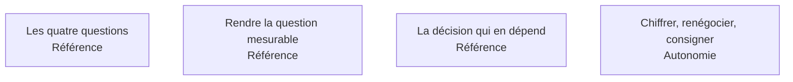

Une demande arrive presque toujours sous une forme inexploitable. La transformer en question qui a une réponse vérifiable prend rarement plus d'une heure et détermine l'essentiel de la valeur du livrable.

## Les quatre sujets

**Porte de sortie** : cinq lignes écrites et validées par le demandeur avant la première requête.

## Ma progression

- [ ] [[parcours/data-analyst/cadrer-la-question/les-quatre-questions|Les quatre questions]] — savoir laquelle des quatre on vous pose, avant de commencer
- [ ] [[parcours/data-analyst/cadrer-la-question/rendre-la-question-mesurable|Rendre la question mesurable]] — chaque terme devient une colonne, un filtre ou un seuil
- [ ] [[parcours/data-analyst/cadrer-la-question/la-decision-qui-en-depend|La décision qui en dépend]] — elle fixe la précision requise, et parfois l'annulation
- [ ] [[parcours/data-analyst/cadrer-la-question/chiffrer-renegocier-consigner|Chiffrer, renégocier, consigner]] — estimer le coût, refuser utilement, garder la trace
