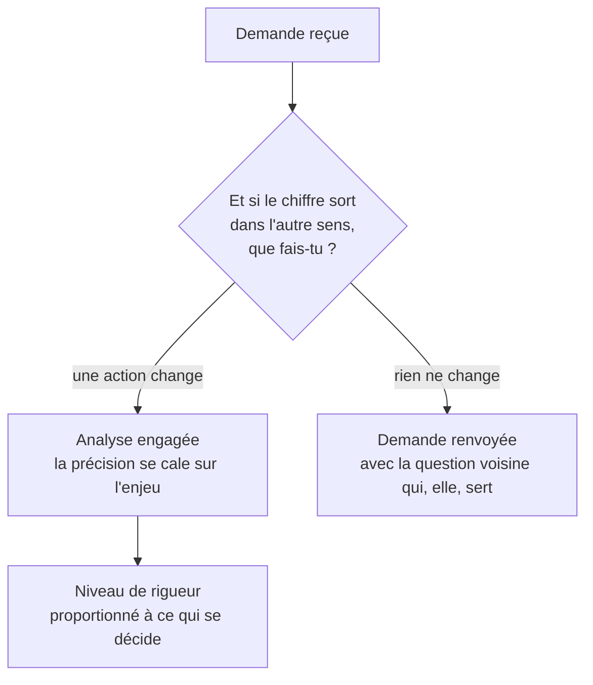

Niveau attendu : **référence**. « Et si le chiffre sort dans l'autre sens ? » est la question que seul l'analyste pose, et qui annule parfois sa propre mission.

Une analyse qui ne change aucune action est du travail propre et inutile, et elle consomme le temps qu'on aurait mis sur la question suivante. Demander quelle décision dépend du résultat est le geste de cadrage le plus rentable du métier.

## Ce qu'il faut savoir faire

- Poser la question qui protège : « et si le chiffre sort dans l'autre sens, qu'est-ce que tu fais ? ». Si la réponse est « rien », l'analyse n'a pas lieu d'être — et le dire est un service rendu.
- Caler la précision sur l'enjeu. Un arbitrage budgétaire à deux millions d'euros ne demande pas la même rigueur qu'un choix de formulation d'e-mail, et confondre les deux fait perdre du temps dans les deux sens.
- Identifier qui décide réellement, qui sera consulté et qui peut bloquer. Une analyse impeccable adressée à quelqu'un sans mandat ne produit aucune décision.
- Repérer la demande dont la conclusion est déjà écrite. Il arrive qu'on vous demande d'étayer un arbitrage déjà pris ; c'est parfois légitime, mais il faut le savoir avant, pas en réunion de restitution.
- Dater la décision. Une analyse livrée après l'arbitrage n'a aucune valeur, quelle que soit sa qualité — l'échéance fait partie du cadrage, au même titre que la mesure.
- Écrire la décision visée dans le cadrage, en une ligne, et la relire avant de livrer. C'est ce qui évite la dérive vers l'analyse intéressante mais hors sujet.

## Les notions mobilisées

- [[notions/cadrage-besoin]] — la décision visée est la question qu'un recueil de besoin oublie le plus souvent de poser.
- [[notions/gestion-parties-prenantes]] — savoir qui décide, qui est consulté et qui peut bloquer, avant de choisir à qui l'on parle.
- [[notions/roi-des-projets-ia]] — chiffrer ce que la décision met en jeu est ce qui justifie le niveau d'effort demandé.
- [[notions/conduite-du-changement]] — une analyse qui contredit une pratique installée ne produit une décision que si quelqu'un porte le changement.

> [!warning] Piège
> Accepter une demande parce qu'elle vient de haut. L'origine hiérarchique ne dit rien de l'usage prévu, et une demande de direction sans décision associée consomme plus de temps qu'une autre, parce qu'on y met plus de soin. La question sur la décision se pose à tout le monde, avec les mêmes mots.

## Pour apprendre

- [Stakeholder Management Guide](https://simplystakeholders.com/resources/guides/stakeholder-management/) — cartographier qui décide et qui influence, méthodiquement.
- [Project management triangle](https://asana.com/resources/project-management-triangle) — l'arbitrage délai, périmètre et qualité, qui s'applique tel quel à une demande d'analyse.
- [5 Principles of Data Ethics for Business](https://online.hbs.edu/blog/post/data-ethics) — court et exploitable, notamment sur ce qu'on accepte de mesurer et pour qui.
