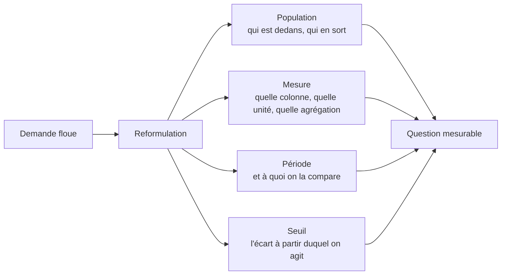

Niveau attendu : **référence**. Traduire chaque terme flou en colonne, filtre ou seuil est le geste pour lequel le métier vient le chercher, et il n'a pas de suppléant.

« Les clients sont moins actifs », « on perd de l'argent sur le segment pro », « regarde-moi ça ». Le travail consiste à transformer cela en une question qui a une réponse vérifiable — et chaque terme doit devenir une colonne, un filtre ou un seuil avant la première requête.

## Ce qu'il faut savoir faire

- Décomposer toute demande en quatre éléments : la population, la mesure, la période de comparaison, le seuil de décision. Tant que l'un des quatre manque, la question n'est pas analysable et toute requête écrite est prématurée.
- Faire valider la définition de la mesure par le demandeur, à l'écrit. « Client actif » a autant de définitions que d'interlocuteurs, et découvrir le malentendu en restitution coûte toute l'analyse.
- Traduire chaque terme en objet de données : quelle table, quelle colonne, quel filtre, quelle granularité. Un terme qui ne se traduit pas signale soit une donnée absente, soit une notion que personne n'a jamais définie — les deux sont des informations à remonter tout de suite.
- Choisir la comparaison en même temps que la mesure. Un chiffre seul ne dit rien : c'est l'écart à la période précédente, au reste de la population ou à un objectif qui porte l'information.
- Vérifier que la donnée nécessaire existe et couvre la période demandée, avant de s'engager sur un délai. Une question qui suppose de reconstituer six mois d'historique à partir de journaux techniques n'a pas le même prix qu'un regroupement sur une table existante.

## Les notions mobilisées

- [[notions/cadrage-besoin]] — la reformulation et la spécification ; l'angle analyste est que le cadrage se termine en objets de données, pas en paragraphes.
- [[notions/statistiques-descriptives]] — choisir la mesure, c'est déjà choisir entre une moyenne, une médiane et une part, avec ce que chacune masque.
- [[notions/mesure-d-usage-produit]] — quand la question porte sur un comportement dans un produit, la mesure existe rarement telle quelle : il faut savoir ce qui est instrumenté.
- [[notions/qualite-des-donnees]] — la définition d'une mesure n'a de sens que si la colonne qui la porte est renseignée, et cela se vérifie au cadrage.

> [!tip] Le bloc de cinq lignes
> La question reformulée, la population, la mesure, la période de comparaison, la décision attendue. Écrit avant toute requête, gardé en tête de notebook et en tête de restitution. C'est le seul artefact du métier qui résiste au temps : les requêtes seront réécrites, le chiffre sera périmé, la question cadrée reste lisible et vérifiable.

## Pour apprendre

- [Requirements Gathering in Software Engineering](https://www.jamasoftware.com/requirements-management-guide/requirements-gathering-and-management-processes/what-is-requirements-gathering/) — la méthode de recueil et le vocabulaire qui va avec, transposable directement.
- [Population vs. Sample](https://www.scribbr.com/methodology/population-vs-sample/) — définir le périmètre avant de mesurer, et ce que la confusion coûte.
- [Choosing the Right Statistical Test](https://www.scribbr.com/statistics/statistical-tests/) — utile dès le cadrage : la forme de la question détermine ce qu'on pourra conclure.
