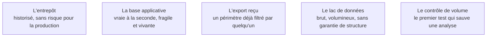

La même question a souvent trois réponses possibles selon l'endroit où l'on tire : la base applicative, l'entrepôt, ou l'export que quelqu'un vous envoie. Le choix se fait avant la requête, et il conditionne ce qu'on pourra affirmer.

## Ce qu'il faut savoir faire

- Interroger l'entrepôt plutôt que le système de production quand il existe : mêmes données, historisées, sans risque de charge sur un service vivant. Tirer sur la production se négocie et se planifie, il ne s'improvise pas un mardi après-midi.
- Savoir ce que la source a déjà transformé. Une table d'entrepôt porte des règles de gestion appliquées en amont — statuts regroupés, lignes filtrées, montants convertis — et ces règles ne sont pas toujours celles de votre question.
- Vérifier le volume attendu dès la collecte. Une table de commandes qui rend 4 000 lignes là où le métier en annonce 40 000 signale un filtre implicite, un droit d'accès partiel ou une jointure fautive — et il vaut mieux le voir maintenant.
- Traiter un export reçu comme une source de second ordre : quelqu'un a choisi les colonnes, la période et les filtres, et personne n'a écrit lesquels. Demander la requête qui l'a produit, ou refaire l'extraction soi-même.
- Identifier la source à laquelle les gens se fient réellement, qui n'est pas toujours la source officielle. C'est celle qu'il faudra confronter en restitution si votre chiffre en diffère.
- Demander les droits d'accès dont on a besoin, explicitement et pour la durée de l'analyse. Travailler avec un accès partiel sans le savoir est la façon la plus discrète de produire un chiffre faux.

## Les notions mobilisées

- [[notions/collecte-de-donnees]] — provenance, fraîcheur et périmètre exclu : les trois informations qui ne se retrouvent pas après coup.
- [[notions/entrepot-de-donnees]] — pourquoi l'entrepôt est la source de référence, et ce que sa modélisation a déjà décidé pour vous.
- [[notions/data-lake]] — le stockage brut, utile quand l'entrepôt n'a pas gardé le détail dont la question a besoin.
- [[notions/systemes-patrimoniaux]] — l'ERP et le CRM, dont l'accès direct est rarement souhaitable et parfois la seule option.
- [[notions/qualite-des-donnees]] — le contrôle de volume est le premier test de qualité, et il coûte une requête.

> [!warning] Piège
> Choisir la source sur sa commodité d'accès. Le fichier déjà sur le disque partagé est le plus rapide à ouvrir et le plus difficile à défendre : personne ne sait qui l'a produit, quand, ni ce qu'il exclut. Le temps gagné à l'ouverture se paie intégralement en restitution.

## Pour apprendre

- [What is a Data Warehouse?](https://cloud.google.com/learn/what-is-a-data-warehouse) — la présentation la plus sobre du concept, sans argumentaire produit malgré l'origine.
- [BigQuery — Introduction](https://docs.cloud.google.com/bigquery/docs/introduction) — le modèle d'un entrepôt sans serveur, et la facturation à la donnée lue.
- [Delta Lake](https://docs.databricks.com/aws/en/delta) — les transactions sur un lac de données, et le problème qu'elles résolvent vraiment.
- [What Is Data Lineage?](https://www.ibm.com/think/topics/data-lineage) — pour savoir quelles questions poser sur ce que la source a subi avant vous.
