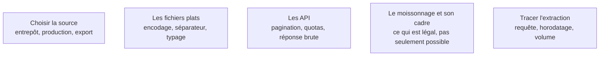

L'analyste ne construit pas les flux de données, il en dépend entièrement et il est le premier à en constater les défauts. Collecter, ici, veut dire rapatrier le bon sous-ensemble en sachant d'où il vient, de quand il date et ce qu'il exclut.

## Les cinq sujets

**Porte de sortie** : l'extraction se rejoue par script et rend le même nombre de lignes.

## Ma progression

- [ ] [[parcours/data-analyst/collecter/choisir-la-source|Choisir la source]] — l'entrepôt plutôt que la production, et pourquoi le volume se vérifie tout de suite
- [ ] [[parcours/data-analyst/collecter/les-fichiers-plats|Les fichiers plats]] — la première source d'erreurs silencieuses du métier
- [ ] [[parcours/data-analyst/collecter/les-api|Les API]] — lire les quotas avant d'écrire la boucle, garder la réponse brute
- [ ] [[parcours/data-analyst/collecter/le-moissonnage-et-son-cadre|Le moissonnage et son cadre]] — conditions d'utilisation, droit des bases, données personnelles
- [ ] [[parcours/data-analyst/collecter/tracer-l-extraction|Tracer l'extraction]] — les trois métadonnées qui permettent d'expliquer un écart
