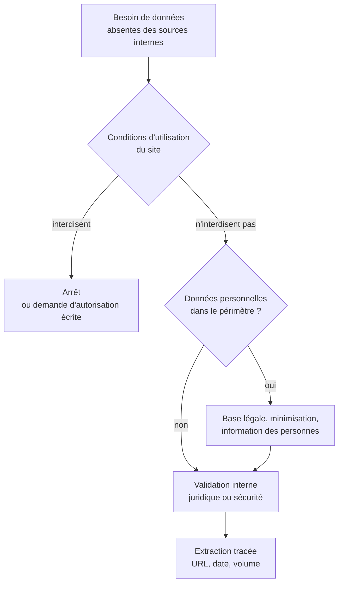

Niveau attendu : **notion**. Il faut reconnaître qu'on entre sur un terrain juridique et savoir qui confirme — le juridique tranche, pas l'analyste.

Techniquement accessible, juridiquement encadré. La question à trancher n'est pas « est-ce que j'y arrive » mais « ai-je le droit, et qui le confirme » — et en entreprise, cela se fait valider avant, jamais après.

## Ce qu'il faut savoir faire

- Lire les conditions d'utilisation du site visé et son `robots.txt` avant d'écrire une ligne. Ce sont deux sources différentes : l'une est contractuelle, l'autre est une convention technique, et aucune ne remplace l'autre.
- Vérifier s'il existe une API ou un jeu de données ouvert avant de moissonner. C'est souvent le cas, c'est toujours plus stable, et cela supprime la question juridique.
- Reconnaître la présence de données personnelles, qui est plus fréquente qu'on ne le croit : un nom d'auteur, un identifiant de compte, un avis signé. Le RGPD s'applique dès là, y compris sur des données publiquement accessibles.
- Faire valider en interne, par écrit, avant de lancer. La collecte massive sur un site tiers engage l'entreprise, pas l'analyste — et c'est une des rares situations du métier où l'on peut créer un risque juridique en travaillant seul.
- Limiter la charge imposée au site : débit modéré, extraction hors heures de pointe, identification honnête du client. Un moissonnage agressif est repéré, bloqué, et parfois signalé.
- Conserver l'URL exacte, la date et le volume de chaque passe. Une page moissonnée aujourd'hui n'existe plus sous la même forme dans six mois, et c'est la seule preuve de ce qui a été lu.

## Les notions mobilisées

- [[notions/rgpd]] — bases légales et minimisation, qui s'appliquent intégralement à la donnée publiquement accessible.
- [[notions/donnees-sensibles]] — la classification de ce qu'on rapatrie décide de l'endroit où on a le droit de le stocker.
- [[notions/collecte-de-donnees]] — les métadonnées d'extraction sont ici la seule preuve reconstituable de ce qui a été collecté.
- [[notions/conception-d-api]] — chercher l'interface officielle avant de moissonner la page est le premier réflexe, et il résout souvent le problème.

> [!warning] Piège
> Considérer que « c'est public, donc c'est libre ». Trois régimes distincts se superposent sur une même page : les conditions contractuelles du site, le droit des bases de données qui protège l'investissement de son producteur, et le droit des données personnelles qui protège les personnes citées. Aucun des trois ne se déduit du fait que la page s'affiche sans mot de passe.

## Pour apprendre

- [RFC 9309 — Robots Exclusion Protocol](https://www.rfc-editor.org/rfc/rfc9309.html) — ce que `robots.txt` dit et ne dit pas, spécifié depuis 2022.
- [Texte du RGPD](https://gdpr-info.eu/) — la source, à consulter plutôt que les résumés commerciaux.
- [CNIL — Réutilisation des données publiquement accessibles](https://www.cnil.fr/fr/la-reutilisation-des-donnees-publiquement-accessibles-en-ligne-des-fins-de-demarchage-commercial) — la position du régulateur français, directement applicable.
- [5 Principles of Data Ethics for Business](https://online.hbs.edu/blog/post/data-ethics) — le versant éthique, utile pour la discussion interne qui précède la validation.
