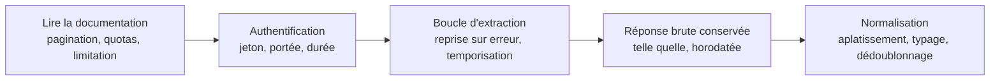

Niveau attendu : **usage**. Lire une documentation de pagination et de quotas suffit ; concevoir l'interface ou industrialiser l'appel n'est pas le sujet.

Lire la pagination, les quotas et la politique de limitation avant d'écrire la boucle, et conserver la réponse brute avant tout traitement. Une extraction relancée trois jours plus tard ne renvoie pas les mêmes données.

## Ce qu'il faut savoir faire

- Lire la documentation avant de coder : mode de pagination, quota par minute et par jour, comportement en cas de dépassement, fenêtre d'historique disponible. Ces quatre points déterminent si l'extraction prend dix minutes ou deux jours.
- Écrire une boucle qui reprend là où elle s'est arrêtée. Une extraction longue échoue toujours au moins une fois, et la refaire depuis le début coûte le quota autant que le temps.
- Conserver la réponse brute — le JSON tel qu'il est arrivé, horodaté — avant toute normalisation. C'est la seule façon de rejouer un aplatissement qui s'avère faux sans redemander les données.
- Respecter la limitation de débit et l'annoncer dans le code : temporisation entre appels, relance exponentielle, arrêt propre. Un script d'analyse qui sature une API de production est un incident d'exploitation.
- Vérifier la stabilité de ce qui est renvoyé. Beaucoup d'API paginent sur des données qui bougent pendant la pagination : on obtient alors des doublons et des manquants sans aucune erreur.
- Savoir ce que l'API exclut. Une API d'événements produit ne renvoie souvent que ce qui a été instrumenté, et ce périmètre est une décision d'équipe produit, pas une propriété du monde.

## Les notions mobilisées

- [[notions/collecte-de-donnees]] — l'horodatage et le volume obtenu font partie de l'extraction, pas de la documentation du script.
- [[notions/conception-d-api]] — comprendre REST, la pagination et le versionnement suffit à lire n'importe quelle documentation d'API.
- [[notions/mesure-d-usage-produit]] — quand la source est un outil d'analytique produit, ce qu'elle contient dépend de ce qui a été instrumenté.
- [[notions/controle-d-acces]] — le jeton a une portée et une durée ; les demander justes évite à la fois le blocage et l'accès trop large.

> [!warning] Piège
> Traiter la réponse au fil de l'eau sans jamais stocker le brut. Le jour où l'on découvre qu'un champ imbriqué avait une deuxième forme pour 3 % des enregistrements, il faut refaire toute l'extraction — en espérant que la fenêtre d'historique le permette encore.

## Pour apprendre

- [MDN — HTTP](https://developer.mozilla.org/fr/docs/Web/HTTP) — les codes de statut et les en-têtes, dont ceux qui portent les quotas.
- [GitHub REST — Limites de débit](https://docs.github.com/en/rest/using-the-rest-api/rate-limits-for-the-rest-api) — un exemple complet et bien documenté de politique de limitation, transposable.
- [Requests — Documentation](https://requests.readthedocs.io/en/latest/) — le client HTTP de référence côté Python, avec les sessions et les relances.
- [JSON Lines](https://jsonlines.org/) — le format qui convient au stockage brut d'une extraction paginée : une réponse par ligne, reprise facile.
