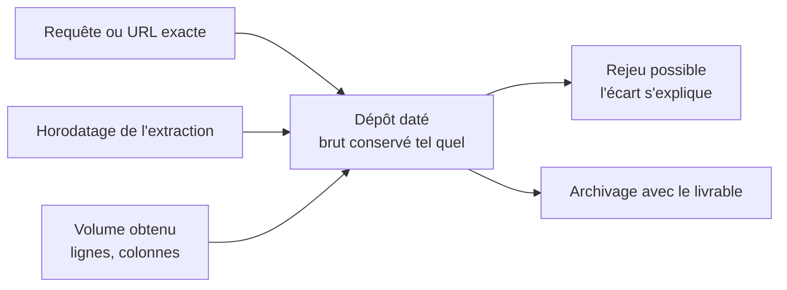

Trois métadonnées consignées avec chaque extraction : la requête ou l'URL exacte, l'horodatage, le nombre de lignes obtenu. C'est ce qui permet de rejouer et d'expliquer un écart entre deux versions du même chiffre — et rien de tout cela ne se retrouve après coup.

## Ce qu'il faut savoir faire

- Écrire la collecte en script ou en requête dès la première fois, même quand une extraction manuelle irait plus vite. Si un chiffre doit ressortir plus d'une fois, l'export cliqué à la main n'est ni rejouable ni vérifiable.
- Consigner les trois métadonnées automatiquement, dans le script, plutôt que dans un fichier de notes. Ce qui dépend de la discipline de l'analyste disparaît dès la semaine chargée.
- Garder la donnée brute intacte et dater le dépôt. Toute transformation se rejoue par-dessus, jamais à sa place — c'est ce qui permet de revenir en arrière quand une règle se révèle fausse au milieu de l'analyse.
- Savoir expliquer un écart entre deux extractions du même périmètre. Les causes sont peu nombreuses : la période a bougé, la source a été corrigée en arrière, un filtre a changé, ou l'un des deux tirages est partiel. Sans horodatage ni volume, aucune des quatre ne se démontre.
- Nommer les fichiers pour qu'ils se trient seuls : périmètre, date d'extraction, version. Un dossier d'analyse se relit six mois plus tard, souvent par quelqu'un d'autre.
- Joindre les métadonnées d'extraction au livrable final. La question « d'où sort ce chiffre » arrive toujours, et elle arrive souvent longtemps après.

## Les notions mobilisées

- [[notions/collecte-de-donnees]] — la fiabilité d'une collecte se juge à ses métadonnées autant qu'à son contenu.
- [[notions/lignage-des-donnees]] — la traçabilité d'entreprise, dont la version analyste tient dans trois lignes écrites par le script.
- [[notions/qualite-des-donnees]] — le volume obtenu est le contrôle le plus simple et le plus révélateur : il se compare à l'attendu du métier.
- [[notions/redaction-technique]] — le dossier d'analyse est un document : il se structure pour être repris, pas pour être écrit vite.

> [!warning] Piège
> L'extraction manuelle refaite à la main tous les mois — un export depuis une interface, un filtre cliqué, un fichier daté à la main. Elle n'est ni rejouable ni vérifiable, et l'écart entre deux mois est impossible à expliquer. Le coût de l'automatiser est presque toujours inférieur au coût du premier écart inexpliqué.

## Pour apprendre

- [What Is Data Lineage?](https://www.ibm.com/think/topics/data-lineage) — la définition de référence, et les questions qu'elle apprend à poser sur une source.
- [DVC — Prise en main](https://doc.dvc.org/start) — versionner les données et les étapes, pas seulement le code : le modèle à copier même sans adopter l'outil.
- [The Ultimate Guide To Data Lineage](https://montecarlo.ai/blog-data-lineage) — le versant pratique : ce que la traçabilité coûte, et ce qu'elle rapporte quand une table casse.
