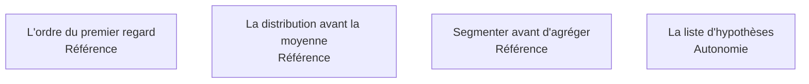

Le moment où l'on découvre ce que la donnée contient réellement, par opposition à ce que le dictionnaire prétend. L'exploration ne sert pas à trouver la réponse : elle sert à vérifier que la question tient, et à produire la liste des hypothèses à tester.

## Les quatre sujets

**Porte de sortie** : une liste d'hypothèses écrite, et aucune conclusion tirée de l'exploration elle-même.

## Ma progression

- [ ] [[parcours/data-analyst/explorer/l-ordre-du-premier-regard|L'ordre du premier regard]] — la séquence qui fait gagner une journée
- [ ] [[parcours/data-analyst/explorer/la-distribution-avant-la-moyenne|La distribution avant la moyenne]] — médiane et quartiles par défaut sur montants et délais
- [ ] [[parcours/data-analyst/explorer/segmenter-avant-d-agreger|Segmenter avant d'agréger]] — le contrôle le moins cher et le plus rentable du métier
- [ ] [[parcours/data-analyst/explorer/la-liste-d-hypotheses|La liste d'hypothèses]] — ce qui rend l'étape suivante honnête
