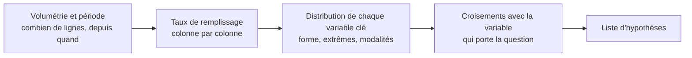

Il existe une séquence qui fait gagner une journée, et elle ne commence pas par la variable qui intéresse. Elle commence par ce qui invaliderait l'analyse entière si on le découvrait trop tard.

## Ce qu'il faut savoir faire

- Commencer par la volumétrie et la période couverte, et les confronter à ce que le métier annonce. L'écart entre les deux est l'information la plus rentable de la journée.
- Regarder le taux de remplissage de toutes les colonnes, pas seulement de celles qui intéressent. La sixième colonne, celle qu'on n'avait pas prévu d'utiliser, est souvent celle qui invalide l'analyse.
- Vérifier la continuité temporelle : un mois manquant, une rupture de volume, un changement de niveau soudain signalent une migration, un changement de périmètre ou un arrêt de collecte — jamais un phénomène métier.
- Regarder les modalités distinctes des colonnes censées être normalisées. Deux conventions de statut qui cohabitent depuis une migration expliquent à elles seules la moitié des bizarreries d'une analyse.
- Se servir du profilage automatique pour la première passe — distributions, manquants, cardinalités, corrélations en une commande. Le gain réel n'est pas le temps, c'est l'exhaustivité : un humain pressé regarde cinq colonnes.
- Noter au fil de l'eau ce qui surprend, sans chercher à l'expliquer tout de suite. La liste des surprises devient la liste des hypothèses.

## Les notions mobilisées

- [[notions/statistiques-descriptives]] — le contenu statistique de cette étape : tendance centrale, dispersion, forme de distribution.
- [[notions/qualite-des-donnees]] — l'exploration est le moment où les défauts se voient ; ce qui se voit ici se corrige à l'étape précédente.
- [[notions/visualisation-de-donnees]] — l'histogramme et le nuage de points d'exploration sont des outils de travail, pas des livrables.
- [[notions/series-temporelles]] — la continuité et le niveau d'une série se regardent avant toute interprétation d'évolution.

> [!warning] Piège
> Partir explorer « pour voir » avant d'avoir cadré la question. On trouve toujours quelque chose, et ce quelque chose devient la réponse par construction : on a exploré jusqu'à trouver un écart intéressant, puis on l'a raconté. Explorer est indispensable — après avoir écrit la question, pas à sa place.

## Pour apprendre

- [mlcourse.ai](https://mlcourse.ai/) — l'un des rares cours libres à traiter sérieusement l'analyse exploratoire avant la modélisation.
- [ydata-profiling](https://docs.profiling.ydata.ai/) — le rapport de profilage en une commande : distributions, manquants, cardinalités, alertes.
- [DuckDB — SUMMARIZE](https://duckdb.org/docs/stable/guides/meta/summarize) — le même résultat en SQL, sur un fichier, sans rien installer de plus.
- [OpenIntro Statistics](https://www.openintro.org/book/os/) — le manuel libre qui donne le vocabulaire de ce qu'on regarde.
