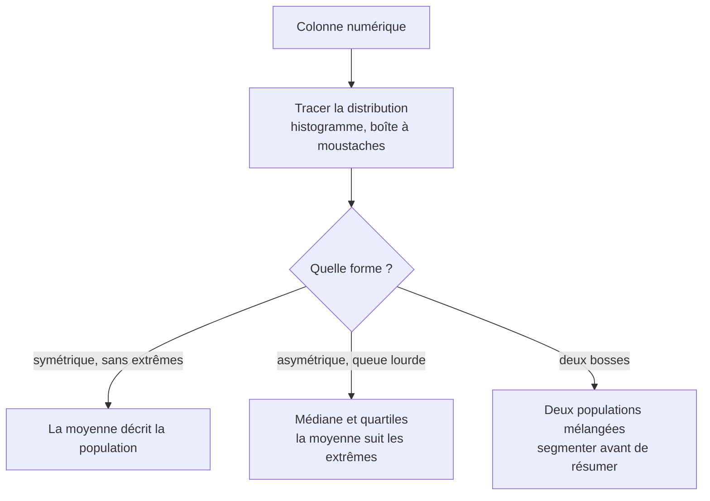

Une moyenne sur une distribution bimodale ou à queue lourde décrit une population qui n'existe pas. Sur les montants, les durées et les délais — les grandeurs du métier — la médiane et les quartiles répondent mieux à la question « un cas typique, c'est quoi ».

## Ce qu'il faut savoir faire

- Tracer la distribution avant de citer le moindre résumé. C'est une commande, quelques secondes, et cela évite la conclusion la plus embarrassante du métier : le revenu moyen d'une équipe où le dirigeant est compté.
- Prendre la médiane et les quartiles par défaut sur les montants, les durées et les délais, qui sont presque toujours asymétriques. Passer à la moyenne demande une justification, pas l'inverse.
- Donner un écart avec le centre : quartiles, décile supérieur, ou min-max selon l'auditoire. Un résumé sans dispersion laisse croire à une homogénéité qui n'existe pas.
- Reconnaître la distribution bimodale pour ce qu'elle est : deux populations dans la même colonne, à séparer avant tout résumé. C'est souvent deux produits, deux canaux ou deux périodes.
- Vérifier l'effet des extrêmes sur le résumé retenu en recalculant sans eux. Si la moyenne bouge de 30 % quand on retire trois lignes, la moyenne n'est pas le bon résumé.
- Choisir le résumé en fonction de la décision, pas de l'habitude. « Combien coûte un dossier typique » et « combien coûte l'ensemble des dossiers » appellent deux statistiques différentes, et les deux sont légitimes.

## Les notions mobilisées

- [[notions/statistiques-descriptives]] — tendance centrale, dispersion, asymétrie : ce que chaque résumé suppose de la forme des données.
- [[notions/visualisation-de-donnees]] — l'histogramme et la boîte à moustaches, et ce que chacun masque de l'autre.
- [[notions/regression-lineaire]] — beaucoup de méthodes supposent une forme de distribution ; la regarder d'abord évite de les appliquer à tort.

> [!tip] Le chiffre qu'on donne toujours en plus
> Le nombre d'observations derrière le résumé. Une médiane sur douze dossiers et une médiane sur douze mille se présentent de la même façon et n'engagent pas du tout au même niveau — et c'est presque toujours la première question d'un lecteur attentif.

## Pour apprendre

- [StatQuest](https://www.youtube.com/@statquest) — la meilleure vulgarisation statistique disponible, et la seule qui explique pourquoi la formule est celle-là.
- [OpenIntro Statistics](https://www.openintro.org/book/os/) — le manuel d'introduction libre le mieux fait, exercices corrigés compris.
- [Fundamentals of Data Visualization](https://clauswilke.com/dataviz/introduction.html) — représenter des distributions honnêtement, y compris quand elles sont vilaines.
- [Khan Academy — Statistiques et probabilités](https://www.khanacademy.org/math/statistics-probability) — le rattrapage le plus efficace pour qui vient du métier.
