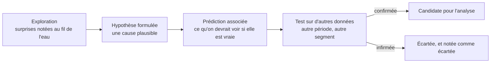

L'exploration ne produit pas de réponse : elle produit une liste d'hypothèses, chacune assortie de ce qu'on s'attend à observer si elle est vraie. C'est ce qui rend l'étape d'analyse honnête, parce que la liste est écrite avant de chercher à la confirmer.

## Ce qu'il faut savoir faire

- Écrire chaque hypothèse avec sa prédiction : « si c'est la migration de mars, alors l'écart n'existe que sur les dossiers créés avant mars ». Une hypothèse sans prédiction observable n'est pas testable, c'est une opinion.
- Traiter toute découverte d'exploration comme une hypothèse, jamais comme un résultat. Un écart repéré en regardant vingt croisements a de bonnes chances d'être du bruit : sur vingt comparaisons, une au seuil de 5 % sort par pur hasard.
- Confirmer sur d'autres données que celles qui ont suggéré l'hypothèse — autre période, autre segment, autre source. C'est la seule protection réelle contre la découverte fabriquée par la recherche elle-même.
- Formuler aussi les hypothèses ennuyeuses : un changement de périmètre, une correction de données, un jour férié, un changement de définition. Elles expliquent plus d'écarts que les hypothèses métier, et elles se testent en dix minutes.
- Demander au métier ce qui a changé sur la période, avant de chercher dans les données. Une réorganisation, une campagne, un changement de tarif ou un nouvel outil expliquent souvent l'écart d'un coup.
- Garder trace des hypothèses écartées et de la raison. C'est ce qui, en restitution, permet de dire « j'ai regardé, ce n'est pas ça » — la phrase qui construit la confiance.

## Les notions mobilisées

- [[notions/tests-hypotheses]] — l'hypothèse écrite avant le test est la condition de validité de tout ce qui suit.
- [[notions/analyse-correlation]] — chaque hypothèse de lien appelle ses explications concurrentes, dès sa formulation.
- [[notions/ab-testing]] — quand l'hypothèse porte sur l'effet d'une action qu'on contrôle, elle se teste par protocole et non par observation.
- [[notions/cadrage-besoin]] — la liste d'hypothèses se relit contre la question cadrée : celles qui n'y répondent pas attendront.

> [!tip] La question qui débloque une exploration
> « Qu'est-ce qui a changé dans le système d'information sur la période ? » Elle s'adresse à la DSI ou à l'équipe de données, pas au métier, et elle élimine en une réponse la moitié des écarts inexpliqués : migration, changement de règle de calcul, reprise de données, nouveau canal branché.

## Pour apprendre

- [Type I & Type II Errors](https://www.scribbr.com/statistics/type-i-and-type-ii-errors/) — la distinction qu'on croit connaître et qu'on inverse en réunion.
- [A Refresher on A/B Testing](https://hbr.org/2017/06/a-refresher-on-ab-testing) — le rappel de protocole à relire avant tout test, y compris le dixième.
- [OpenIntro Statistics](https://www.openintro.org/book/os/) — les chapitres sur l'inférence, pour savoir ce qu'une hypothèse engage.
