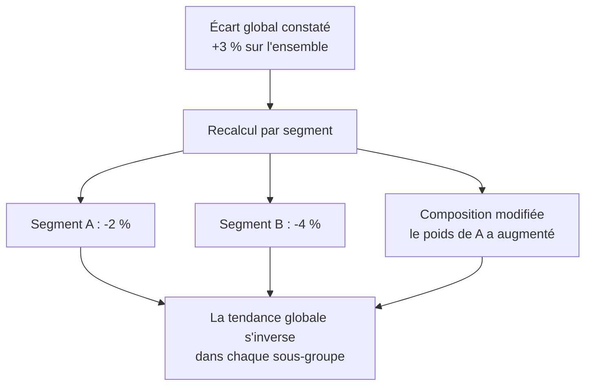

Un agrégat global masque presque toujours deux populations qui bougent en sens inverse. Recalculer tout écart segment par segment avant de le publier est le contrôle le moins cher et le plus rentable du métier : il tient en une ligne de code.

## Ce qu'il faut savoir faire

- Recalculer systématiquement tout écart agrégé par segment avant de le publier. Une tendance globale peut s'inverser dans chacun des sous-groupes : c'est le paradoxe de Simpson, et il n'est ni rare ni exotique en entreprise.
- Choisir les axes de segmentation avec le métier — produit, canal, région, ancienneté, taille de client — et les fixer avant de regarder. Segmenter jusqu'à trouver un écart intéressant est une autre façon de tester vingt hypothèses.
- Distinguer un changement de comportement d'un changement de composition. Un taux qui bouge parce que le mélange de population a changé n'a rien à voir avec un taux qui bouge parce que les gens font autre chose — et la décision n'est pas la même.
- Vérifier les effectifs de chaque segment avant de commenter ses variations. Un segment de quarante lignes bouge de 20 % tous les mois sans que rien ne se passe.
- Regarder la même question par cohorte d'entrée quand l'ancienneté joue. C'est le seul moyen simple de comparer des groupes ayant le même âge plutôt que la même date.
- Présenter le global et le détail ensemble quand ils divergent. Cacher la divergence pour simplifier la restitution est la manière la plus sûre de perdre sa crédibilité au premier contrôle.

## Les notions mobilisées

- [[notions/analyse-correlation]] — la variable de confusion est le cas majoritaire, et la segmentation est ce qui la fait apparaître.
- [[notions/analyse-de-cohorte]] — regrouper par période d'entrée pour distinguer une amélioration réelle d'un effet de composition.
- [[notions/statistiques-descriptives]] — un agrégat n'est qu'un résumé, et tout résumé perd l'information qui explique l'écart.
- [[notions/series-temporelles]] — quand la segmentation est temporelle, saisonnalité et tendance doivent être séparées avant toute comparaison.

> [!warning] Piège
> Publier un écart global flatteur sans l'avoir décomposé. Quelqu'un finira par le faire — souvent en réunion, souvent quelqu'un qui connaît mieux le métier que vous — et la découverte publique que la tendance s'inverse par segment coûte plus cher que l'analyse tout entière.

## Pour apprendre

- [Correlation vs. Causation](https://www.scribbr.com/methodology/correlation-vs-causation/) — court, à garder sous la main pour les réunions, littéralement.
- [A Refresher on Regression Analysis](https://hbr.org/2015/11/a-refresher-on-regression-analysis) — ce qu'un contrôle par variable apporte et ce qu'il ne règle pas.
- [Introduction to Time Series Analysis (NIST)](https://www.itl.nist.gov/div898/handbook/pmc/section4/pmc4.htm) — séparer tendance, saisonnalité et résidu, rigoureusement et gratuitement.
