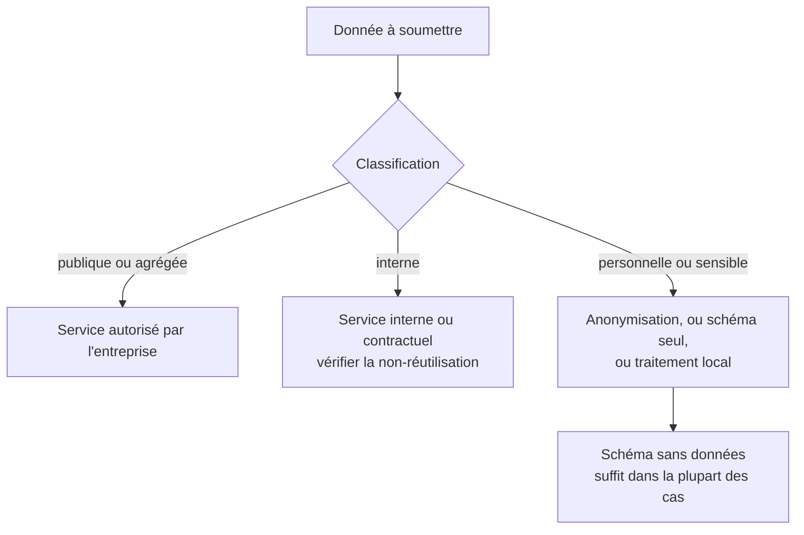

Niveau attendu : **autonomie**. Savoir refuser un envoi et justifier le refus est un arbitrage qu'on assume seul, souvent contre l'urgence de quelqu'un d'autre.

Un extrait de base client ne se colle pas dans un service grand public. La question n'est pas de savoir si c'est techniquement possible, mais ce que l'entreprise autorise, à quel niveau de donnée, et vers quel service.

## Ce qu'il faut savoir faire

- Vérifier ce que l'entreprise autorise, et à quel niveau de donnée, avant le premier usage. La réponse est rarement « rien » et presque jamais « tout » : elle distingue les services, les classifications et les volumes.
- Envoyer le schéma plutôt que les données. Pour générer une requête, le modèle a besoin des noms de tables et de colonnes, pas des lignes — et cela règle l'essentiel de la question.
- Reconnaître les données personnelles dans un extrait, y compris là où on ne les attend pas : un champ de commentaire, un identifiant de commande recoupable, une adresse électronique dans une colonne de notes.
- Travailler sur des données anonymisées ou synthétiques pour mettre au point un traitement, puis exécuter le traitement validé sur les vraies données, localement.
- Savoir si le service utilisé réutilise les entrées pour entraîner ses modèles, et sous quel contrat. C'est la différence principale entre une offre grand public et une offre professionnelle, et elle est écrite.
- Documenter les usages dans le dossier d'analyse : quel service, sur quelles données, pour quelle étape. Une question de conformité arrive tôt ou tard, et y répondre de mémoire ne tient pas.

## Les notions mobilisées

- [[notions/rgpd]] — bases légales, minimisation et transferts s'appliquent intégralement à ce geste-là.
- [[notions/donnees-sensibles]] — la classification décide de ce qui sort du système d'information, et c'est une décision antérieure à la vôtre.
- [[notions/gouvernance-ia]] — le cadre interne et réglementaire qui dit ce qui est autorisé, et à qui le demander.
- [[notions/injection-de-prompt]] — un verbatim client soumis à un modèle est une entrée non fiable ; c'est un vrai risque dès que la sortie déclenche une action.
- [[notions/cout-et-latence-inference]] — un traitement par lot sur des dizaines de milliers de lignes a un coût, à connaître avant de le lancer.

> [!warning] Piège
> L'extrait « anonymisé » qui ne l'est pas. Retirer le nom et l'adresse ne suffit pas : un code postal, une date de naissance et un sexe suffisent souvent à réidentifier une personne, et un identifiant interne conservé permet le recoupement immédiat par quiconque a accès à une autre table. L'anonymisation est une opération technique exigeante, pas une suppression de colonnes.

## Pour apprendre

- [Texte du RGPD](https://gdpr-info.eu/) — la source, à consulter plutôt que les résumés commerciaux.
- [CNIL — Intelligence artificielle](https://www.cnil.fr/fr/intelligence-artificielle) — les recommandations du régulateur français, régulièrement mises à jour et directement applicables.
- [EU AI Act Explorer](https://artificialintelligenceact.eu/ai-act-explorer/) — le texte européen, navigable par article.
- [Claude — Atténuer jailbreaks et injections](https://platform.claude.com/docs/en/test-and-evaluate/strengthen-guardrails/mitigate-jailbreaks) — utile dès qu'on traite du texte rédigé par des tiers.
