L'IA générative a fortement accéléré la partie **fabrication** du travail d'analyse, et n'a rien changé à la partie **jugement**. La conséquence est un déplacement du niveau d'exigence, pas une disparition du poste.

```mermaid
flowchart TD
  F["Fabrication<br/>divisée par deux ou trois"] --> F1["Écrire requêtes et transformations"]
  F --> F2["Dégrossir un jeu inconnu"]
  F --> F3["Classer des verbatims"]
  F --> F4["Premier jet de restitution"]
  J["Jugement<br/>identique, et désormais majoritaire"] --> J1["Cadrer la question"]
  J --> J2["Connaître la sémantique réelle des colonnes"]
  J --> J3["Distinguer corrélation et causalité"]
  J --> J4["Répondre du chiffre devant quelqu'un"]

  click F1 "/parcours/data-analyst/ia-generative/generer-des-requetes"
  click F2 "/parcours/data-analyst/ia-generative/explorer-avec-un-modele"
  click F3 "/parcours/data-analyst/modelisation-appliquee/le-texte-libre"
  click F4 "/parcours/data-analyst/restituer/la-reponse-en-une-phrase"
  click J1 "/parcours/data-analyst/cadrer-la-question"
  click J2 "/parcours/data-analyst/nettoyer/transformer-et-documenter"
  click J3 "/parcours/data-analyst/analyser/correlation-et-causalite"
  click J4 "/parcours/data-analyst/restituer/dire-ce-qu-on-ne-sait-pas"

  classDef inchange stroke:#f9a825,stroke-width:1px,stroke-dasharray:4 3
  class J,J1,J2,J3,J4 inchange
```

## Ce qu'il faut savoir faire

- Situer chaque tâche dans l'une des deux colonnes avant de décider si l'on délègue. La règle est simple : ce qui a une réponse vérifiable se délègue et se vérifie ; ce qui demande de connaître le terrain ne se délègue pas.
- Assumer que la production de requêtes n'est plus un facteur de différenciation. Ce qui l'est devenu : la qualité du cadrage, la connaissance de la sémantique réelle des données, et la tenue en restitution.
- Reconnaître que la connaissance du terrain est le cœur de la valeur. Savoir que les commandes de juillet 2024 sont dupliquées à cause d'une reprise de données ne se trouve dans aucun modèle.
- Garder la division du travail stable : vous écrivez la question cadrée et les contrôles, le modèle écrit le code, vous vérifiez le résultat contre un chiffre que vous connaissez déjà.
- Se situer sans naïveté sur l'exposition du poste. Les profils les plus exposés sont ceux dont le travail consistait à exécuter des demandes déjà formulées ; la réponse n'est pas de refuser l'outil, elle est de remonter vers le cadrage et la restitution.
- Mesurer soi-même le gain plutôt que de le supposer. Sur une semaine de travail réel, le temps gagné se situe là où on ne l'attend pas, et rarement là où les démonstrations le promettent.

## Les notions mobilisées

- [[notions/assistants-de-codage]] — les usages réels sur du code d'analyse, et ce qu'ils supposent de contexte fourni.
- [[notions/ingenierie-de-prompt]] — ce qui marche encore et ce qui relève du folklore, appliqué à des tâches de données.
- [[notions/gouvernance-ia]] — le cadre dans lequel l'entreprise autorise ou non ces usages, qui s'impose à l'analyste.
- [[notions/cout-et-latence-inference]] — dès que le traitement passe par lots sur des milliers de lignes, le coût devient une donnée du choix.

> [!tip] Le test qui sépare les deux colonnes
> Poser la question : est-ce que je saurais vérifier la réponse en moins de cinq minutes ? Si oui, c'est de la fabrication et le modèle peut la faire. Si non, c'est du jugement, et déléguer revient à publier quelque chose qu'on ne sait pas contrôler.

## Pour apprendre

- [Claude Code](https://code.claude.com/docs/en/overview) — l'assistant en ligne de commande, celui qui s'insère le plus naturellement dans un dossier d'analyse versionné.
- [GitHub Copilot](https://docs.github.com/en/copilot) — l'autre usage répandu, intégré à l'éditeur.
- [AI Index Report — Stanford HAI](https://hai.stanford.edu/ai-index) — des chiffres sur l'adoption réelle et les gains mesurés, plutôt que des annonces.
