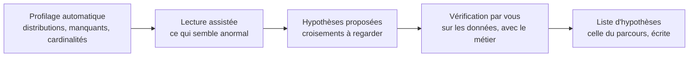

Niveau attendu : **usage**. Dégrossir un jeu inconnu avec assistance est confortable ; conclure avec elle ne l'est jamais, et l'exploration reste le domaine où l'analyste doit faire référence par lui-même.

Décrire un jeu de données inconnu, proposer les croisements à regarder, repérer les colonnes suspectes. Utile pour dégrossir, jamais pour conclure — et la distinction se tient, parce que tout ce qui sort ici est une hypothèse.

## Ce qu'il faut savoir faire

- Se servir du modèle pour l'exhaustivité plutôt que pour la vitesse. Le gain réel n'est pas le temps économisé, c'est que les trente colonnes sont regardées et pas seulement les cinq qui intéressaient.
- Lui donner le contexte métier avec les données : ce que l'entreprise fait, ce que la table est censée décrire, ce que la question cherche. Sans cela il produit des observations statistiques sans portée.
- Traiter toute observation produite comme une hypothèse à vérifier soi-même, sur les données, et à confronter au métier. Une anomalie « détectée » sans vérification est une anomalie inventée une fois sur trois.
- Faire décrire les colonnes suspectes plutôt que conclure : une distribution bimodale, une cardinalité inattendue, une date qui s'arrête brusquement. C'est un usage où l'erreur est peu coûteuse et le gain réel.
- Ne jamais lui faire produire le chiffre de conclusion. Il n'a pas accès à ce que vous savez du terrain, et sa réponse sera formulée avec la même assurance qu'elle soit juste ou fausse.
- Vérifier les statistiques qu'il énonce en les recalculant. Un modèle qui décrit un tableau donne des ordres de grandeur convaincants sans les avoir calculés.

## Les notions mobilisées

- [[notions/assistants-de-codage]] — le cadre d'usage : un outil qui écrit le code d'exploration, que vous exécutez et lisez.
- [[notions/evaluation-llm]] — vérifier ce qu'un modèle affirme est une évaluation, et elle se fait sur un échantillon, pas au feeling.
- [[notions/statistiques-descriptives]] — ce que produit le profilage, et ce qu'il faut savoir lire pour juger si c'est pertinent.
- [[notions/qualite-des-donnees]] — les anomalies proposées sont des candidats de défauts, à confirmer par des tests exécutables.

> [!warning] Piège
> Laisser le modèle choisir ce qui est intéressant. Il retiendra ce qui ressemble à une découverte, c'est-à-dire l'écart le plus spectaculaire parmi ceux qu'il a examinés — exactement le mécanisme de la multiplicité des tests, appliqué sans qu'on sache combien de comparaisons ont été faites.

## Pour apprendre

- [ydata-profiling](https://docs.profiling.ydata.ai/) — le rapport de profilage, qui donne au modèle et à vous la même base factuelle.
- [Claude Code](https://code.claude.com/docs/en/overview) — l'exploration dans un dossier réel, où le code écrit s'exécute et se relit.
- [DuckDB — SUMMARIZE](https://duckdb.org/docs/stable/guides/meta/summarize) — la version déterministe du même premier regard, à confronter à ce que le modèle affirme.
