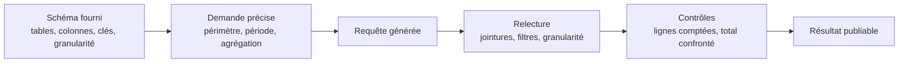

Niveau attendu : **usage**. Fournir le schéma, relire, recompter : un chemin balisé, dont la seule exigence est de ne jamais livrer sans vérification.

Le gain le plus net du métier, à deux conditions : fournir le schéma, et relire. Un modèle qui ne connaît pas vos tables invente des noms de colonnes plausibles ; un modèle à qui vous donnez le schéma produit du SQL correct la plupart du temps.

## Ce qu'il faut savoir faire

- Fournir le schéma et les règles de gestion avec la demande : noms de tables, colonnes, clés, granularité, pièges connus. C'est ce qui fait la différence entre une requête utilisable et une requête plausible.
- Relire la requête sur trois points avant de l'exécuter : les jointures et leur cardinalité, les filtres de périmètre, la granularité du regroupement. Ce sont les trois endroits où une erreur ne se voit pas dans le résultat.
- Compter les lignes avant et après chaque jointure, systématiquement. Une jointure sur une clé non unique multiplie les lignes et gonfle un total de 30 % sans lever la moindre erreur.
- Confronter l'agrégat à une valeur connue avant de publier : un total du contrôle de gestion, un rapport officiel, un ordre de grandeur que le métier connaît. C'est la seule protection qui fonctionne réellement.
- Demander l'explication de la requête plutôt que la requête seule quand on n'est pas sûr du dialecte ou de la structure. Lire l'explication révèle les hypothèses que le modèle a faites à votre place.
- Refuser de publier une requête qu'on ne saurait pas défendre ligne à ligne. Le fait qu'elle ait été générée n'est pas une circonstance atténuante : c'est votre chiffre.

## Les notions mobilisées

- [[notions/assistants-de-codage]] — ce que ces outils font bien sur du SQL et du code de transformation, et ce qu'ils inventent.
- [[notions/sql]] — la relecture suppose de savoir lire, ce qui reste la compétence de base du métier.
- [[notions/qualite-des-donnees]] — les contrôles de cardinalité et de total sont exactement ceux qu'on faisait déjà, devenus obligatoires.
- [[notions/ingenierie-de-prompt]] — fournir le schéma, préciser le dialecte, demander l'explication : le peu de technique de consigne qui sert ici.

> [!warning] Piège
> Le SQL plausible qui s'exécute et qui est faux. C'est le mode d'échec dominant, et il est silencieux : le code généré ne bloque pas, il répond. Il n'existe aucune alerte, aucun message, aucune couleur rouge — seulement un chiffre crédible et faux, qui partira en réunion si personne ne l'a confronté à une source indépendante.

## Pour apprendre

- [Claude Code](https://code.claude.com/docs/en/overview) — l'usage dans un dossier versionné, où le modèle voit les scripts et le schéma.
- [Claude — Réduire les hallucinations](https://platform.claude.com/docs/en/test-and-evaluate/strengthen-guardrails/reduce-hallucinations) — les techniques qui réduisent l'invention de noms de colonnes, et leurs limites.
- [Cursor](https://cursor.com/docs) — l'assistant intégré à l'éditeur, pour qui travaille surtout en notebooks et scripts.
- [SQL Window Functions](https://www.thoughtspot.com/sql-tutorial/sql-window-functions) — parce que relire suppose de connaître, et que le fenêtrage est ce qui se relit le plus mal.
