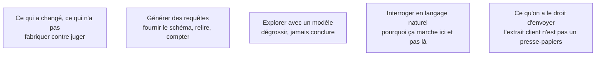

Elle a fortement accéléré la partie fabrication du travail d'analyse et n'a rien changé à la partie jugement. La conséquence pratique est un déplacement du niveau d'exigence, pas une disparition du poste.

## Les cinq sujets

**Porte de sortie** : tout résultat produit avec assistance est confronté à un chiffre connu par ailleurs.

## Ma progression

- [ ] [[parcours/data-analyst/ia-generative/ce-qui-a-change|Ce qui a changé, ce qui n'a pas]] — la fabrication divisée par trois, le jugement identique
- [ ] [[parcours/data-analyst/ia-generative/generer-des-requetes|Générer des requêtes]] — le SQL plausible qui s'exécute et qui est faux
- [ ] [[parcours/data-analyst/ia-generative/explorer-avec-un-modele|Explorer avec un modèle]] — décrire un jeu inconnu, proposer des croisements
- [ ] [[parcours/data-analyst/ia-generative/interroger-en-langage-naturel|Interroger en langage naturel]] — la couche sémantique fait la différence
- [ ] [[parcours/data-analyst/ia-generative/ce-qu-on-a-le-droit-d-envoyer|Ce qu'on a le droit d'envoyer]] — confidentialité, RGPD, et la règle d'entreprise
