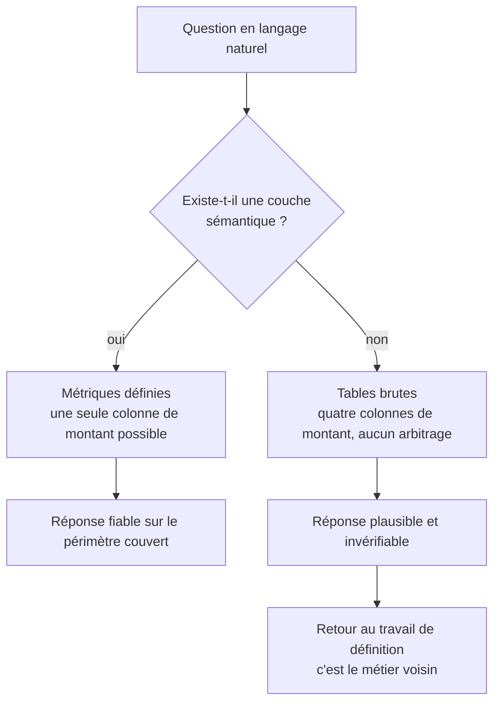

Cela fonctionne quand une couche sémantique définit les métriques, et échoue quand on le branche sur des tables brutes. C'est ce qui explique que le même outil soit jugé excellent dans une entreprise et inutilisable dans une autre.

## Ce qu'il faut savoir faire

- Comprendre pourquoi cela échoue sur des tables brutes : le modèle n'a aucun moyen de savoir laquelle des quatre colonnes de montant est la bonne, ni si le chiffre d'affaires s'entend hors taxes, net de remise, ou après annulations.
- Reconnaître que le travail préalable est une définition partagée des métriques, pas un choix d'outil. Construire cette couche est le travail de [[parcours/bi-analyst]] — et c'est ce qui décide du succès.
- Utiliser l'interrogation en langage naturel pour ce qu'elle fait bien : les questions simples sur un périmètre bien défini, posées par des gens qui ne savent pas écrire de requête. Cela désencombre réellement une file de demandes.
- Vérifier systématiquement les réponses des premières semaines, en recalculant. Une couche sémantique incomplète produit des réponses fausses sur les questions qu'elle ne couvre pas, sans le signaler.
- Expliquer aux utilisateurs ce que l'outil ne couvre pas. Faute de quoi ils poseront la question hors périmètre, obtiendront une réponse, et la croiront.
- Lire la requête générée quand l'outil la montre. C'est le seul contrôle réel, et c'est aussi ce qui permet de repérer les définitions manquantes.

## Les notions mobilisées

- [[notions/modelisation-dimensionnelle]] — la granularité et les définitions de mesures, sans lesquelles la question naturelle n'a pas de réponse unique.
- [[notions/outils-decisionnels]] — la couche sémantique vit dans ces plateformes, et c'est elle qu'on achète, pas le graphique.
- [[notions/sql]] — lire la requête produite reste le seul contrôle possible sur la réponse.
- [[notions/rag]] — le mécanisme de récupération sur documents, souvent proposé en complément, avec des modes d'échec propres.
- [[notions/evaluation-llm]] — mesurer le taux de réponses correctes sur un jeu de questions connues avant de l'ouvrir à tous.

> [!tip] Le test à faire avant d'y croire
> Poser vingt questions dont vous connaissez déjà la réponse, dont cinq formulées de façon ambiguë. Le taux de bonnes réponses sur les quinze claires dit ce que l'outil vaut ; le comportement sur les cinq ambiguës dit s'il signale son incertitude ou s'il invente avec assurance. C'est la seconde information qui décide de son déploiement.

## Pour apprendre

- [What is dbt](https://www.getdbt.com/product/what-is-dbt) — le cadrage du travail de définition des métriques, en dix minutes.
- [dbt — Documentation](https://docs.getdbt.com/docs/build/documentation) — les tests et la documentation générée, qui constituent la couche que l'outil interrogera.
- [Ragas](https://docs.ragas.io/en/stable/) — mesurer la qualité des réponses d'un système de ce type, plutôt que de la ressentir.
