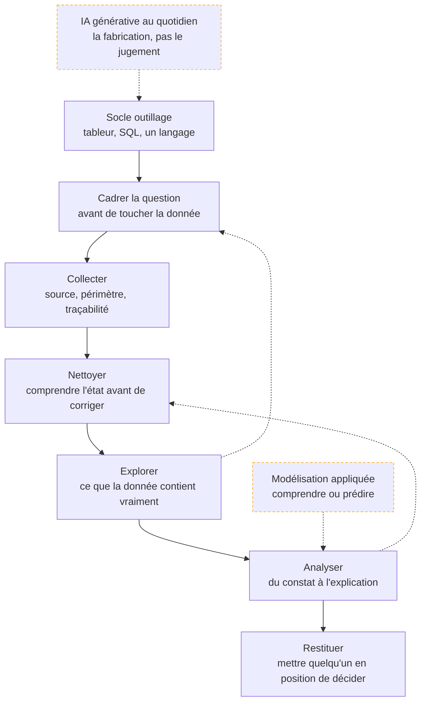

Le métier de celui à qui on pose une question et qui rend une réponse chiffrée, datée, défendable — et dont le travail est fini quand quelqu'un décide.

## La roadmap

Chaque case mène à sa page. Cochez les étapes acquises en bas de page pour suivre votre progression.

Les flèches en pointillé qui remontent sont la norme : l'exploration reformule la question, l'analyse renvoie au nettoyage. Une mission qui se déroule en ligne droite est une mission où personne n'a regardé les données. Comptez six à neuf mois pour être opérationnel en travaillant à côté, et commencez par SQL : il conditionne l'accès à tout le reste.

## Ma progression

- [ ] [[parcours/data-analyst/socle-outillage/index|Socle outillage]] — tableur, SQL, un langage, et le seuil de bascule de l'un à l'autre
- [ ] [[parcours/data-analyst/cadrer-la-question/index|Cadrer la question]] — transformer une demande floue en question qui a une réponse vérifiable
- [ ] [[parcours/data-analyst/collecter/index|Collecter]] — rapatrier le bon sous-ensemble en sachant d'où il vient et ce qu'il exclut
- [ ] [[parcours/data-analyst/nettoyer/index|Nettoyer]] — manquants, doublons, aberrants, et le script qui rejoue tout
- [ ] [[parcours/data-analyst/explorer/index|Explorer]] — l'ordre du premier regard et la liste d'hypothèses qui en sort
- [ ] [[parcours/data-analyst/analyser/index|Analyser]] — corrélation, test, régression, temps : jusqu'où on a le droit d'aller
- [ ] [[parcours/data-analyst/modelisation-appliquee/index|Modélisation appliquée]] — le machine learning à sa juste place dans ce métier
- [ ] [[parcours/data-analyst/restituer/index|Restituer]] — la réponse en une phrase, ses limites, la décision proposée
- [ ] [[parcours/data-analyst/ia-generative/index|IA générative au quotidien]] — ce qu'elle accélère, ce qu'elle ne remplace pas
