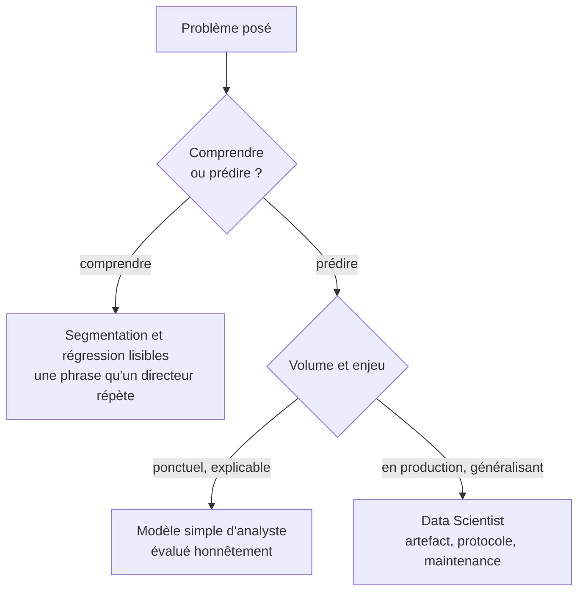

Niveau attendu : **autonomie**. Ce qui doit être maîtrisé ici est de savoir dire « ce n'est plus mon sujet » — un arbitrage de cadrage, et il se défend.

Une seule question de cadrage tranche l'essentiel : le problème est-il de comprendre ou de prédire ? Si c'est comprendre, une segmentation propre et une régression lisible battent tout le reste. Si c'est prédire, à enjeu sérieux, le sujet change de métier.

## Ce qu'il faut savoir faire

- Poser la question avant de choisir l'outil. Un modèle performant et opaque ne répond pas à « pourquoi », et une explication claire ne prédit rien : les deux objectifs se paient l'un l'autre.
- Reconnaître la demande qui n'appelle pas de modèle du tout. « Quels clients risquent de partir » se traite neuf fois sur dix par trois indicateurs de comportement et un seuil convenu avec le métier — livrable en deux jours, actionnable immédiatement.
- Livrer un arbre de décision peu profond quand le métier doit appliquer la règle lui-même. Moins performant, immédiatement lisible, et il produit des règles applicables à la main : c'est souvent le meilleur livrable d'analyste.
- Passer la main quand la demande porte sur un modèle qui devra tourner en production, être surveillé et réentraîné. Ce n'est pas un aveu de faiblesse, c'est une frontière de responsabilité — elle est décrite dans [[ne-pas-confondre]].
- Chiffrer ce que le modèle apporterait par rapport à la règle existante, avant de le construire. Si l'écart attendu ne change aucune décision, le modèle n'a pas de raison d'être.
- Savoir nommer ce qu'on ne fait pas : apprentissage par renforcement, optimisation, recommandation en ligne. Les connaître suffit à ne pas les confondre en réunion.

## Les notions mobilisées

- [[notions/apprentissage-supervise]] — pour l'analyste, prédire une étiquette connue ; c'est le seul usage vraiment courant.
- [[notions/apprentissage-non-supervise]] — dégrossir une segmentation, sans jamais la trancher à la place du métier.
- [[notions/apprentissage-par-renforcement]] — hors périmètre, cité pour ne pas le confondre avec le supervisé.
- [[notions/choix-de-modele]] — l'arbitrage entre performance, coût et explicabilité, qui se fait avant d'écrire du code.

> [!warning] Piège
> Sortir un modèle pour répondre à une question descriptive. Le modèle de churn arrive trois semaines plus tard, obtient une performance honorable, et personne ne s'en sert parce qu'il ne dit pas quoi faire du client identifié. L'indicateur et le seuil, eux, étaient utilisables le jeudi suivant.

## Pour apprendre

- [Google ML Crash Course — Classification](https://developers.google.com/machine-learning/crash-course/classification) — court, gratuit, et le passage sur les seuils est le meilleur du lot.
- [scikit-learn — Guide utilisateur](https://scikit-learn.org/stable/user_guide.html) — la documentation la plus pédagogique de l'écosystème : un cours de ML déguisé.
- [mlcourse.ai](https://mlcourse.ai/) — cours libre et complet, avec devoirs corrigés.
- [The Effect](https://theeffectbook.net/) — pour voir clairement ce que « comprendre » exige de plus que « prédire ».
