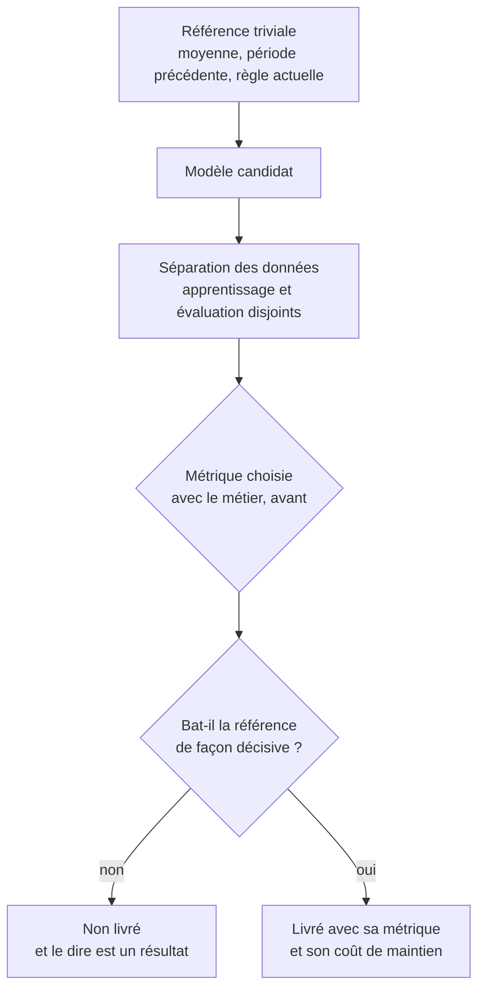

Toujours établir une référence triviale avant de modéliser : la moyenne, la valeur de la période précédente, la règle métier existante. Un modèle qui ne bat pas cette référence n'a aucune raison d'exister, et cela arrive plus souvent qu'on ne le publie.

## Ce qu'il faut savoir faire

- Construire la référence triviale en premier, en dix minutes, et la chiffrer. Elle donne l'échelle de ce qui se joue : si la règle métier actuelle atteint déjà 80 % de ce que le modèle apporterait, le sujet est clos.
- Choisir la métrique avec le métier avant d'entraîner quoi que ce soit. Elle encode un arbitrage entre faux positifs et faux négatifs, et cet arbitrage n'est pas une décision technique.
- Évaluer sur des données que le modèle n'a pas vues, séparées selon la logique du problème — par période quand la prédiction porte sur l'avenir, jamais au hasard dans ce cas.
- Se méfier de l'exactitude sur les classes déséquilibrées : prédire « pas de fraude » partout donne 99 % de bonnes réponses et zéro utilité. Précision, rappel et leur compromis disent ce qui se passe réellement.
- Vérifier la fuite quand la performance surprend en bien. Un score anormalement bon est presque toujours une variable postérieure au fait, pas une découverte.
- Annoncer le coût de maintien avec le modèle : réentraînement, surveillance de la dérive, personne responsable. Un modèle livré sans cela redevient faux en silence.

## Les notions mobilisées

- [[notions/metriques-evaluation-ml]] — exactitude, précision, rappel, F1, AUC, et ce que chacune cache selon l'équilibre des classes.
- [[notions/apprentissage-supervise]] — la séparation des données et la généralisation, qui définissent ce que « évaluer » veut dire.
- [[notions/tests-hypotheses]] — un écart de performance entre deux modèles se juge aussi à sa taille et à son incertitude.
- [[notions/observabilite]] — pour le peu qui va en production, savoir que le modèle dérive suppose de l'avoir instrumenté.

> [!tip] Les trois références à essayer avant tout modèle
> La valeur moyenne ou majoritaire. La valeur de la période précédente. La règle métier appliquée aujourd'hui par les équipes. La troisième est la plus instructive : elle est souvent meilleure qu'on ne le croit, et l'avoir mesurée change complètement la conversation sur l'intérêt du projet.

## Pour apprendre

- [scikit-learn — Évaluation des modèles](https://scikit-learn.org/stable/modules/model_evaluation.html) — les métriques et les estimateurs factices, qui servent précisément de référence triviale.
- [Google ML Crash Course — Classification](https://developers.google.com/machine-learning/crash-course/classification) — la matrice de confusion et les seuils, expliqués proprement.
- [scikit-learn — Recherche d'hyperparamètres](https://scikit-learn.org/stable/modules/grid_search.html) — valider sans se mentir : la validation croisée imbriquée, expliquée correctement.
- [MLflow](https://mlflow.org/docs/latest/) — suivre les essais et leurs résultats, pour ne pas comparer de mémoire.
