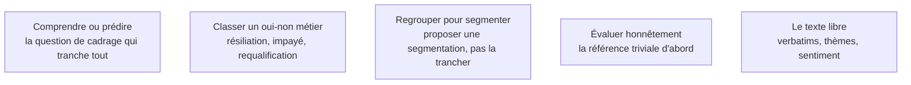

Un analyste applique des modèles, il n'en construit pas, et l'essentiel de sa valeur se situe avant le modèle. L'usage réellement rentable est étroit et bien identifié — ce domaine en trace les bornes.

## Les cinq sujets

**Porte de sortie** : le modèle bat une référence triviale, ou il n'est pas livré.

## Ma progression

- [ ] [[parcours/data-analyst/modelisation-appliquee/comprendre-ou-predire|Comprendre ou prédire]] — la réponse décide si le sujet reste dans ce métier
- [ ] [[parcours/data-analyst/modelisation-appliquee/classer-un-oui-non-metier|Classer un oui-non métier]] — pourquoi la régression logistique reste le premier choix
- [ ] [[parcours/data-analyst/modelisation-appliquee/regrouper-pour-segmenter|Regrouper pour segmenter]] — une segmentation que le métier ne reconnaît pas ne sert à rien
- [ ] [[parcours/data-analyst/modelisation-appliquee/evaluer-honnetement|Évaluer honnêtement]] — la métrique se choisit avec le métier, avant d'entraîner
- [ ] [[parcours/data-analyst/modelisation-appliquee/le-texte-libre|Le texte libre]] — le cas où le rapport valeur sur effort a le plus changé
