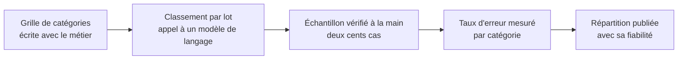

Niveau attendu : **usage**. Les modèles génératifs ont rendu la classification de verbatims accessible sans expertise ; ce qui reste à faire est un protocole de vérification, pas une technique à maîtriser.

Verbatims clients, commentaires, champs de saisie libre : c'est le cas où le rapport entre la valeur et l'effort a le plus changé. Classer dix mille commentaires par thème demandait un corpus annoté ; cela demande aujourd'hui une grille de catégories et une vérification sérieuse.

## Ce qu'il faut savoir faire

- Écrire la grille de catégories avec le métier avant tout traitement. C'est le travail d'analyse ; le classement lui-même est devenu de l'exécution.
- Vérifier manuellement un échantillon d'au moins deux cents cas, et mesurer le taux d'erreur par catégorie. Cette étape n'est pas optionnelle : sans elle, on publie une répartition dont on ignore la fiabilité.
- Lire soi-même une centaine de verbatims bruts avant toute automatisation. On y trouve les catégories qui manquent à la grille, et c'est irremplaçable.
- Distinguer le comptage de thèmes et la citation. Un chiffre de répartition répond à « combien », quelques verbatims bien choisis répondent à « quoi » — et une restitution a besoin des deux.
- Se méfier de l'analyse de sentiment appliquée telle quelle. L'ironie, la négation et le vocabulaire métier la mettent en défaut, et un taux de satisfaction calculé ainsi se défend mal devant ceux qui lisent les commentaires tous les jours.
- Traiter la confidentialité avant d'envoyer quoi que ce soit : un verbatim contient des noms, des numéros de dossier, parfois des données de santé.

## Les notions mobilisées

- [[notions/traitement-langage-naturel]] — les tâches classiques et leurs limites, dont la classification thématique et l'analyse de sentiment.
- [[notions/ingenierie-de-prompt]] — la grille de catégories devient une consigne, et sa formulation décide de la stabilité du classement.
- [[notions/evaluation-llm]] — mesurer la qualité du classement sur un échantillon annoté est exactement une évaluation, avec les mêmes exigences.
- [[notions/rgpd]] — les champs libres sont le premier endroit où se cachent des données personnelles non prévues.
- [[notions/reseaux-de-neurones]] — ce qui tourne derrière ; à connaître pour situer, pas pour construire.

> [!warning] Piège
> Publier une répartition thématique sans taux d'erreur. Une catégorie mal comprise par le modèle absorbe 15 % des verbatims, la répartition paraît nette, et la décision porte sur un thème qui n'existe pas. Le taux d'erreur par catégorie est ce qui rend le chiffre présentable.

## Pour apprendre

- [Hugging Face — LLM Course](https://huggingface.co/learn/llm-course/chapter1/1) — le socle, et la partie classification de texte en particulier.
- [Claude — Prompt engineering](https://platform.claude.com/docs/en/build-with-claude/prompt-engineering/overview) — écrire une consigne de classement stable et reproductible sur un lot.
- [scikit-learn — Extraction de caractéristiques de texte](https://scikit-learn.org/stable/modules/feature_extraction.html#text-feature-extraction) — l'approche classique, encore utile quand le volume est grand et le budget serré.
- [Ragas](https://docs.ragas.io/en/stable/) — la mesure de qualité d'une sortie de modèle, transposable à un classement thématique.
