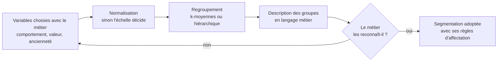

Le regroupement automatique sert à proposer une segmentation, pas à la trancher. Une segmentation statistique qu'aucun responsable métier ne reconnaît ne sera jamais utilisée, quelle que soit sa qualité mathématique.

## Ce qu'il faut savoir faire

- Choisir les variables de regroupement avec le métier. L'algorithme regroupe sur ce qu'on lui donne : donner toutes les colonnes disponibles produit des groupes qui ne veulent rien dire à personne.
- Normaliser avant de regrouper, sinon la variable la plus grande en valeur absolue décide seule de tout. C'est la première cause de segmentation absurde.
- Décrire chaque groupe en langage métier — effectif, profil moyen, ce qui le distingue — plutôt qu'en coordonnées de centre. Un groupe qu'on ne sait pas décrire en une phrase n'existe pas pour l'organisation.
- Tester la stabilité : relancer sur un autre échantillon, sur une autre période, avec un nombre de groupes différent. Des groupes qui changent complètement à chaque exécution ne sont pas une structure, ce sont des coupes arbitraires.
- Fournir une règle d'affectation simple pour les nouveaux cas. Une segmentation utilisable doit pouvoir classer un client qui arrive demain, sans relancer l'analyse.
- Accepter que le métier rejette le découpage et recommencer avec ses variables. La segmentation qui sert est celle que les équipes reprennent, pas celle qui minimise l'inertie intra-classe.

## Les notions mobilisées

- [[notions/apprentissage-non-supervise]] — clustering et réduction de dimension ; l'angle analyste est que le résultat est une proposition, jamais une conclusion.
- [[notions/statistiques-descriptives]] — la description des groupes est du descriptif pur, et c'est elle qui emporte l'adhésion.
- [[notions/visualisation-de-donnees]] — projeter les groupes pour les montrer, en sachant ce que la projection déforme.
- [[notions/analyse-de-cohorte]] — quand la variable structurante est l'ancienneté, la cohorte est une segmentation plus lisible et plus solide.

> [!warning] Piège
> Présenter le nombre de groupes comme un résultat technique. Le choix de quatre segments plutôt que sept est un arbitrage d'exploitation — combien de traitements différents l'organisation est-elle capable de mener — et il appartient au métier. Le présenter comme une sortie d'algorithme fait perdre la discussion utile.

## Pour apprendre

- [scikit-learn — Clustering](https://scikit-learn.org/stable/modules/clustering.html) — les méthodes, leurs hypothèses et, surtout, ce que chacune suppose de la forme des groupes.
- [scikit-learn — Prétraitement](https://scikit-learn.org/stable/modules/preprocessing.html) — la normalisation, sans laquelle tout le reste est faux.
- [mlcourse.ai](https://mlcourse.ai/) — le module sur le non supervisé, avec la partie visualisation qui manque ailleurs.
