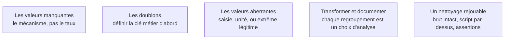

La moitié du temps d'une mission, et la partie que personne ne voit. Nettoyer n'est pas appliquer une recette : c'est comprendre pourquoi la donnée est dans cet état, puis décider — en le documentant — ce qu'on en fait.

## Les cinq sujets

**Porte de sortie** : rien n'a été fait à la main, et le volume de chaque exclusion est écrit.

## Ma progression

- [ ] [[parcours/data-analyst/nettoyer/les-valeurs-manquantes|Les valeurs manquantes]] — trois mécanismes d'absence, trois traitements différents
- [ ] [[parcours/data-analyst/nettoyer/les-doublons|Les doublons]] — dédoublonner sans clé explicite supprime des faits
- [ ] [[parcours/data-analyst/nettoyer/les-valeurs-aberrantes|Les valeurs aberrantes]] — celle qu'on corrige, celle qu'on convertit, celle qu'on garde
- [ ] [[parcours/data-analyst/nettoyer/transformer-et-documenter|Transformer et documenter]] — typage, libellés, regroupements, et la trace de chacun
- [ ] [[parcours/data-analyst/nettoyer/un-nettoyage-rejouable|Un nettoyage rejouable]] — le script depuis la donnée brute et les assertions qui échouent bruyamment
