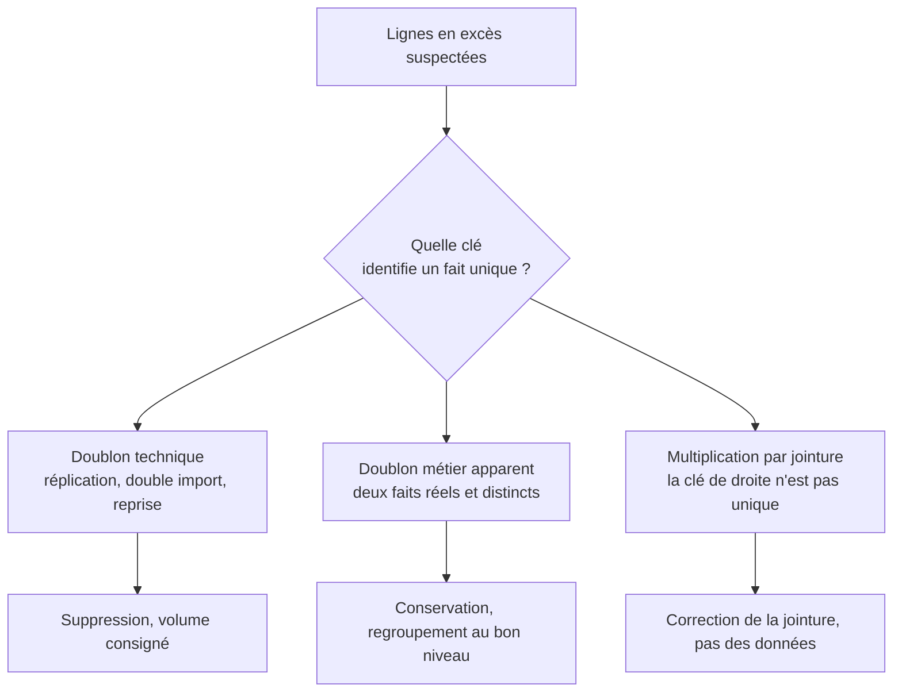

Niveau attendu : **autonomie**. Aucune documentation ne donne la clé métier ; il faut la reconstituer avec le métier, puis assumer les lignes qu'on supprime.

Définir la clé métier avant de dédoublonner. Deux lignes identiques sur toutes les colonnes sont probablement un artefact technique ; deux commandes du même client le même jour sont probablement réelles. Supprimer sans clé explicite supprime des faits.

## Ce qu'il faut savoir faire

- Formuler la clé métier en une phrase avant toute suppression : « une ligne = une commande », « une ligne = un client et un mois ». Sans cette phrase, il n'existe aucun critère pour décider ce qui est un doublon.
- Distinguer les trois origines : la réplication ou le double import, le fait réel qui ressemble à un doublon, et la multiplication produite par une jointure sur une clé non unique. Seule la première se supprime, et la troisième se corrige en amont.
- Compter les lignes avant et après chaque jointure. Une jointure qui fait passer de 50 000 à 63 000 lignes est un défaut de cardinalité, pas un enrichissement — et c'est le mode d'échec le plus fréquent des chiffres faux.
- Tester l'unicité de la clé dans chaque table avant de joindre, par une requête, plutôt que de le supposer d'après le nom des colonnes.
- Traiter les quasi-doublons séparément : même personne saisie deux fois avec deux orthographes, même entreprise avec et sans forme juridique. Le rapprochement approximatif est un travail d'analyse à part entière, qui se documente et se fait valider.
- Consigner le volume supprimé et la clé retenue dans la restitution, au même titre que les exclusions.

## Les notions mobilisées

- [[notions/qualite-des-donnees]] — l'unicité est une propriété testable, et son test est la requête de comptage par clé.
- [[notions/sql]] — la vérification de cardinalité s'écrit en deux lignes de SQL et devrait précéder toute jointure.
- [[notions/pandas]] — la suppression des doublons sans clé explicite est un geste courant et destructeur ; l'option existe, l'usage par défaut est le piège.
- [[notions/collecte-de-donnees]] — un doublon d'import se règle à la collecte, pas au nettoyage : mieux vaut réextraire proprement.

> [!tip] Le contrôle qui prend dix secondes
> Comparer le nombre de lignes au nombre de valeurs distinctes de la clé supposée. Si les deux diffèrent, on sait immédiatement qu'on n'a pas compris la granularité de la table — et c'est une information plus précieuse que le dédoublonnage lui-même.

## Pour apprendre

- [SQL Window Functions](https://www.thoughtspot.com/sql-tutorial/sql-window-functions) — le fenêtrage est l'outil qui permet de garder une ligne par clé selon une règle explicite.
- [pandas — Fusion et jointure](https://pandas.pydata.org/docs/user_guide/merging.html) — les options de validation de cardinalité, qui échouent bruyamment plutôt que de multiplier les lignes.
- [Pandera](https://pandera.readthedocs.io/) — l'unicité déclarée comme contrainte, vérifiée à chaque exécution.
- [OpenRefine](https://openrefine.org/) — le regroupement de valeurs proches, pour les quasi-doublons de libellés saisis à la main.
