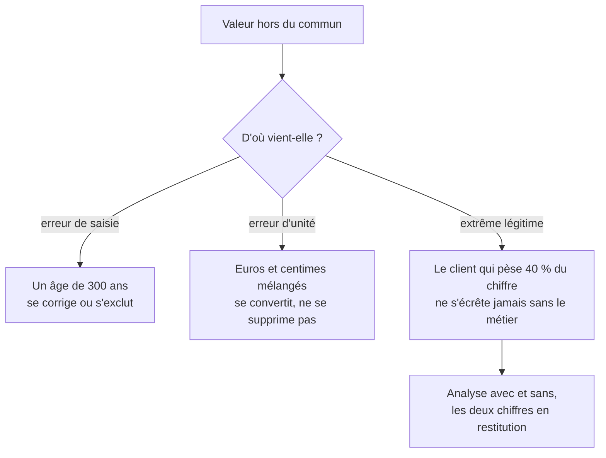

Niveau attendu : **autonomie**. Corriger, convertir ou garder est l'arbitrage où l'erreur coûte le plus cher — écrêter la valeur qui portait le signal — et il se défend cas par cas.

Trois origines à distinguer, et une seule se corrige sans discussion. L'erreur la plus coûteuse du métier consiste à écrêter une valeur extrême parce qu'elle dépasse un seuil statistique, alors qu'elle porte l'essentiel du signal.

## Ce qu'il faut savoir faire

- Regarder la valeur extrême dans sa ligne complète avant de décider. Une commande à un million d'euros s'explique en lisant le client, la date et le produit — pas en regardant la distribution.
- Reconnaître l'erreur d'unité, qui est la plus fréquente et la plus discrète : deux systèmes fusionnés dont l'un stockait des centimes, une durée en secondes dans une colonne de minutes. Elle se convertit, elle ne se supprime pas.
- Ne jamais écrêter un extrême légitime sans l'accord explicite du métier. Dans la plupart des activités, une poignée de clients ou de dossiers porte une part majeure du total : les retirer produit un chiffre qui décrit une entreprise imaginaire.
- Livrer les deux versions quand un extrême pèse lourd : avec et sans, chiffrées, en disant laquelle répond à la question posée. C'est souvent la restitution la plus utile qu'on puisse faire.
- Se méfier des règles automatiques — écart interquartile, trois écarts-types. Elles supposent une distribution que les données d'entreprise n'ont presque jamais, et elles suppriment mécaniquement la queue qui intéresse le métier.
- Distinguer la valeur aberrante de la valeur impossible. L'impossible se traite comme une erreur de qualité et se signale à la source ; l'aberrante se discute.

## Les notions mobilisées

- [[notions/statistiques-descriptives]] — la dispersion et la forme de la distribution, qui disent si « extrême » a un sens ici.
- [[notions/qualite-des-donnees]] — la validité est une propriété testable : un âge négatif est un défaut, pas un point de discussion.
- [[notions/visualisation-de-donnees]] — la boîte à moustaches et le nuage de points repèrent en un coup d'œil ce qu'aucune règle ne classe correctement.
- [[notions/regression-lineaire]] — quelques points extrêmes suffisent à faire basculer une droite ; leur influence se mesure, elle ne se devine pas.

> [!warning] Piège
> Appliquer un filtre d'aberrance générique dans le script de nettoyage, une fois pour toutes. Il s'applique alors à des colonnes dont personne n'a examiné la distribution, il supprime silencieusement les gros clients, et il rend les totaux irréconciliables avec ceux du contrôle de gestion — écart qu'on découvre en réunion.

## Pour apprendre

- [NIST — Detection of Outliers](https://www.itl.nist.gov/div898/handbook/prc/section1/prc16.htm) — les tests classiques, leurs hypothèses, et quand ils cessent d'être valables.
- [Fundamentals of Data Visualization](https://clauswilke.com/dataviz/introduction.html) — Claus Wilke, libre : représenter des distributions à queue lourde sans les trahir.
- [seaborn](https://seaborn.pydata.org/) — les graphiques de distribution en une ligne, pour regarder avant de décider.
- [scikit-learn — Détection de nouveautés et d'anomalies](https://scikit-learn.org/stable/modules/outlier_detection.html) — utile quand la détection est le sujet, et non un prétraitement subi.
